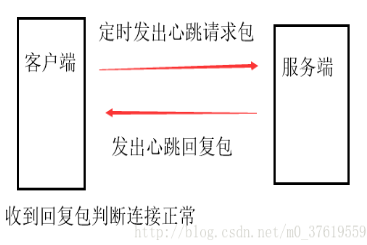
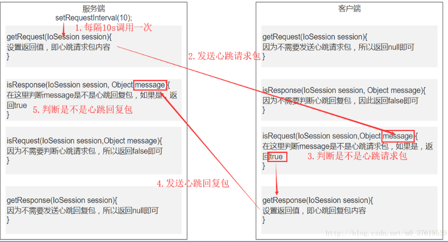

上一篇文章讲了Mina的简单使用，这一篇将要讲讲怎么用Mina实现心跳检测。网上有很多相关的文章，但是我觉得比较难理解，自己折腾了好久才明白，所以想用我觉得容易理解的话总结一下。也给自己做个笔记。

# 心跳机制

​    1.心跳机制有什么用？
在TCP的长连接中，有可能两端有很长一段时间没有数据往来，理论上连接应该是一直保持的。但实际情况中，如果中间节点出现故障，连接断开（如防火墙，或者断网等），这时候故障是难以知道的。

比如客户端因为某种情况断开了连接，服务端并不会收到消息，可能还傻傻的等待对方发送消息过来。反过来也一样。

所以发明了心跳机制来维持长连接，保活。


​    2.心跳机制是什么？

心跳机制原理很简单，就是客户端每隔一段时间发送一个“请求心跳包”到服务端，服务端收到“请求心跳包”之后回复一个心跳包，客户端接收到“回复心跳包”后判断连接正常。

如果客户端“在一定时间（即超时时间）”没有收到回复包则表示中间出错了，可以尝试重新连接或者做出相应的操作。

当然一般我们会设置一个变量，“多次判断”有没有收到回复包。比如3次没收到回复包，才判断连接出错。如果收到了回复包，则把变量重置为0。

由谁（客户端还是服务端）发起请求其实都一样，当然也可以两边都发，具体情况看需求和方便性。比如为了减轻服务端压力，由客户端发出请求较合适。




​    3.心跳包是什么？

心跳包其实就是双方规定的一个信息，可以是一个数字、一串字符、也可以是一个结构对象，只要接收方能够判断就行。

我把发出请求的心跳包叫做心跳请求包，把回复的心跳包叫做心跳回复包。

心跳包之所以叫心跳包是因为：他像心跳一样每隔一定时间发送一次，以此告诉对方，自己还活着。

# Mina实现心跳机制

​    上一篇文章讲了Mina的简单使用，我们通过设置IoHandler来处理业务逻辑，IoHandler中有messageReceived方法，当接收到消息时回调此方法。

​    **1.很容易想到的方法**

所以我们很容易想到，只要在任何一端（假设为A端）设置一个定时器，定时发送一个心跳请求包。然后在另一端（假设为B端）的messageReceived方法中判断接收到的消息是不是心跳请求包。如果是，则发出一个心跳回复包，同样在A端的messageReceived方法中判断接收到的消息是不是一个心跳回复包。如果是则判断连接成功。

​    **2.定时器**

上面说的思路肯定是能够实现的，现在我们来说下这个定时器怎么设置。

上一篇文章中还提到了一个函数

```java
acceptor.getSessionConfig().setIdleTime(IdleStatus.BOTH_IDLE, 10);
```

这个函数会在判断当前Session为闲置状态时，每隔10S调用一次IoHandler的sessionIdle方法，因此我们可以使用这个函数设置合适的时间，在sessionIdle中发出心跳请求包，就不用自己写一个定时器了。

​    **3.这么容易满足吗？**

上面说的已经能够实现正常的心跳机制了。但是把所有的代码和判断都放在IoHandler的业务逻辑处理中，是否不够优雅？

在上篇文章中，我们提到了消息是通过IoService接收，通过层层拦截器IoFilterChain，然后才传递到IoHandler中进行业务逻辑处理，处理之后的发送也需要通过层层拦截器才能发送出去。

因此我们想心跳包检测要是能在拦截器阶段就被消费掉，是否就不用传递到IoHandler中了，IoHandler就可以只处理业务逻辑，将心跳检测独立出来。

很庆幸，Mina已经将这个拦截器给我们封装好了，我们只需要知道如何使用即可。

​    **4.Mina的心跳检测拦截器/过滤器**

**创建拦截器：**

```java
            //实现KeepAliveMessageFactory接口方法
            HeartRequestFactoryImpl heartRequestFactory = new HeartRequestFactoryImpl();
            //创建拦截器，第一个参数是心跳处理接口，第二个参数是心跳超时处理接口
            KeepAliveFilter kaf = new KeepAliveFilter(heartRequestFactory, new KeepAliveRequestTimeoutHandlerImpl());
            //设置请求间隔，单位s
            kaf.setRequestInterval(20);
            //设置超时时间
            kaf.setRequestTimeout(10);
            //设置是否forward到下一个filter,默认为false
//            kaf.setForwardEvent(true);
            acceptor.getFilterChain().addLast("heart", kaf);
```


**需要注意的是：**

（1）客户端也需要添加心跳检测拦截器，只不过KeepAliveMessageFactory实现方法不同

（2）由服务端发出心跳请求包的话，客户端不需要实现超时处理方法，即KeepAliveRequestTimeoutHandler。超时方法是一定时间内没有收到“心跳回复包”才调用的，而客户端只会收到心跳请求包，不会收到心跳回复包


我们需要做的主要是实现KeepAliveMessageFactory接口方法

有四个方法，isRequest，isResponse，getRequest，getResponse需要我们实现，这些方法具体作用如下：

isRequest：判断接收到的消息是不是心跳请求包
isResponse：判断接收到的消息是不是心跳回复包
getRequest：获取心跳请求包
getResponse：获取心跳回复包


**关键要理解这些方法返回值的含义和调用时机：**

以服务端发送心跳请求包为例（反过来也一样），流程如下：


可以看到，客户端和服务端都需要创建拦截器，实现KeepAliveMessageFactory接口方法，只不过写法不一样。其他的发送消息流程并不需要关心

除此之外，发送请求包的一方还可以实现超时处理接口，如下：

```java
public class KeepAliveRequestTimeoutHandlerImpl implements KeepAliveRequestTimeoutHandler {
    @Override//在超时时间范围内没有收到消息会调用此方法
    public void keepAliveRequestTimedOut(KeepAliveFilter keepAliveFilter, IoSession ioSession) throws Exception {
        System.out.println("心跳超时！");//做出相应处理
    }
}
```


**分析源码：**

心跳拦截器KeepAliveFliter源码，关键部分如下：

```java
    public void messageReceived(NextFilter nextFilter, IoSession session, Object message) throws Exception {
        try {
            if(this.messageFactory.isRequest(session, message)) {
                Object pongMessage = this.messageFactory.getResponse(session, message);
                if(pongMessage != null) {
                    nextFilter.filterWrite(session, new DefaultWriteRequest(pongMessage));
                }
            }

            if(this.messageFactory.isResponse(session, message)) {
                this.resetStatus(session);
            }
        } finally {
            if(!this.isKeepAliveMessage(session, message)) {
                nextFilter.messageReceived(session, message);
            }

        }
    }

    public void messageSent(NextFilter nextFilter, IoSession session, WriteRequest writeRequest) throws Exception {
        Object message = writeRequest.getMessage();
        if(!this.isKeepAliveMessage(session, message)) {
            nextFilter.messageSent(session, writeRequest);
        }

    }

    public void sessionIdle(NextFilter nextFilter, IoSession session, IdleStatus status) throws Exception {
        if(status == this.interestedIdleStatus) {
            if(!session.containsAttribute(this.WAITING_FOR_RESPONSE)) {
                Object pingMessage = this.messageFactory.getRequest(session);
                if(pingMessage != null) {
                    nextFilter.filterWrite(session, new DefaultWriteRequest(pingMessage));
                    if(this.getRequestTimeoutHandler() != KeepAliveRequestTimeoutHandler.DEAF_SPEAKER) {
                        this.markStatus(session);
                        if(this.interestedIdleStatus == IdleStatus.BOTH_IDLE) {
                            session.setAttribute(this.IGNORE_READER_IDLE_ONCE);
                        }
                    } else {
                        this.resetStatus(session);
                    }
                }
            } else {
                this.handlePingTimeout(session);
            }
        } else if(status == IdleStatus.READER_IDLE && session.removeAttribute(this.IGNORE_READER_IDLE_ONCE) == null && session.containsAttribute(this.WAITING_FOR_RESPONSE)) {
            this.handlePingTimeout(session);
        }

        if(this.forwardEvent) {
            nextFilter.sessionIdle(session, status);
        }

    }
```

（1）我们设置了setRequestInterval，每隔一定时间就会调用sessionIdle方法，该方法最主要的就是下面几句：

```java
Object pingMessage = this.messageFactory.getRequest(session);//调用getRequest获得返回值
if(pingMessage != null) {                                        //如果有返回值
    nextFilter.filterWrite(session, new DefaultWriteRequest(pingMessage));//将该该返回值发送出去，因此该返回值表示的含义就是心跳请求包
    …………                 
}
```


即如果getRequest方法设置了返回值，就会将该返回值发送出去，所以这个返回值的意义就是“心跳请求包”。

（2）客户端收到消息，会调用拦截器的messageReceived方法：

```java
try {
    if(this.messageFactory.isRequest(session, message)) {//我们在isRequest方法中判断接收到的是不是心跳请求包，如果是返回为true
        Object pongMessage = this.messageFactory.getResponse(session, message);//然后调用getResponse方法获得返回值
        if(pongMessage != null) {                                                //如果有返回值
            nextFilter.filterWrite(session, new DefaultWriteRequest(pongMessage));//则将该返回值发送出去，因此该返回值的意义就是心跳回复包
        }
    }
    if(this.messageFactory.isResponse(session, message)) {//我们在isResponse方法中判断接收到的是不是心跳回复包，如果是返回为true
        this.resetStatus(session);                        //接收到了心跳回复包，需要重置状态，如重新开始计时
    }
} finally {
    if(!this.isKeepAliveMessage(session, message)) {//该方法执行了一遍isRequest和isResponse，如果接收到的消息既不是心跳请求包，也不是回复包
        nextFilter.messageReceived(session, message);//则将该消息往下传递，即交给下个拦截器或者交给Handler的messageReceive方法处理
    }//如果接收到的消息是心跳请求包“或者”心跳回复包，则在上面几句中就已经将该消息消费掉了
}
```

注意上面还有一句：

```java
            //设置是否forward到下一个filter,默认为false
//            kaf.setForwardEvent(true);
```


这句话的作用从源码中可以看出来，源码的sessionIdle方法后面有这么一段

```java
        if(this.forwardEvent) {
            nextFilter.sessionIdle(session, status);//如果设置为true，会将该状态往下传递
        }
```


不知道大家还记不记得IoHandler里面也有sessionIdle方法，上面已经讲过，它的调用时机是通过setIdleTime来设置的，而setForwardEvent设置为false的话，则会将Idle事件拦截掉，不往下传递到IoHandle的sessionIdle，即该方法失效。

总的来说，就是设置了setRequestInterval的话，则设置setIdleTime将会失去意义。


以上是我的理解，如有谬误，恳请各位前辈指出。有不懂得也可以留言。