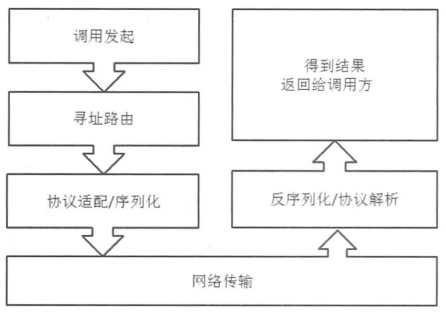
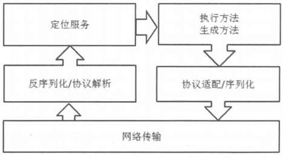

---

layout: post
title: RPC和RPC框架【转载】
date: 2018-7-24
categories: 技术
description: RPC和RPC框架
tags:
- 技术
keywords: [RPC]
---

## [转载]

作者：EnjoyMoving

链接：https://www.zhihu.com/question/25536695/answer/285844835

RPC：远程调用。通过RPC框架，使得我们可以像调用本地方法一样地调用远程机器上的方法：

1、本地调用某个函数方法

2、本地机器的RPC框架把这个调用信息封装起来（调用的函数、入参等），序列化(json、xml等)后，通过网络传输发送给远程服务器

3、远程服务器收到调用请求后，远程机器的RPC框架反序列化获得调用信息，并根据调用信息定位到实际要执行的方法，执行完这个方法后，序列化执行结果，通过网络传输把执行结果发送回本地机器

4、本地机器的RPC框架反序列化出执行结果，函数return这个结果

服务调用端（本地机器）：

服务提供端（远程机器）：

Java Netty 是在TCP(Socket)层对nio进行封装的框架，在RPC框架中可用于解决网络传输问题。

现在流行的微服务框架（dubbo、spring cloud等），实际上就是各种各样的RPC框架