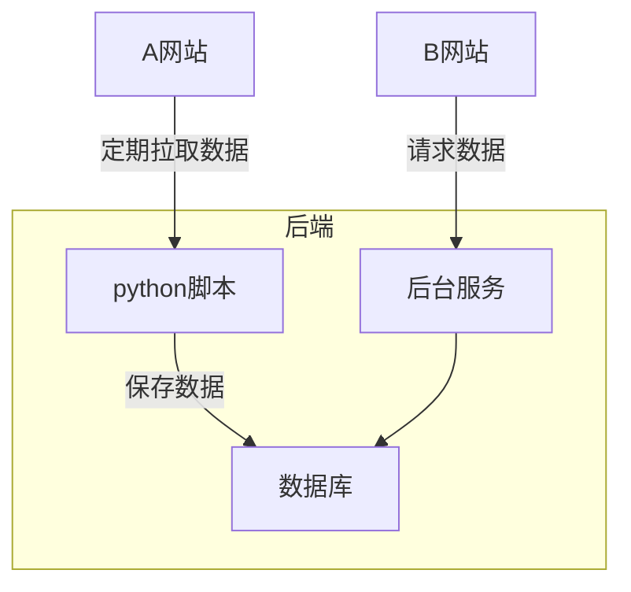
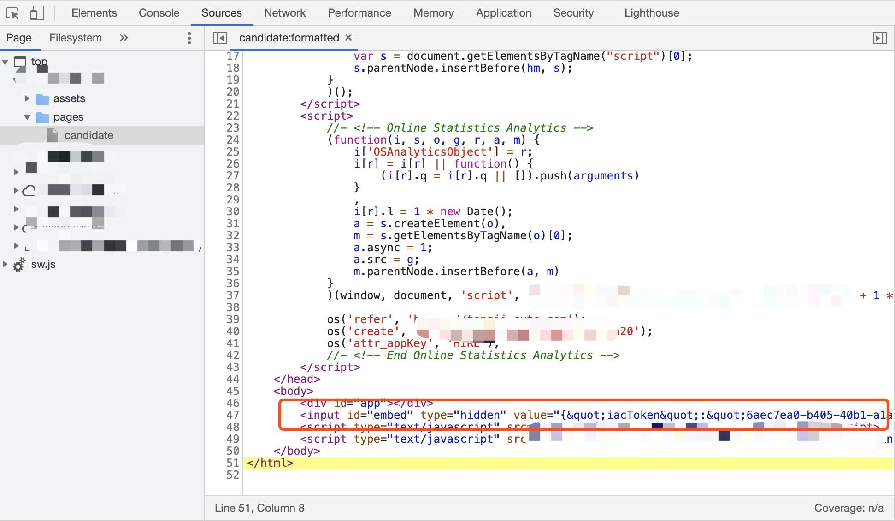

---

layout: post
title: 如何把A网站的数据爬到B网站显示
date: 2021-05-16
categories: 技术
description: 如何把A网站的数据爬到B网站显示
tags:
- 技术
- 前端
- python
keywords: [Python , 前端 ]
---

# 爬虫介绍

主要有两种方式

1. 通过网站提供的API进行爬取
   1. 有的网站不提供API
   2. API可能收费
   3. API可能有速率限制
   4. API可能不会公开部分数据
2. 基于HTML的数据抓取：通过访问网页的HTML代码，并从中抓取到所需节点上的数据。网页结构一旦变化，抓取代码可能需要重写。
   1. 全网爬虫：主要用于搜索引擎。深度优先策略、广度优先策略。
   2. 聚焦网络爬虫：爬取特定主题页面。
   3. 增量式网络爬虫：只爬取新产生或者发生变化的页面。
   4. Deep Web爬虫：需要提交表单才能获取到页面。

# 思路

大体有两种思路

1. 使用python定期抓取数据，写入自己的数据库，再自己写个后端服务，前端请求自己的后端数据



2. 不需要搭建后端和数据库，直接前端请求A网站后端接口数据

这里采用第二种方式，坑有点多，下面一一介绍。

# 过程

## 找到请求URL并模拟请求获取数据

1. 控制台找到接口url和请求头等，postman模拟请求
2. 由于后端有做校验，请求会失败，返回403或者500
3. 从控制台中找到`Request Header`和`Cookie`等，复制到postman中模拟请求，成功说明爬数据可行。
   1. 大部分header信息是没用的，可以一个一个删除，尝试请求，最后只留下关键的请求头和cookie。
4. 这里发现主要有两个信息，一个是csrfToken，一个是loginToken（实际名称不是这个）。
   1. csrfToken为自定义请求头，保存在headers中，错误服务端会返回500，并提示`invalid csrf token`
   2. loginToken保存在headers的cookie字段中，错误会返回200，提示登录失效，请重新登录
   3. 还有两个koa字段，用来配合csrfToken做校验，这三个值需要对应。由于保存在cookie中，获取方式和loginToken类似，因此不做详细说明

`RequestHeader`关键信息如下：

```shell
# Cookie为浏览器自带的Header
Cookie: loginToken=***; koa.xxx=***; koa.xxx.sig=***;
# csrf-token为服务端自定义Header
csrf-token: *** 
```

**这里token可能会过期，我们不可能每次都去手动复制、粘贴请求头。因此需要动态抓取csrfToken和loginToken。**

控制台中可以查到在登录页面，后端返回的`Response Header`中的`Set-Cookie`字段带了loginToken，设置到了浏览器

csrfToken找了半天发现嵌在网页的body中。

我们的目标就是获取到该页面，通过正则从html中提取csrfToken。



## Python模拟登录获取Cookie和Token等信息

> **可以先用postman模拟，验证可行性。**

### 获取loginToken

1. 使用python请求登录页面url：需要设置相应的登录信息，如用户名和密码等。
   1. 这里看到请求数据也是保存在cookie，而不是在`RequestBody`中，不过这一部分基本是不变的，因此可以直接复制粘贴cookie到`RequestHeader`中。
2. 登录成功后从`Response Header`中获取到相应的cookie，代码如下

```python
import urllib.request
import http.cookiejar

def login():
    global loginToken
    url = "登录url"
    cookie = http.cookiejar.CookieJar()
    handler = urllib.request.HTTPCookieProcessor(cookie)
    opener = urllib.request.build_opener(handler)
    opener.addheaders = [
    		#...
      	# 直接拷贝该url的cookie到Header中即可
        ('Cookie', '...包含用户名之类的信息'),
        #...
    ]
    request = urllib.request.Request(method="GET", url=url)
    response = opener.open(request)
    # 获取ResponseHeader中的Cookie
    for item in cookie:
        print('cookies: %s = %s' % (item.name, item.value))
        if item.name == "loginToken":
            loginToken = item.value
```

这里使用python的`requests`包请求会失败，原因应该是登录url有几次重定向。

>  使用`urllib.request + http.cookiejar`这两个包请求并获取cookie

### 获取csrfToken

请求html网页，使用正则提取csrfToken的值，代码如下

```python
def getKey():
    global csrfToken
    global koa1
    global koa2
    cookie = http.cookiejar.CookieJar()
    handler = urllib.request.HTTPCookieProcessor(cookie)
    opener = urllib.request.build_opener(handler)
    response = opener.open('请求url')
    # read读取结果
    code_of_html = response.read().decode('utf-8')
		# 正则提取CSRFToken字段的值
    csrfToken = re.search('''(?<=CSRFToken&quot;:&quot;).*?(?=&quot;)''', code_of_html).group()
    print("csrfToken: " + csrfToken)
    for item in cookie:
      	# 这里其实除了csrfToken之外还有两个保存在cookie字段，是用来配合csrfToken做校验的。由于获取方式和loginToken类似，因此不做详细说明
        print('cookies: %s = %s' % (item.name, item.value))
        if item.name == "koa.***":
            koa1 = item.value
        if item.name == "koa.***.sig":
            koa2 = item.value
```

## python请求接口数据

获取到token信息之后，添加到相应的请求头中即可，模拟请求成功，结果同postman。

走到这一步方案一和方案二还是一样的。用python请求数据先验证可行性，后面实在走不通也可以切换到方案一，将python爬到的数据保存到数据库。

事实上，由于前端浏览器环境和直接用python有很大的不同，后面会有很多坑。

## 前端请求接口数据

这里先不管请求头怎么设置，直接请求数据，可以使用Chrome ModHeader插件手动填写请求头。

### 浏览器跨域请求问题

1. 方法1：服务器设置允许跨域。由于是爬别人的数据，没有后端，因此走不通。
2. 方法2：使用代理，将请求转发到代理服务，由代理服务拿到结果后返回给浏览器。

以vue+vite配置为例：

```js
//vite.config.js配置代理
server: {
	//配置代理解决跨域问题
	proxy: {
		"/api": {
			target: "https://hostname.com/", // 你请求的第三方接口
			changeOrigin: true, // 在本地会创建一个虚拟服务端，然后发送请求的数据，并同时接收请求的数据，这样服务端和服务端进行数据的交互就不会有跨域问题
			rewrite: (path) => path.replace(/^\/api/, ""),
		},
	},
},
```

#### vite和nginx部署

vite和nginx都可以作为Web服务器运行前端页面，也支持配置代理服务。vite内部还是通过nodejs启动服务器

在我看来，他们的区别只在于**nginx是专业的服务器，性能更好。而vite是一个开发工具**。（PS：如负载均衡、并发强、支持反向代理等，这一块没接触过不懂）

一般情况下vite只在开发时使用，正式环境需要编译打包代码，部署到nginx之类的专业服务器，这个时候vite的配置就不生效了，因此再使用nginx做反向代理。

考虑到内部使用的小型网站，直接使用vite部署即可。

```json
//package.json
{
  "scripts": {
    "build": "vite build",
    "serve": "vite preview"
  }
}
//npm run build & npm run serve运行
```

### Axios设置请求头问题

####  Refused to set unsafe header "Cookie"

axios请求配置headers报错： Refused to set unsafe header "Cookie"。

> w3c规定，添加以下不安全的请求头，浏览器会终止请求。

```
  Accept-Charset
  Accept-Encoding
  Connection
  Content-Length
  Cookie
  Cookie2
  Content-Transfer-Encoding
  Date
  Expect
  Host
  Keep-Alive
  Referer
  TE
  Trailer
  Transfer-Encoding
  Upgrade
  User-Agent
  Via
```

服务端自定义的请求头csrfToken不会有问题。因此关键信息只有cookie。

解决方案：

> js使用document.cookie给浏览器设置cookie，请求的时候浏览器会自动带上

**如果还有其他不安全的Header需要设置，暂时不知道怎么解决，这取决于服务端**

实在走不通就只能换回方案一，或者通过Mod Header手动填写Headers。由于token会过期，因此隔一段时间就要改很麻烦

#### 带Http Only的cookie，无法通过document.cookie获取和设置

参考文章：[浅谈Js 操作Cookie，以及HttpOnly 的限制](https://zhuanlan.zhihu.com/p/36197012)

简单来说，后端通过`ResponseHeader`的`Set-Cookie`字段设置浏览器Cookie，如果带了httponly标志，表示该cookie只能通过服务端修改，客户端浏览器无法通过JS的document.cookie获取和设置该cookie。

```shell
Set-Cookie: loginToken=***; path=/; httponly
```

> HttpOnly是包含在Set-Cookie HTTP响应头文件中的附加标志。生成cookie时使用HttpOnly标志有助于降低客户端脚本访问受保护cookie的风险（如果浏览器支持）

解决方案：

> 浏览器设置退出的时候清除该网站cookie。
>
> 原因：网页首次加载的时候可以设置该Cookie，因为该httponly的标志是服务端Response的时候设置的。只要清除该Cookie，每次打开网页通过document.cookie设置即可。

## 前端模拟登录动态获取请求头和Token

这里存在很多问题：

1. 跨域问题
2. 登录url重定向：前端请求不知道支不支持处理重定向后的结果
3. 用户信息加密：如果不知道加密算法，即使输入了账号密码也不行
4. 4A登录：大部分公司有单点登录的门户，单点登录返回的token，不是实际业务网站的token，因此即使登录了也没法通过这个token请求接口数据。

这些问题前端比较难解决，除非知道正式的登录接口如何请求。因此最终选了其他方案。

> 前面通过python模拟登录，可以拿到token等信息，只要自己写个接口，返回token信息的json即可。
>
> 取巧的方式：不需要写代码和接口，直接把token写到一个文件中，使用python内置的http服务器开启服务端口，访问该文件即可。
>
> * Python2：`python -m SimpleHTTPServer 8081 `，指定端口8081，默认端口8080
> * Python3：`python -m http.server 8081`

## python定期更新token

token隔一段时间会更新，通过python的schedule定期执行脚本，更新token

```python
#!/usr/bin/python
# -*- coding: UTF-8 -*-

import os
import schedule
import time

def job():
    os.system("python3 generate_cookie.py")

if __name__ == '__main__':
    schedule.every(4).hours.do(job)

    print('Press Ctrl+{0} to exit'.format('Break' if os.name == 'nt' else 'C'))
    os.system("python start.py &")
    job()
    while True:
        schedule.run_pending()
```


## python http服务器跨域问题

使用python服务器开放cookie文件之后，前端请求cookie文件，提示跨域（域名相同，端口号不一样也会跨域）

> python服务器设置允许跨域。代码如下
>
> 通过该脚本启动服务`python start.py &`，替代`python -m http.server 8080`。&表示后台执行脚本

```python
#!/usr/bin/env python
try:
    # Python 3
    from http.server import HTTPServer, SimpleHTTPRequestHandler, test as test_orig
    import sys
    def test (*args):
        test_orig(*args, port=int(sys.argv[1]) if len(sys.argv) > 1 else 8080)
except ImportError: # Python 2
    from BaseHTTPServer import HTTPServer, test
    from SimpleHTTPServer import SimpleHTTPRequestHandler

class CORSRequestHandler (SimpleHTTPRequestHandler):
    def end_headers (self):
        self.send_header('Access-Control-Allow-Origin', '*')
        SimpleHTTPRequestHandler.end_headers(self)

if __name__ == '__main__':
    test(CORSRequestHandler, HTTPServer)
```

# 结束

到这里前端网页已经能够拿到其他网站的数据了，具体拿到这个数据怎么处理，怎么组装就要写逻辑了。

别人网站的接口数据格式一般情况下就只适用于自身的UI和业务，放到我们自己的网站UI肯定需要组装和适配。

总结：一步一个坑


