---

layout: post
title: CI——回首毕业论文
date: 2021-09-04
categories: 技术
description: 本文源于本人本科毕业论文—— 《面向Android项目的持续集成系统的设计与实现》，把论文内容整理成博客。
tags:
- 持续集成
- 组件化
- Docker
- Jenkins
keywords: [持续集成 , 组件化 , Docker , Jenkins]
---

# 前言

本文源于本人本科毕业论文—— 《面向Android项目的持续集成系统的设计与实现》，把论文内容整理成博客。

时隔两年多再看，当时整体的思想和系统设计还是比较领先的。当然经历了更多的项目，见识过了大团队的CI，也有了更多的感悟，发现一些功能和细节可以更加完善。

# 论文内容

**标题**：面向Android项目的持续集成系统的设计与开发

DESIGN AND IMPLEMENTATION OF CONTINUOUS INTEGRATION SYSTEM FOR ANDROID PROJECT

 

**摘要**: 本文结合Android组件化架构设计了一套基于Jenkins的持续集成方案，通过自动化构建、集成、打包等一系列环节，规范软件开发流程、缩短迭代周期、及时发现问题、减少发布风险、保证软件质量，能够快速地响应需求变化，随时提供可以运行的软件版本，提高了软件在开发过程中的可见性。

该系统主要由Web前端、Web后端、Jenkins服务、Maven私有仓库等多个部分组成。其中前端用于进行组件、项目的管理和构建以及日志查看；后端实现了请求响应、数据存储、WebSocket即时推送通知等功能；Jenkins服务提供了统一的开发环境，根据配置和脚本执行构建任务，并推送构建结果到后端和个人邮箱；Maven私有仓库用于存放依赖包。

本文前半部分介绍了持续集成的相关理论以及项目中所用到的技术，后半部分详细说明了持续集成方案的实施步骤和开发过程，并通过具体项目案例，验证了系统的可行性和意义。

**关键词**：持续集成；敏捷开发；Jenkins；Android组件化

 

**DESIGN AND IMPLEMENTATION OF CONTINUOUS INTEGRATION SYSTEM FOR ANDROID PROJECT**

**Abstract:** This paper desgin a Continuous Integration scheme based on Jenkins which is combined with Android Component-based Architecture. Through a series of links such as build, integrate and package automatically, it can standardize the process of software development, shorten the cycle of iteration, find the problem of project in time, reduce the risk of release and ensure the quality of software. What’s more, it can respond to the change of demand quickly and provide runnable software versions at any time which has improved the visibility of software in the development. 

This system is mainly composed of Web front-end, Web back-end, Jenkins service and Maven repository. The front-end is used to manage and build components or project as well as checking log. The back-end can respond the request from front-end, save data and realize the instant push by WebSocket. Jenkins service provides a unified environment of development and execute the task according to the configuration and scripts. In addition, it can push the result of buildings to the back-end and the mailboxes. The Maven repository is used to store the dependency files. 

The first part of this paper introduces the related theory of Continuous Integration and some technology used in the project. The second part describes the implementation steps and development process of my Continuous Integration scheme in detail. Moreover, it verifies the significance and feasibility of the system through a specific case. 

**Keywords:** Continuous Integration；Agile Development；Jenkins；Android Component-Based Architecture

# 1 绪论

## 1.1 课题背景

随着互联网的飞速发展、软件架构日益复杂，传统的瀑布式开发、集中式软件测试已不能适应需求频繁变更、快速迭代的要求。如何应对频繁的需求变更，并且在缩短软件开发周期的同时保证产品质量[1]、减少发布风险，成了人们研究的问题。敏捷软件开发模式应运而生。

敏捷开发的概念源于Kent Beck在90年代初期提出的软件开发思想——极限编程（简称XP[2]），持续集成（简称CI）便是XP中提出的实践。

2000年，Martin Fowler定义了持续集成：持续集成是一种软件开发实践，项目成员需要频繁对他们的工作进行集成，每天至少集成一次，并且进行自动化测试，这样就能够及时地发现项目缺陷[3]。

国外团队对持续集成的探索和实践起步较早。相继出现了CruiseControl、Hudson、LuntBuild、QuickBuild和Bamboo，以及近几年发展起来的Jenkins等持续集成工具[4]。

近几年国内许多团队也开始引入到实际项目开发中，实现了快速迭代，提高了开发效率。如何选择持续集成方案需要根据团队、业务和项目情况等因素综合考虑。

## 1.2 研究目标和内容

本课题在研究持续集成理论的基础上，利用Git（版本控制工具）、Gradle（构建工具）、Maven（构件仓库）、Jenkins（持续集成工具）等多种工具和技术，针对Android组件化项目的架构和存在的问题，实现了一套的持续集成系统。由Web前端、Web后端、Jenkins服务、代码仓库和构件仓库等各部分组成，实现了一条Android项目构建、集成到部署的流水线，用于规范开发流程、减少重复工作、及时发现问题、缩短迭代周期，方便对组件和项目进行管理，提高效率，快速迭代，真正达到敏捷开发。

本系统预期实现的目标如下：

（1）减少重复劳动，降低手动维护成本和出错概率，提高效率。

（2）避免构建环境不一致出现的问题，减少环境部署时间。

（3）通过版本控制系统统一管理代码。

（4）通过邮件和前端通知及时反馈问题，并可以通过链接查看和定位问题。

（5）实现代码质量检查、测试、构建、发布自动化，无需开发者手动执行脚本。

（6）Jenkins后台执行构建，避免开发者本地编译忙等，耗时费力，且无法保存构建记录，不便于事后追溯。

（7）能够随时提供可运行的软件供测试团队进行测试。

（8）项目进度可见可控，降低了沟通成本。

（9）避免软件最终集成时一次性暴露大量错误，难以定位等问题。

（10）前端统一对组件、项目进行管理，能够及时收到更新通知，能够查看组件和项目信息、构建历史、责任人等，易于追溯问题，并且可以在这一环节加入权限控制。

（11）后端实现响应请求、对数据进行存储、验证，与Jenkins服务交互，并实现主动推送等功能。

## 1.3 论文结构安排

第一章：介绍课题背景、研究目标和内容以及论文的结构。

第二章：对比传统的瀑布式开发模型，针对其问题和不足引出持续集成理论。研究和分析本课题相关技术，包括Android组件化架构和技术，Docker虚拟化技术等。

第三章：通过对比两种开发模式和流程分析了系统的需求和实现的意义。

第四章：设计持续集成系统功能和架构以及关键流程，能够进行Android组件和项目的可视化管理，执行Android组件和项目的构建、打包、部署等任务，将构建结果反馈到前端，并且通过邮件通知用户。

第五章：详细讲述了系统的实施步骤和流程，包括组件化方案设计和实现，Maven私服和Jenkins服务搭建，以及前后端的关键实现等。

第六章：搭建Android组件化架构，通过具体的项目案例演示了开发流程和系统的使用流程。

第七章：总结课题内容，提出系统下一步的优化方案。

致谢和参考文献。

 

# 2 相关理论与技术

## 2.1 瀑布式开发和敏捷开发

传统软件开发流程采用“瀑布式”开发模型[5]，这种模式源于工业生产，它的开发过程包括市场调研、需求分析、产品设计、程序开发、软件测试、成品发布、后期维护等阶段，每个阶段都需要制定明确的目标，并且提供详尽的文档，按照计划一步步执行，步骤清晰明确，可预见性强，能够避免资源的无效投入，保证开发质量。但在这种开发模式下，只有项目初期的想法和建议允许加入开发计划中，在开发过程中不允许加入新的需求。而事实上，随着开发过程逐渐深入、技术架构的日新月异和市场的快速变化，好的想法和建议也会不断涌现[6]。因此，这种开发模式在需要快速产出、占领市场先机和需求不明的情况下基本是不可行的。同时在此期间，项目程序将长期不能运行[7]，需要等到所有分支开发结束后才能进行测试和集成的工作，并且一旦分支偏离主干太远，会造成项目集成困难、问题频发且不容易定位，导致项目发布前混乱紧张的局面甚至延期发布。

敏捷开发提倡拥抱变化，进行软件迭代开发，将大项目分为一个个子项目，每个子项目都可以独立的运行、测试、集成等，因此软件能够随时地集成使用和交付。敏捷开发借鉴了XP的思想，提出了12条原则[8]，并建立了以下价值观：

（1）个体和互动高于流程和工具

（2）可运行的软件高于详尽的文档

（3）客户合作高于合同谈判

（4）响应变化高于遵循计划

相比传统的瀑布开发，敏捷开发模式具有更强地适应性和灵活性，它强调“以人为本、目标导向、客户为先、拥抱变化”，要求快速迭代和及早测试，它的出现影响了团队开发的工作方式，也改变了软件发布的方式。

## 2.2 持续集成

为了验证开发者提交的最新代码能否编译成功，能否通过自动化测试用例，以及是否会影响项目集成等。可以通过频繁地进行集成，可以快速得到反馈，容易知道是哪次提交导致集成失败，易于开发者定位问题。我们将这种方法称为持续集成，也叫作每日构建[9]。

CI是敏捷开发最为成功的实践之一[10]，它最大的好处在于降低风险，它无法消除问题，但是可以帮助你快速发现问题，及时反馈。通过自动化构建、代码检查、测试和发布流水线[11]，能够减少开发人员手动编译、打包的时间，有效提高软件开发效率、及时发现项目缺陷，降低发布风险，保障软件开发质量，同时对团队所有成员来说整个开发过程可见，能够辅助项目负责人把控项目整体进度，帮助开发者定位问题，还能增强大家对产品的信心。

持续集成有以下几点原则：

（1）要求开发者控制好代码提交粒度，及时push，不然就失去了持续构建的意义。

（2）使用专门的机器进行每日构建。

（3）优先修复失败构建。

（4）保证每次构建都通过，能够生成可运行和发布的软件。

持续集成具体流程如图2-1所示：

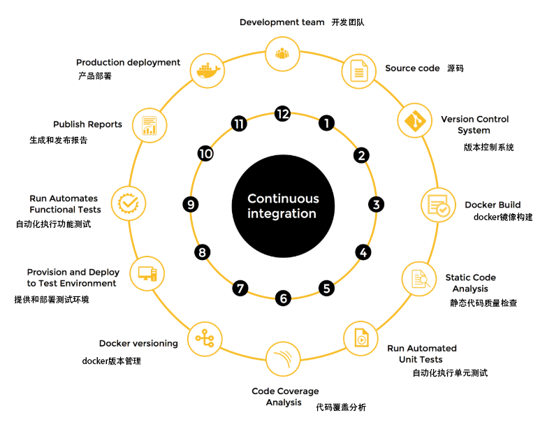 

 图2-1 持续集成开发流程图[12]

## 2.3 Android组件化架构和技术

随着APP业务逐渐复杂，功能不断增加，项目工程会越来越庞大。为了减少代码间的耦合，通过Gradle的Module功能，将项目分成一个个子模块。每个模块能够单独进行开发、编译、打包、调试，可以拆卸和移植，通过依赖的方式进行管理，并且组件间可以相互通信。组件化架构能够很好地实现业务和代码的解耦，还便于控制代码权限。

Android组件化架构[13]利用了Gradle的这一特性，建议将模块分类进行管理，由上往下进行依赖，分为：

（1）壳组件：用于将整个项目进行打包，生成可安装的apk文件，即安卓安装包。

（2）业务组件：根据业务的不同进行划分，实现了完整的业务功能。

（3）功能组件：封装了一些常用功能，供业务组件使用。如网络、数据库、图片加载、日志、UI等框架。

（4）基础组件：封装了通用的工具类、基础类和资源等，供其他业务组件使用。

（5）三方库：一些开源的三方框架，由框架作者进行维护，存放在远程仓库中。

安卓组件化架构如图2-2。

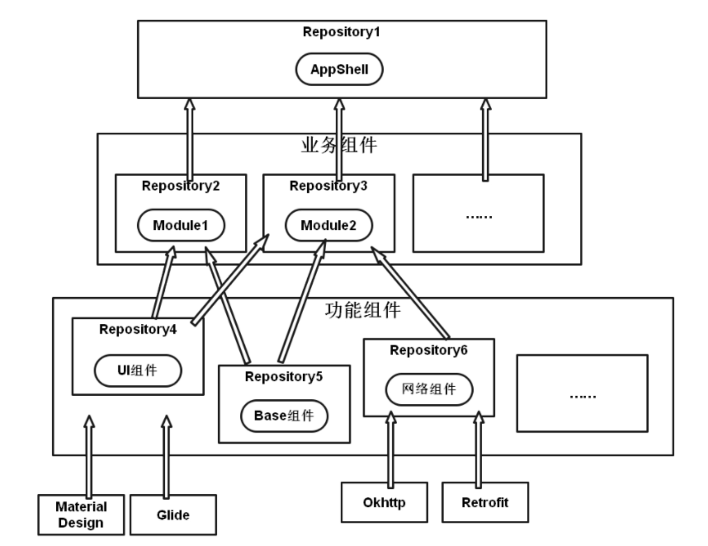 

图2-2 Android组件化架构图

目前流行的组件化方案主要有两种，如下：

（1）Sub-Module方案：整个项目只有一个工程，所有模块共用一个仓库，或者每个module创建自己的仓库，通过Git的子仓库功能进行管理。缺点是仓库分支复杂，代码耦合度较高，团队协作的时候容易发生冲突，而且每次调试都需要对所有的模块进行编译，耗时费力。

Sub-Module架构如图2-3所示：

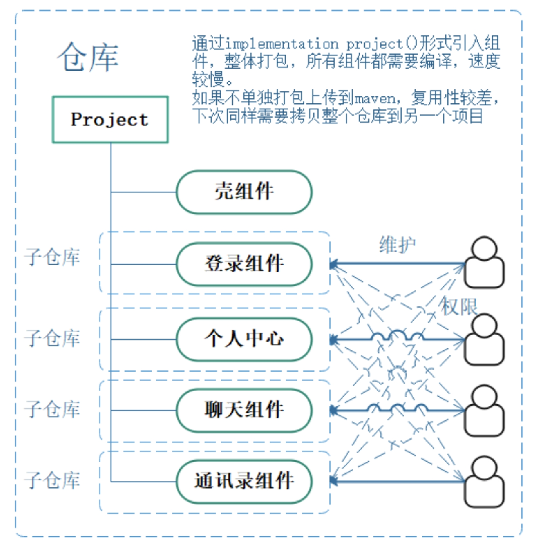 

图2-3 Sub-Module组件化模式

（2）Multi-Project模式：根据业务拆分工程，每个工程都包含壳模块和业务模块，将业务模块编译打包成aar上传至构件仓库，通过修改壳工程的依赖配置集成项目，通过git仓库的权限管理，可以保证代码不被他人修改查看，并且项目编译的时候不需要编译其他组件。

Multi-Project架构如图2-4所示：

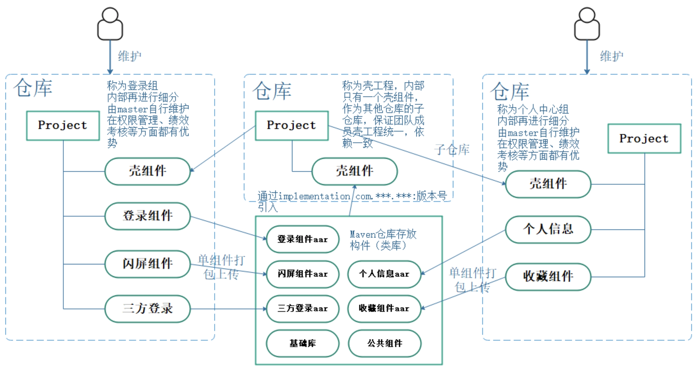 

图2-4 Multi-Project组件化模式

两种模式需要根据项目情况选择，主要取决于业务特性、团队规模、组件化细分粒度等条件。对于小型且不需要频繁迭代的团队选择Submodule模式较合适。对于大型团队且迭代频繁的团队选择Multi-Project方案较合适。本毕业设计决定选择第二种方案实现组件化方架构，并针对Multi-Project模式设计软件开发流程、前端交互和数据库结构等。

## 2.4 Docker虚拟化技术

Docker有几个概念[14]：

（1）Image（镜像）：用于创建Docker容器的模板。

（2）Container（容器）：是独立运行的一个或一组应用。

（3）Registry（仓库）：用于保存镜像，类似代码仓库，Docker Hub是官方的镜像仓库，提供了大量的镜像。

Docker的基本架构如下图2-5：

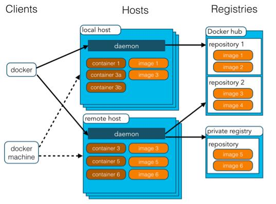 

图2-5 Docker架构图

开发者能够将他们的应用或服务打包成一个镜像，发布到镜像仓库上，用户可以从远程仓库中下载镜像，并且以镜像为模板创建具体的容器来运行软件。Docker使用操作系统虚拟化技术，为应用提供隔离的运行环境，不同容器之间没有任何关联。容器拥有独立的权限管理和资源管理，以及独立的网络环境，相当于一个独立的虚拟机，也就是说所有的程序开发环境都需要在容器内再安装一遍，并且需要配置环境变量。通过容器可移植的特性，可以实现一次构建、处处运行，而不需要针对不同系统重新进行构建和部署。

与虚拟机相比，它具有更轻量，启动更加快速等特点，并且同一台主机上可以运行多个Docker容器。Docker容器的原理是利用了Linux的命名空间、控制组等特性对容器进行隔离，降低了每个容器的系统开销。

另外容器删除后，容器内的数据会清空，因此需要使用类似Linux的挂载技术，将主机路径挂载到容器中，容器数据存放在主机目录下，重新创建容器时只需要指定数据挂载目录，即可实现持久化数据。

# 3 系统需求分析

本章将针对项目在接入持续集成平台前后的开发模式进行详细对比，来分析开发这套系统的必要性。

以Multi-Project组件化方案为例，在接入持续集成平台之前，整体的开发流程如图3-1所示：

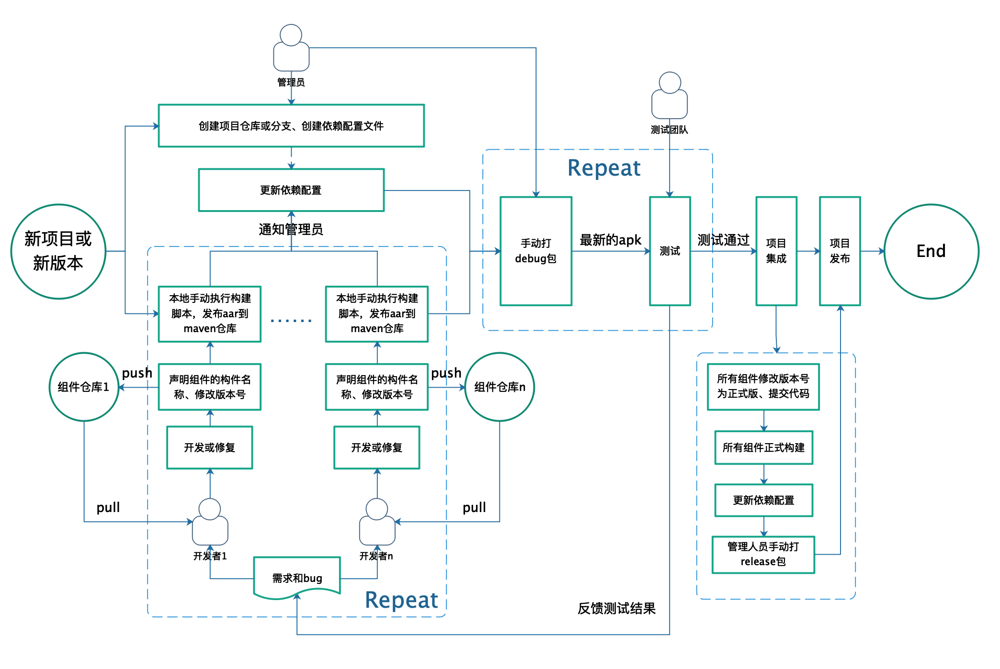 

图3-1 早期项目开发流程图

在上述流程中，存在以下几个缺陷：

（1）开发者需要手动在代码中定义构件名称并修改组件版本号，随源代码一起提交。可能会存在构件名称或版本命名不统一（包括版本前后命名不统一、不同成员间的不统一），测试版和正式版需要分别构建等，造成构件仓库混乱的问题。且Maven仓库限制除了snapshot的构件以外，其他构件不能拥有两个一样的版本号，因此可能会存在发布失败的情况。

（2）开发人员手动构建时间长，浪费了大部分开发时间，且开发者们的构建环境不一致，容易出现问题。

（3）管理员需要和多个开发者沟通、频繁进行重复性操作更新依赖配置，效率低下且容易出错。管理员每天都需要等待项目打包成功，将apk交付测试。

（4）集成操作复杂，需要各个组件负责人配合，可以合并为一个步骤。

在接入持续集成平台之后，整体的开发流程如图3-2所示：

 

图3-2 接入系统之后项目开发流程图

相比之前的方式，有了以下几点改进：

（1）平台可以对组件进行管理，组件创建需要指定代码仓库、分支等，由服务端记录和保存，并可以进行校验，如不允许添加重复组件等。且组件版本号按照一定规则递增，开发者不需要关心，只需要在平台上确认构建。避免了构件仓库混乱的现象。

（2）构建和集成的任务都在Jenkins服务中执行，减少了开发者编译和构建代码的时间，并且确保了构建环境统一。

（3）减少了管理员和开发者或者测试团队的沟通成本。所有组件和项目信息和构建历史记录都保存下来，所有人都能够随时查看，方便地定位错误，追溯问题。

（4）平台操作简便，学习成本低，可以供产品经理或者测试人员共同使用。

（5）平台可以实现自动化构建、质量检查、测试、集成、打包等功能，减少重复性操作，节约时间。

# 4 系统概要设计

如何合理的管理组件和项目，建立项目组件关联，方便用户使用是本系统要研究的最大的问题。并且需要结合团队和项目情况选择合适的方案，如构建时机选择手动触发、还是git自动触发或者定时触发。只有优化了管理和开发流程，本系统的意义才能真正体现出来。

## 4.1 系统功能

本系统主要分为五个部分：

（1）Android组件化项目：用于系统功能测试和演示。

（2）Maven私服：用于存放依赖包，通过Gradle插件可以进行软件包的上传和依赖库管理。

（3）前端网页：用于提供可视化的操作页面，供项目管理者、开发者、测试人员等使用。可以进行组件和项目的管理、构建，并且可以查看构建日志、应用下载地址等。并且实现表单检查、数据排序、筛选、查找等功能。简单易用，提高了项目开发过程的可见性。

（4）Web后端：用于响应前端请求，进行数据连接和CRUD操作，调用Jenkins API，接收Jenkins消息等，通过WebSocket实现主动推送。并且需要实现异常拦截、错误处理、日志记录等功能。

（5）Jenkins服务端：提供统一的构建环境，如git、python、gradle、java等，可以创建或执行后台自动化构建、发布等Job，并且实现版本控制和邮件通知功能。

由于Docker容器的隔离性，各容器之间系统、网络、端口等都是独立的，导致难以通信，包括宿主机访问容器，容器访问宿主机，容器访问公网，容器之间互相访问等存在问题。因此本系统实现的一个关键点在于系统间各个部分如何通信、连接，相互协作完成整个工作流程，以及如何进行事务控制，保证数据的正确性等。本系统最终采用以下方案：

（1）前后端使用http协议通信，前端发起http请求，后端进行业务处理，然后对请求进行响应，关闭连接。

（2）由于某些请求如后台构建，无法立即响应结果，因此需要实现后端主动向前端推送通知的功能。可以通过轮询、长连接、WebSocket实现，本系统采用WebSocket。

（3）后端与Jenkins之间可以通过http或者RPC协议进行通信，这里选择http，Jenkins服务提供了RESTFul API供后端调用。Jenkins在执行完任务之后可以通过python或者shell脚本发起http请求。

（4）Jenkins服务通过gradle插件上传应用包到Maven仓库。

（5）Jenkins服务使用Git工具对Android项目进行版本控制。

## 4.2 架构设计

系统架构设计如图4-1所示：

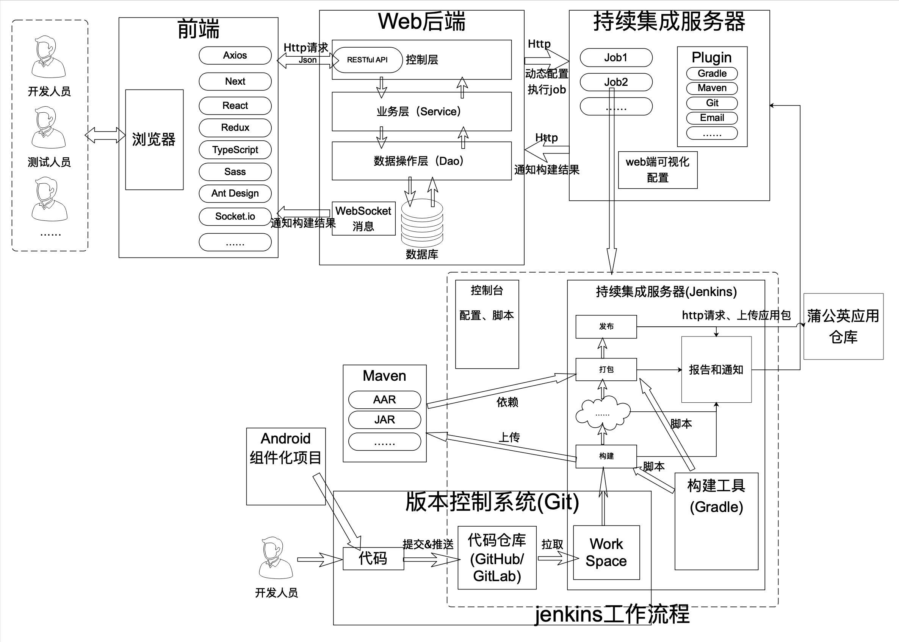 

图4-1 CI系统架构图

## 4.3 团队协作开发流程

接入持续集成系统后大大地能够优化团队android组件化项目的开发流程，减化了开发者和管理员的部分重复性操作，降低了沟通成本，所有的构建都在远程执行，保证了构建环境的一致，并且开发人员不需要忙等。预期工作流程如图4-2所示，流程如下：

（1）开启新项目时由管理员在平台上创建并配置好项目信息。开发人员创建或更新各自的组件信息。

（2）开发人员拉取最新代码，进行开发或修复问题，提交代码到远程仓库，之后在平台上点击构建组件。

（3）管理员更新项目依赖的组件版本，通过邮件或者红点提示知道是否有新版本。

（4）管理人员在平台上手动点击构建项目，也可以设置定时自动构建，或者git触发构建。项目构建完成后自动上传apk到蒲公英应用托管仓库，并且返回下载地址。

（5）测试团队可以在平台上点击下载地址，进入下载页面，获取最新的应用包进行测试，并反馈测试结果给开发者。

（6）循环3-5步，直到项目开发完成，测试通过，管理员可以集成并发布项目。

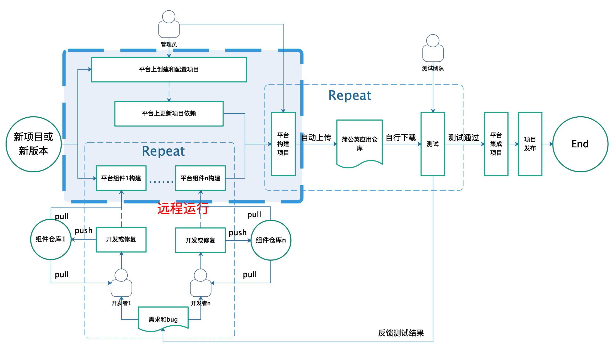 

图4-2 预期团队开发流程

## 4.4 系统内部运行关键流程

### 4.4.1 创建组件流程

创建组件需要填写组件基本信息，限制不允许出现同名组件，同时Jenkins服务端根据配置模板创建相应的Job，创建成功之后数据库会插入组件信息，创建失败则不插入，最后前端根据返回的结果弹出相应提示。具体流程如图4-3所示。

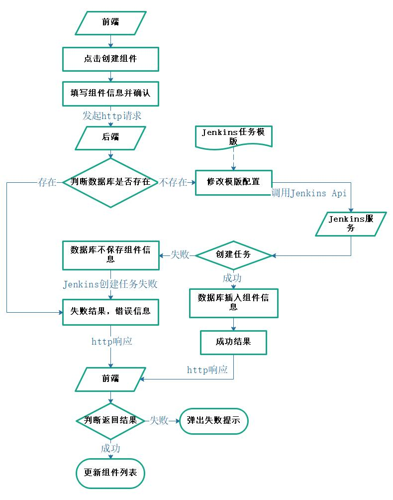 

图4-3 组件创建流程

### 4.4.2 组件构建流程

构建组件会在后台执行，前端请求成功之后更新组件状态为正在构建，同时Jenkins服务端开始执行Job，从远程仓库拉取代码，修改版本号，接着对组件源码进行编译和打包，上传aar包到Maven私服，然后提交代码。最后通知后端任务执行结果，后端保存构建记录并将结果发送到前端，前端更新组件信息和构建历史。同时任务执行结果还会以邮件形式通知到用户。具体流程如图4-4所示。

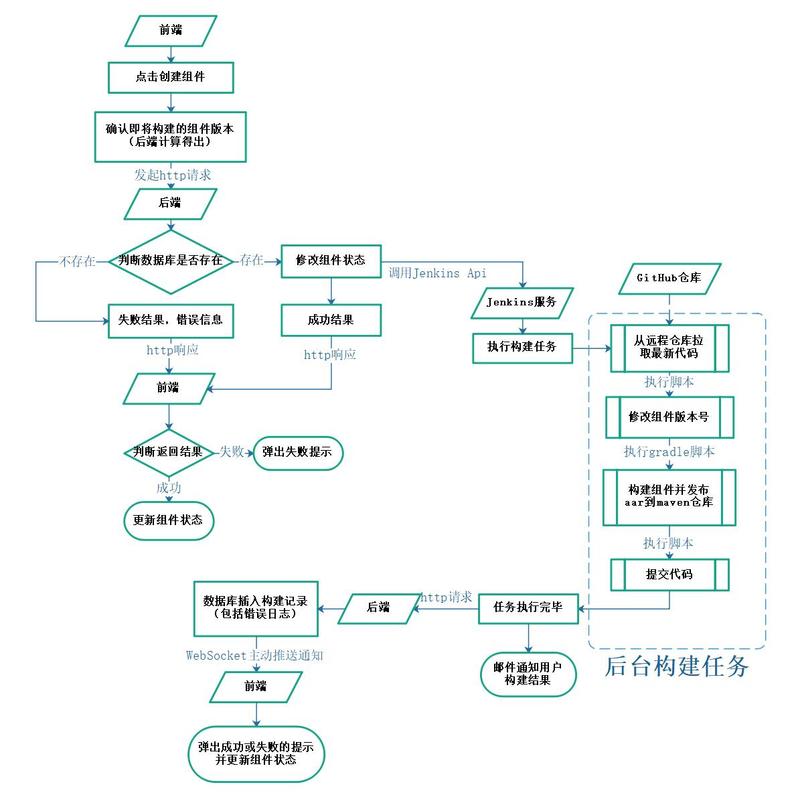 

图4-4 组件构建流程

 

### 4.4.3 项目集成流程

项目集成同样在后台执行，Jenkins Job会更新项目依赖，获取最新依赖包，进行项目编译和打包，将打出来的应用上传到应用托管仓库，并且提交代码。最后通知后端任务执行结果，后端保存记录并将结果发送到前端，前端更新项目信息和构建历史，并且能够链接到应用下载地址。同时任务执行结果会以邮件形式通知到用户。具体流程如图4-5所示。

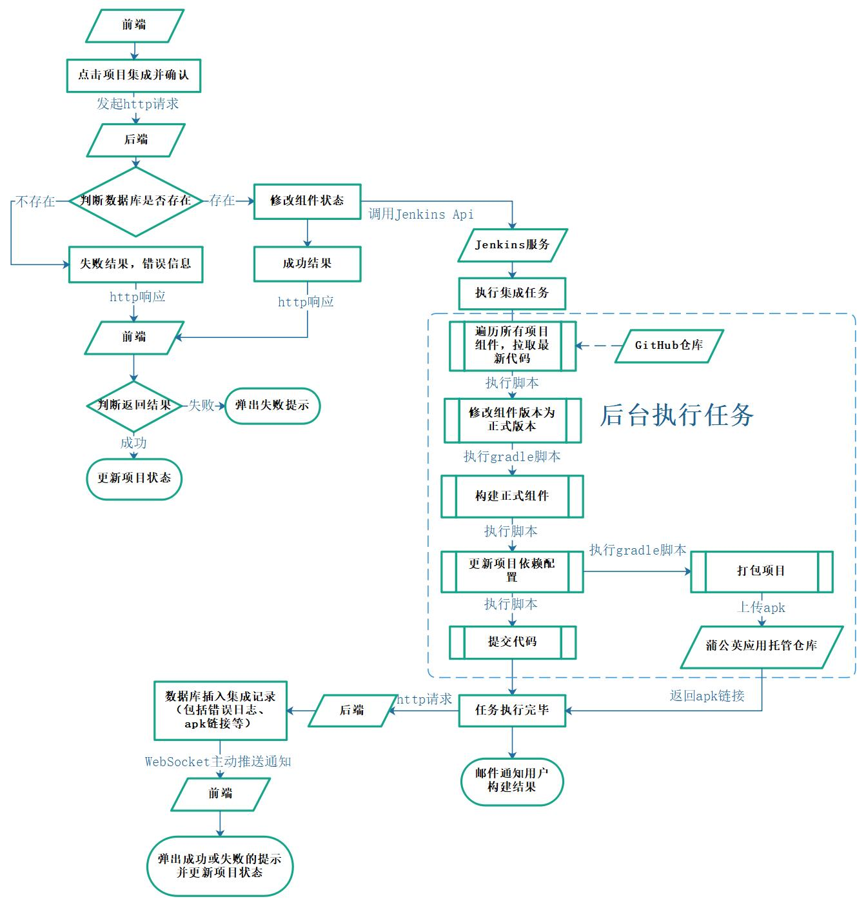 

图4-5 项目集成流程

 

# 5 系统实现

整个系统实现步骤和流程如图5-1，首先研究相应的技术，各部分先单独实现和测试，再进行各个部分的联调测试。最终通过案例进行整体的流程测试，优化功能和代码结构。

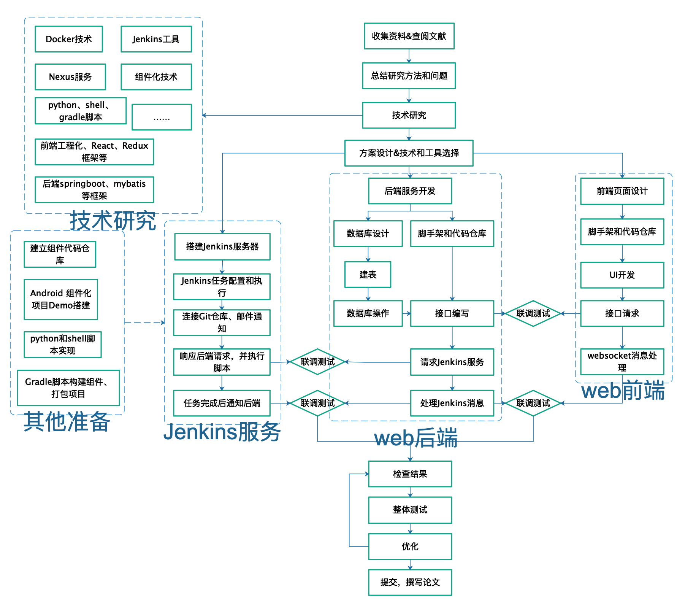 

图5-1 系统实现步骤和流程

## 5.1 组件化方案实现

从GitHub下载了一个开源的Android项目作为演示项目，功能较简单，实现了主页、每日新闻，每日图片等功能[15]。案例效果图如5-2

 

图5-2 组件化案例效果

使用Multi-Project组件化方案对其进行改造，所有组件都包含壳模块，最终拆分为6个工程，分别为：

（1）壳模块：只包含Android工程中主模块的代码，用于管理依赖包、存放项目构建和打包等配置以及其他一些资源，如apk签名文件，多国语言包等。

（2）壳组件：不包含业务模块，只作为壳工程，用于打包apk。

（3）公共组件：属于基础组件，包含基础类、公共类等代码和公共资源，作为底层库供所有业务组件使用。

（4）主页组件：实现了应用的Home业务，由Home页面可以跳转到新闻页面和图片欣赏页面。

（5）新闻组件：实现了查看每日新闻业务。

（6）美女图片组件：实现了图片欣赏业务。

### 5.1.1 代码版本控制工具

本系统使用GitHub作为代码仓库，共建立了6个代码仓库，分别存放上述6个工程。其中壳模块使用Git工具的submodule功能，作为所有组件的子模块，存在于其他5个工程之中。子模块本质也是一个代码仓库，只不过通过submodule将其与其他工程关联起来。

本方案中壳模块只用于存放依赖配置和部分资源，由管理员或持续集成平台对其进行更新和提交代码，其他组件只能通过壳模块获取最新的配置，并用其进行打包，在其他组件中不建议直接修改壳模块文件，或者向壳模块提交代码，即使修改了也应该只用于本地临时使用，正式使用仍然需要拉取远程仓库的代码覆盖本地配置，可以对该仓库进行代码提交的权限控制。

Git的sumodule相关配置在.gitmodules文件中，如图5-3所示，声明了子模块的名称，仓库地址，分支等。在工程目录下可以通过git submodule update –remote命令拉取子模块的最新代码，或者进入子模块目录下使用git pull命令拉取代码。

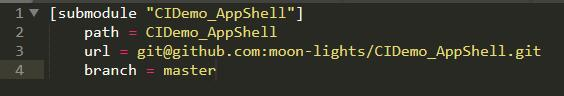 

图5-3 Git子模块配置文件

### 5.1.2 Gradle构建工具

Gradle是一个类似Ant和Maven的开源项目构建工具，使用Groovy语言的DSL（领域特定语言）来配置项目。提供依赖管理、多工程管理和局部构建功能，并且对脚本和插件支持良好。

可以通过IDE或者使用Gradle命令行执行构建、打包等Task。此外，Android项目还支持使用Gradle包装命令的方式来构建、打包Android的组件和项目：

（1）构建组件：使用maven插件配置构件名称、版本等信息。如图5-4所示。然后在工程目录下执行gradlew :组件名:upload，即可自动构建组件，并上传aar包到依赖仓库。

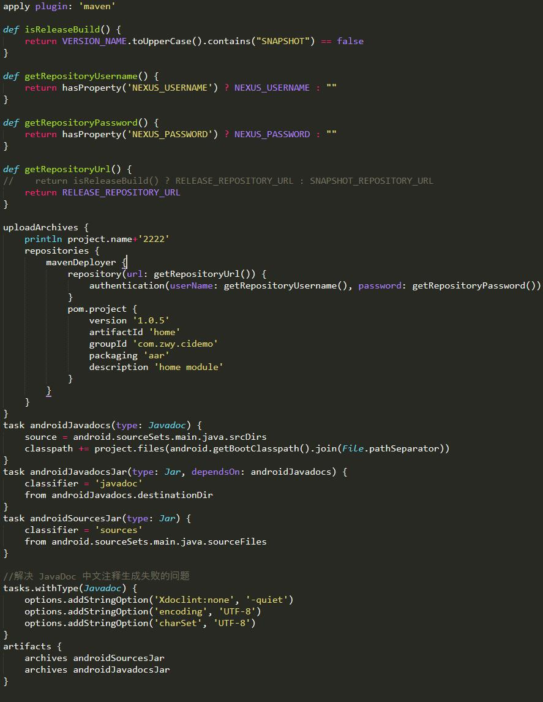 

图5-4 组件打包上传配置

（2）打包项目：进行Android项目的相关配置，然后在工程目录下执行gradlew assembleDebug来打包Debug版apk，通过assembleRelease来打包正式版的apk。

## 5.2 Docker搭建Maven私服

### 5.2.1 Docker安装

本系统通过Docker部署Maven私有仓库，需要安装Docker，步骤如下：

首先需要开启Win10虚拟化技术：打开Windows程序和功能->启用或关闭Windows功能->选中Hyper-V。如图5-5所示。然后从官网下载Docker for windows并按照提示安装即可。

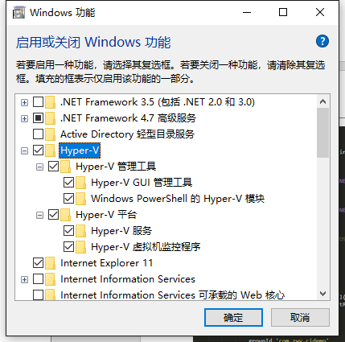 

图5-5 Win10开启虚拟化技术

由于国内下载Docker镜像速度较慢，因此需要配置镜像加速器，这里使用官方中国区镜像地址，配置方式如图5-6所示：

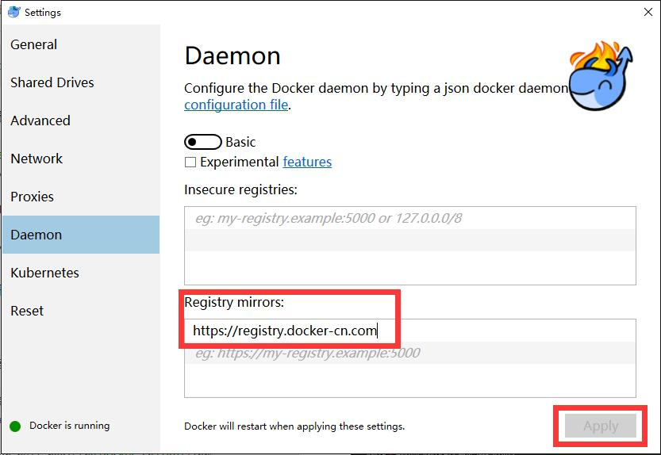 

图5-6 Docker国内镜像源地址

### 5.2.2 Nexus服务搭建

首先通过【docker search nexus】命令查找Nexus镜像，如图5-7可以看到有很多镜像可以选择，这里选择第一个镜像：sonatype/nexus3。

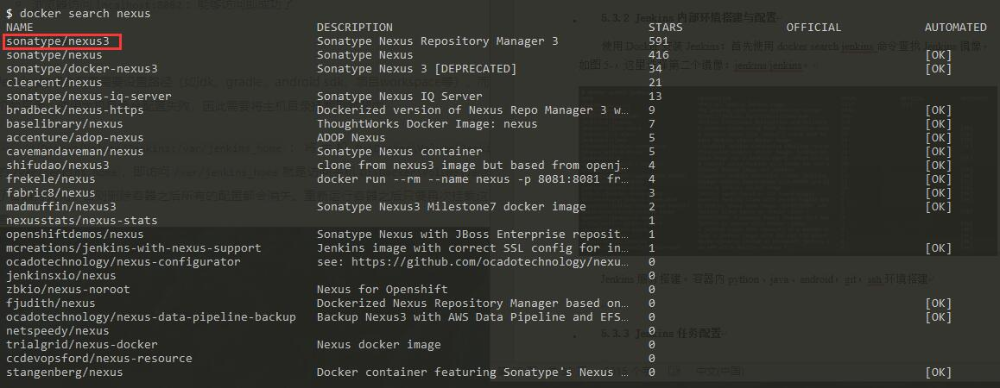 

图5-7 Docker搜索Nexus镜像

然后使用【docker run -d -p 8081:8081 --name nexus3 -v /d/Docker/Volume/Nexus3:/nexus-data sonatype/nexus3】命令运行nexus3容器。其中【docker run [OPTIONS] <IMAGE>】命令用来创建并运行容器，如果本地没有镜像，则会从Docker Hub获取。

运行成功后，可以访问8081端口，出现图5-8页面则表示Nexus服务成功运行。

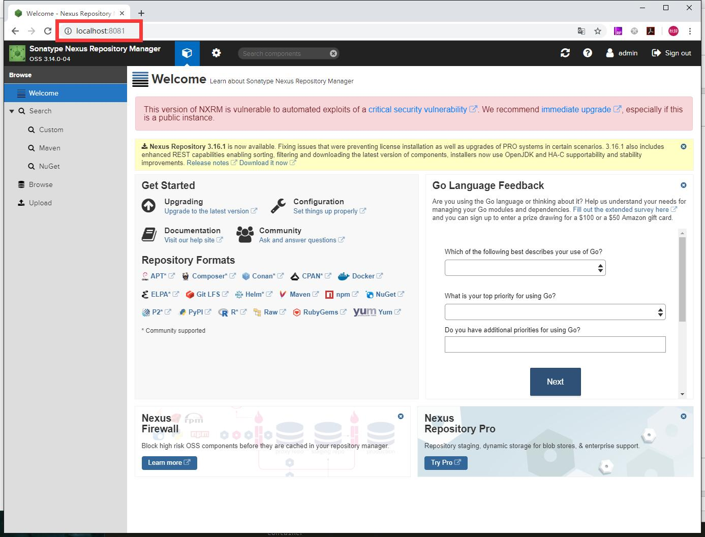 

图5-8 Nexus服务运行结果

可以使用docker ps命令查看正在运行的容器，如图5-9所示

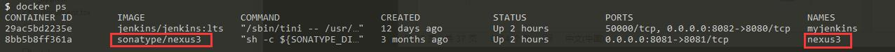 

图5-9 Docker查看正在运行的容器

## 5.3 持续集成服务器搭建

### 5.3.1 Jenkins持续集成工具

Jenkins是一款开源的持续集成工具[16]，具有丰富的插件系统，支持任何类型的构建或集成，并且提供自动化构建、分布式构建、邮件通知等功能。其本质上是一个服务，用户可以通过可视化的Web操作页面配置和执行任务，并且提供了RESTful Api的访问形式，开发者可以通过调用相应的Api来动态的配置任务、执行任务、获取任务信息和构建信息等。

### 5.3.2 Jenkins安装与配置

本系统使用Docker来安装和运行Jenkins。

（1）首先执行docker search jenkins命令查找Jenkins镜像，如图5-10，这里选择第二个镜像：jenkins/jenkins。

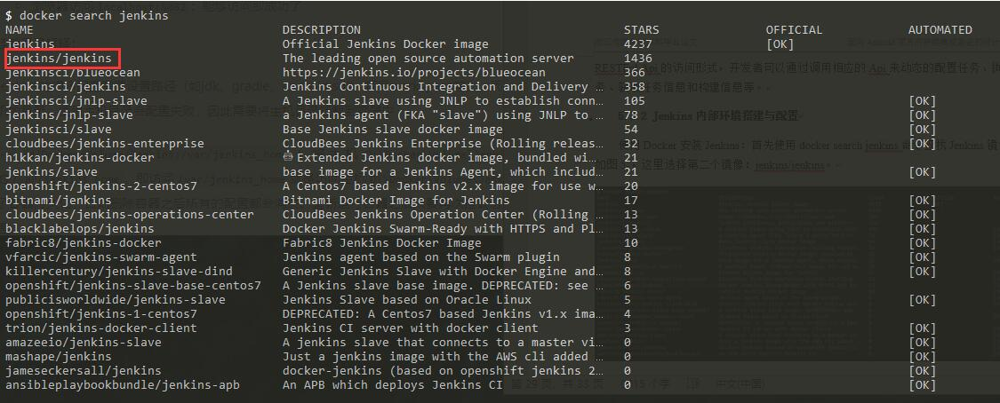 

图5-10 Docker搜索Jenkins镜像

（2）运行docker pull jenkins/jenkins拉取镜像到本地。

（3）输入【docker run -p 8082:8080 -d --name myjenkins -v /e/ASproject:/var/as_project -v /d/android-sdk-windows:/var/android_sdk -v /d/Docker/Volume/Jenkins:/var/jenkins_home jenkins/jenkins:lts】命令运行Jenkins容器。

（4）浏览器访问8082端口，出现页面则表示Jenkins服务启动成功[17]，如图5-11。

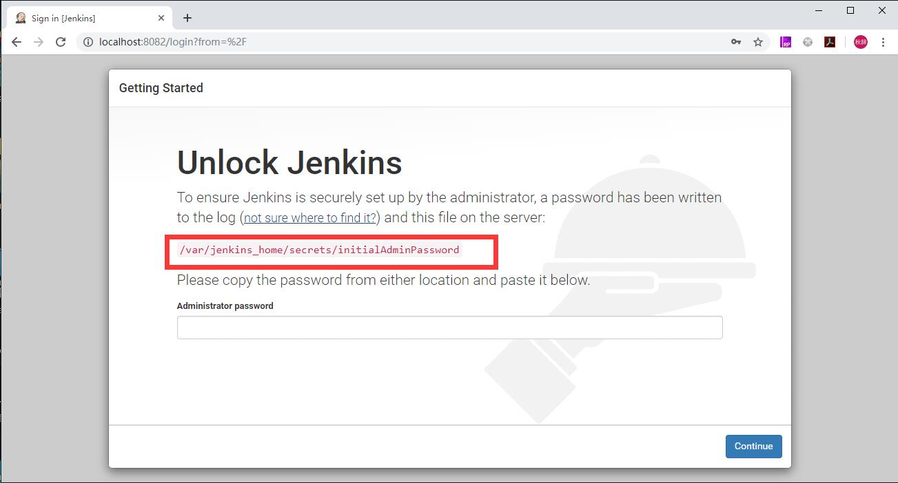 

图5-11 Jenkins服务运行结果

（5）首次启动需要初始化密码，上图所示路径为Jenkins容器中的路径，无法直接通过宿主机访问，需要进入该容器内部访问，使用docker exec命令访问容器，然后进入/var/jenkins_home/secrets/文件夹下查看初始密码。如图5-12所示。输入密码进入下一步。

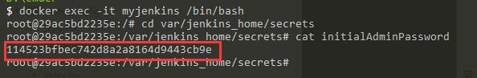 

图5-12 Jenkins进入容器内部查看文件

（6）根据提示安装插件，创建Jenkins用户，完成之后进入Jenkins主页，如图5-13所示

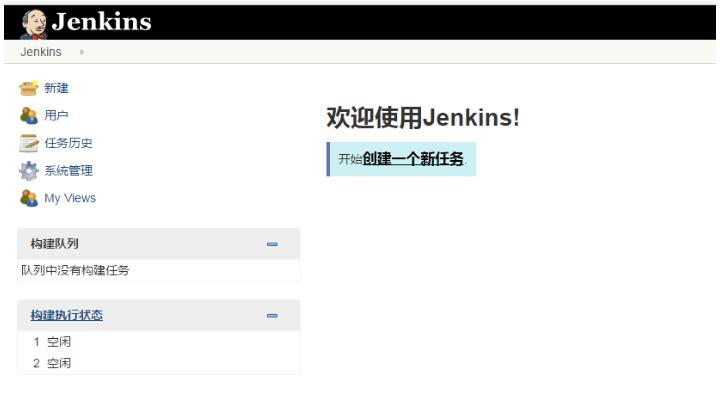 

图5-13 Jenkins主页

（7）Jenkins的说明文档采用REST API样式，URL格式如Jenkins资源/api。常用的资源有主机名、Job和Build等。如：localhost:8082/api

### 5.3.3 Jenkins容器内部环境搭建

由于容器与宿主机是完全隔离的，因此容器内无法使用宿主机环境，需要在容器内部重新设置环境变量。在Docker容器中配置环境变量有以下方式：

（1）由于Docker基于Linux操作系统，因此可以通过【docker exec -it myjenkins /bin/bash】命令开启交互模式终端，进入容器内部，接着使用Linux的方式，如apt或者wget等工具安装软件即可。

（2）使用挂载的方式，将宿主机已经安装好的软件目录挂载到容器中的某个目录下，接着进入容器内部设置环境变量即可。

接下来介绍下本系统中Jenkins如何搭建需要的环境：

（1）Java环境：本版本的镜像自带了Java环境，因此不需要再次安装，可以进入容器内部，执行【java -version】命令查看java版本。如下图5-14所示

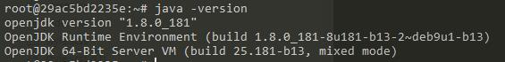 

图5-14 Jenkins验证java环境

（2）Android环境：上面启动容器的时候已经将宿主机的Android SDK目录挂载到了Jenkins容器中，因此直接配置环境变量即可。在主页->系统管理->系统设置->找到环境变量，如下图5-15配置。注意这里的路径为挂载后容器内的路径。

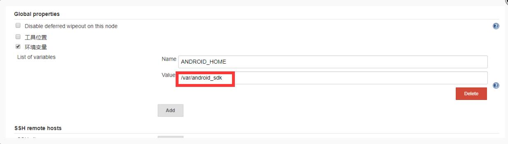 

图5-15 Jenkins配置Android环境

（3）Gradle：同样地，将宿主机Gradle安装文件夹挂载到容器内部，在主页->系统管理->全局工具配置->找到Gradle，如下图5-16配置。

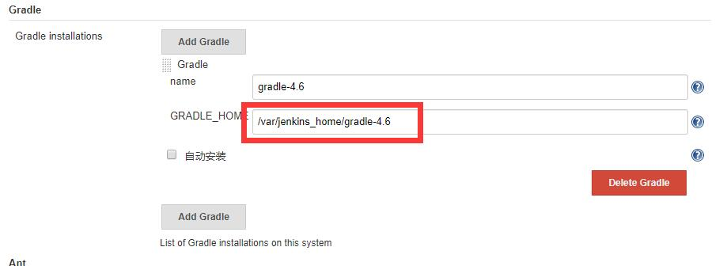 

图5-16 Jenkins配置Gradle

（4）Python环境：这个版本的Jenkins镜像自带了Python2的环境，可以进入容器内部，使用【python –v】命令查看Python版本。但是缺少Pip工具，同样地进入容器内，如图5-17完成安装。出现Pip版本号则表示安装成功。

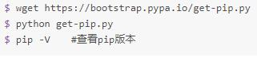 

图5-17 Jenkins安装pip

（5）Git环境和SSH登录配置：这个版本的Jenkins镜像自带了Git环境，可以进入容器内部，使用git -v命令打印版本信息。GitHub支持以SSH协议访问Git仓库，避免每次输入用户名和密码。

首先进入容器内部，通过【ssh-keygen -t rsa -C 邮箱】生成密钥对，然后进入~/.ssh目录下，查看公钥信息，如图5-18所示。

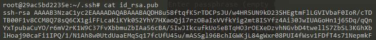 

图5-18 Jenkins配置SSH登录

将公钥拷贝到GitHub设置页面的如下图5-19的位置，然后点击添加。

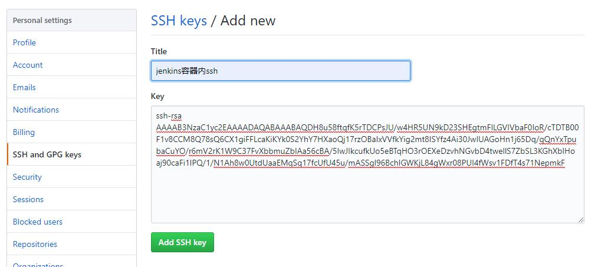 

图5-19 GitHub配置SSH keys

最后可以使用`ssh -T git@github.com`命令验证是否配置成功。

### 5.3.4 Jenkins任务配置

在Jenkins主页点击新建任务->输入名称->选择任务类型->……，这几步较简单，创建完成后任务界面如图5-20所示。

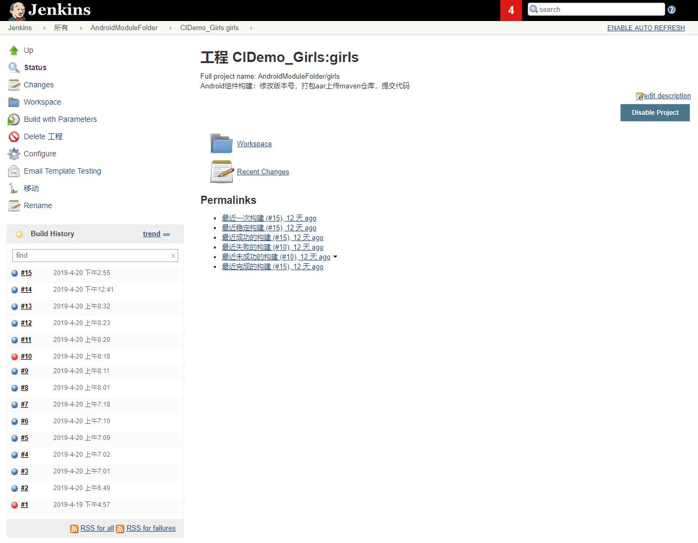 

图5-20 Jenkins任务页面

从左侧Configure项进入任务配置页面，这里只介绍几项关键配置：

（1）参数和工作区配置：点开General->Advanced，定义构建任务需要传入的参数，参数可以有多种类型，如下图5-21所示，输入工作区路径，注意这里的路径是Jenkins容器内部路径。

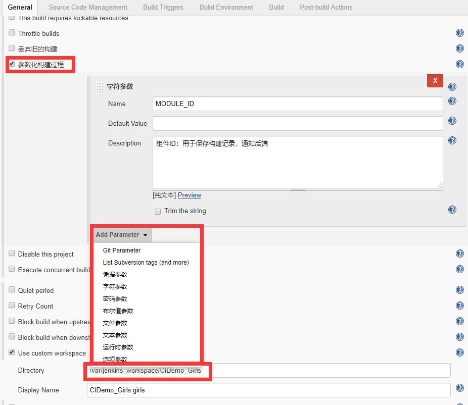 

图5-21 Jenkins任务配置页面

（2）脚本配置：即任务执行的具体内容，可以执行多种类型的脚本，或者根据需要安装不同的插件来执行命令。如图5-22所示，

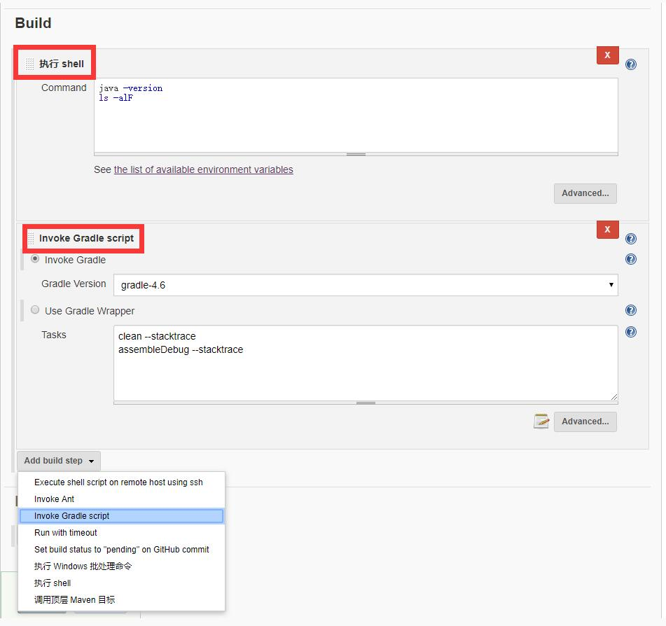 

图5-22 Jenkins任务脚本配置

（3）Jenkins的任务配置是以xml文件形式保存的，可以通过Jenkins的API接口查看指定任务的配置，如图5-23所示。

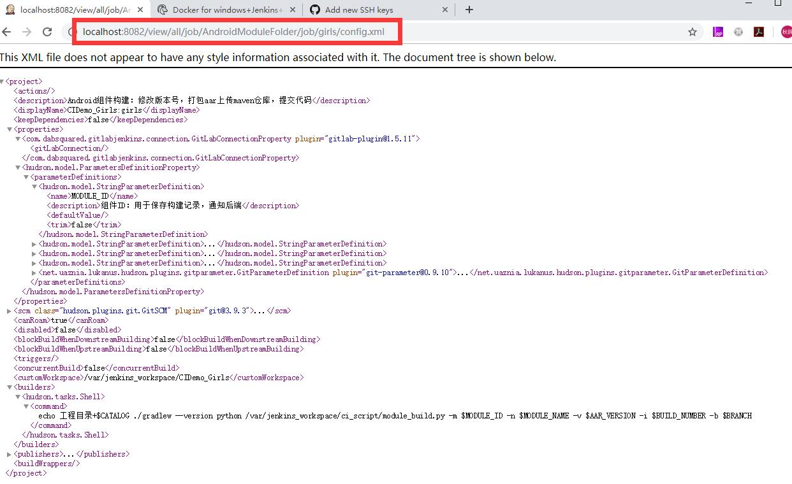 

图5-23 Jenkins API形式查看配置

（4）在任务界面点击Build With Parameters执行参数化构建->输入参数值->点击Build开始构建任务->点击任务界面左侧构建历史可以查看构建结果。如下图5-24

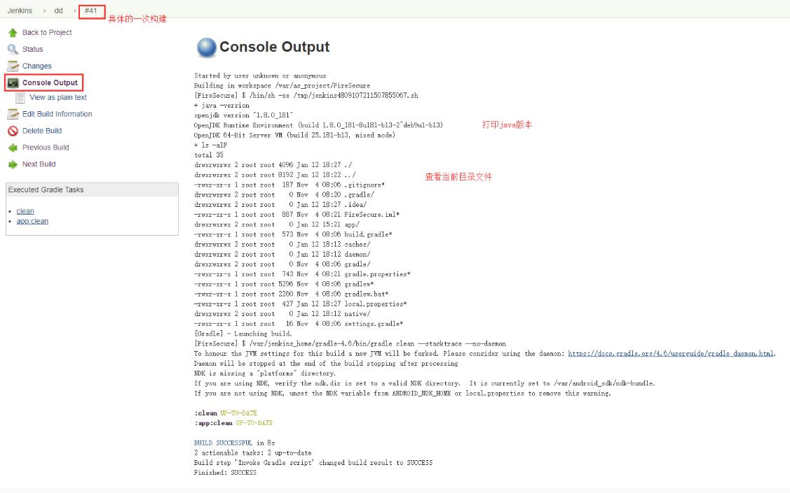 

图5-24 Jenkins构建结果日志

### 5.3.5 脚本实现

Jenkins自动化构建实质上就是定时执行各种任务脚本，如shell脚本、python脚本、gradle等，或者根据需要安装其他插件，本系统主要使用python语言，其中封装了shell命令、gradle命令，git命令等，由python统一运行。

### 5.3.6 邮件通知

由于Jenkins是在后台执行，用户不用在任务执行的时候忙等，但是这样有可能造成用户因为某些原因没有及时查看构建记录或者及时修复失败构建。因此需要加入邮件通知的功能，及时推送构建结果到用户邮箱。

Jenkins集成了邮件通知功能，完成任务时可发送邮件通知指定用户，但是由于格式固定，不够灵活，因此本系统决定采用Email Extension插件实现邮件发送，配置如下：

（1）安装插件：在Jenkins主页面点击系统管理->插件管理->找到Email Extension Plugin并安装。安装完插件后在系统管理->系统设置中会显示Extended E-mail Notification配置项。

（2）邮件全局配置：用于定义邮件模板，邮件发送人等，并开启邮箱服务，邮箱服务可以有多种选择，这里使用腾讯邮箱提供的SMTP服务，如图5-25。

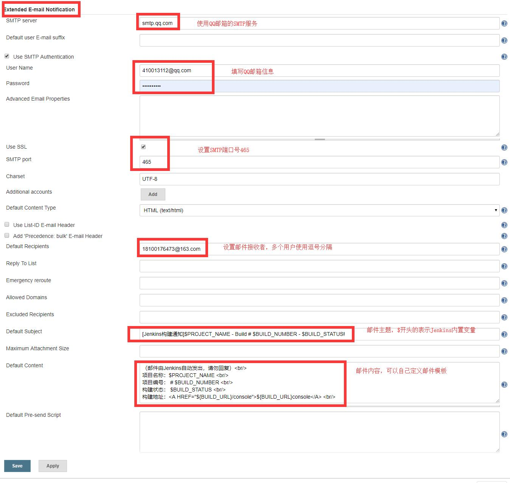 

图5-25 Jenkins邮箱服务配置

（3）任务添加邮件通知：配置了邮件模板之后还需要在具体的任务中添加邮箱通知功能。如图5-26所示，在任务配置->Post Build Actions->选择Editable Email Notification。出现邮件插件配置项。

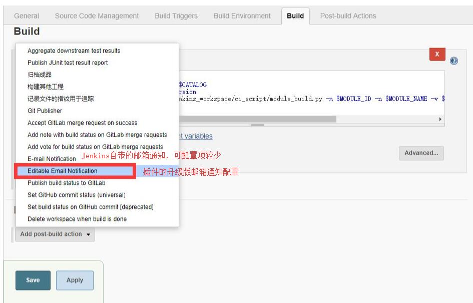 

图5-26 Jenkins任务邮件配置

（4）邮件具体配置：如图5-27所示，可以针对具体的任务修改邮件内容。并且提供了邮件触发条件的功能，如Always表示总是发送邮件，Success表示只在任务执行成功的时候才触发邮件通知等。

 

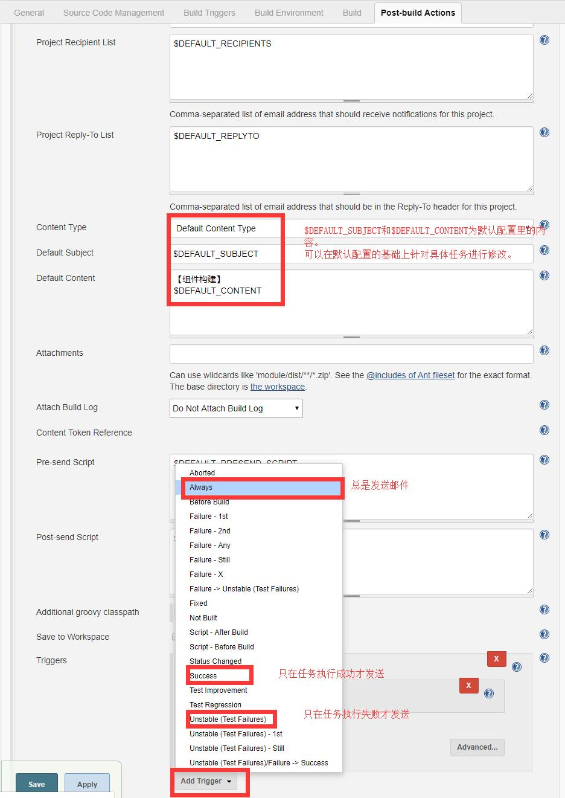 

图5-27 Jenkins任务邮件配置

（5）邮件通知结果：如图5-28为邮件内容，包含组件信息，构建编号，构建状态，构建结果地址等。

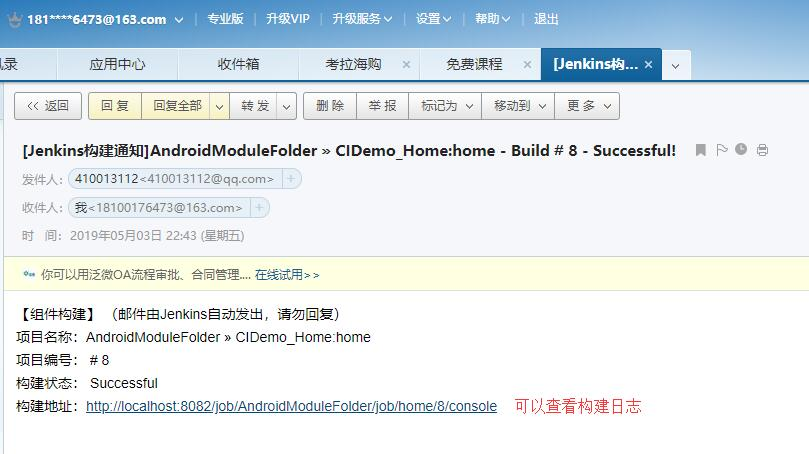 

图5-28 Jenkins邮件通知结果

## 5.4 前端实现

### 5.4.1 Node.js环境安装

Node提供了模块化功能，可以方便的引入模块，并且可以使得JavaScript能够进行服务端的开发。Node的出现影响着前端开发的模式，促进了前端工程化的发展。本系统使用Node中的Npm的包管理功能进行前端开发。

首先从官网上下载Node.js并安装，程序会自动设置好环境变量，安装成功后使用【node –v】和【npm –v】命令检查Node和Npm版本。Npm通过模块下的package.json来定义包的属性，包括包名、版本号、作者、依赖包信息等，可以使用【npm install <Module Name>】命令安装Node模块。由于国内使用npm的官方镜像下载模块速度比较慢，因此使用其他镜像替代。以淘宝镜像源为例，主要有三种配置方式，本项目采用第三种配置方法，配置方式如下：

（1）使用【npm config set registry http://registry.npm.taobao.org】命令设置镜像，使用npm config get registry查看镜像。使用本方式可以持久使用，缺点是对当前机器的所有项目起作用。

（2）使用【npm –registry http://registry.npm.taobao.org install <Module Name>】安装模块，本方式只适合临时使用，缺点是每次安装模块都需要指定镜像源。

（3）在工程目录的.npmrc配置文件中写入镜像源地址，添加【registry=http://registry.npm.taobao.org】。这样做的好处是只针对当前项目起作用，并且只需要拷贝这份配置文件即可移植到新工程中。

### 5.4.2 前端工程化建立

随着前后端分离概念的流行，后端工程师不用再关注前端页面，前端工程师的职责越来越重，能做的事情更加多了，随之而来的是前端项目逐渐庞大，需要考虑开发效率和后期维护等问题，因此，势必走上前端工程化的道路。前端工程化简单的讲就是把复杂不可控的项目变成简单可控的流程，从而提供开发效率，降低风险，是软件工程化在Web前端开发实践中的应用。具体到实践则包含技术框架选型、应用脚手架、代码版本控制、UI组件化、代码质量检查、代码编译、应用构建、打包发布等流程。由此也产生了各种框架和工具。

本系统前端使用Next.js服务端渲染框架搭建，基于React框架，使用Redux框架实现React状态管理，使用TypeScript和Sass等预处理语言替代JS和CSS，UI框架主要使用蚂蚁金服的AntDesign，使用axios框架进行网络请求，WebSocket则利用socket.io框架实现。

本系统脚手架工具使用create-next-app，其中提供了Next.js+AntDesign方案。具体步骤如下：

（1）执行【npm install -g create-next-app】命令安装脚手架。

（2）执行【create-next-app next-ant-app】初始化工程。

（3）在package.json文件中配置依赖库、npm脚本、应用名、版本等信息，如图5-29所示，并运行【npm install】命令安装依赖库。

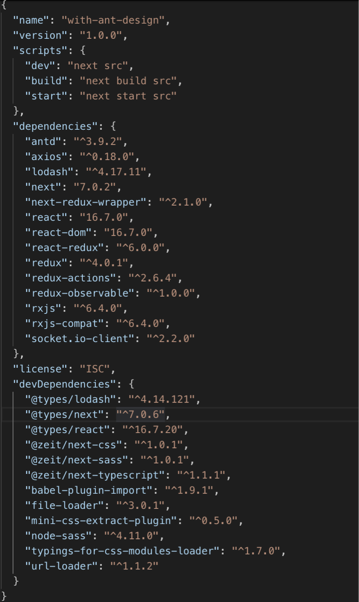 

图5-29 前端npm配置

（4）在.babelrc添加babel配置，如图5-30所示。

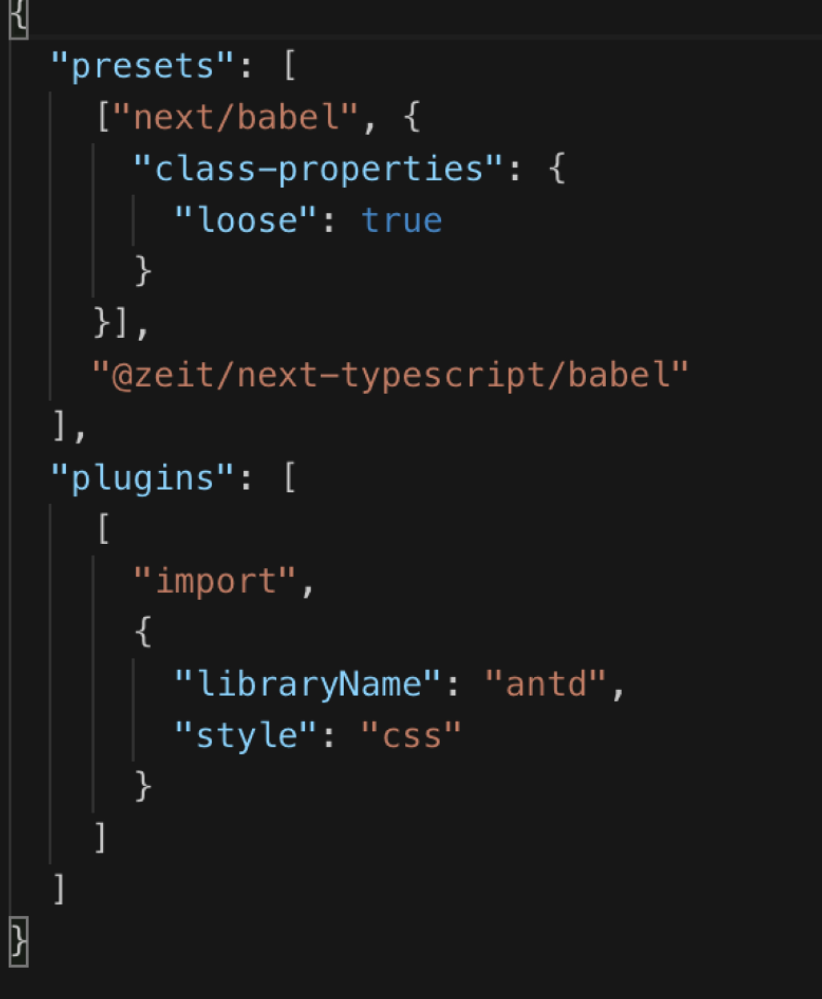 

图5-30 前端babel插件配置

（5）在next.config.js文件中配置TypeScript、Sass处理以及图片、CSS资源等打包，如图5-31所示。

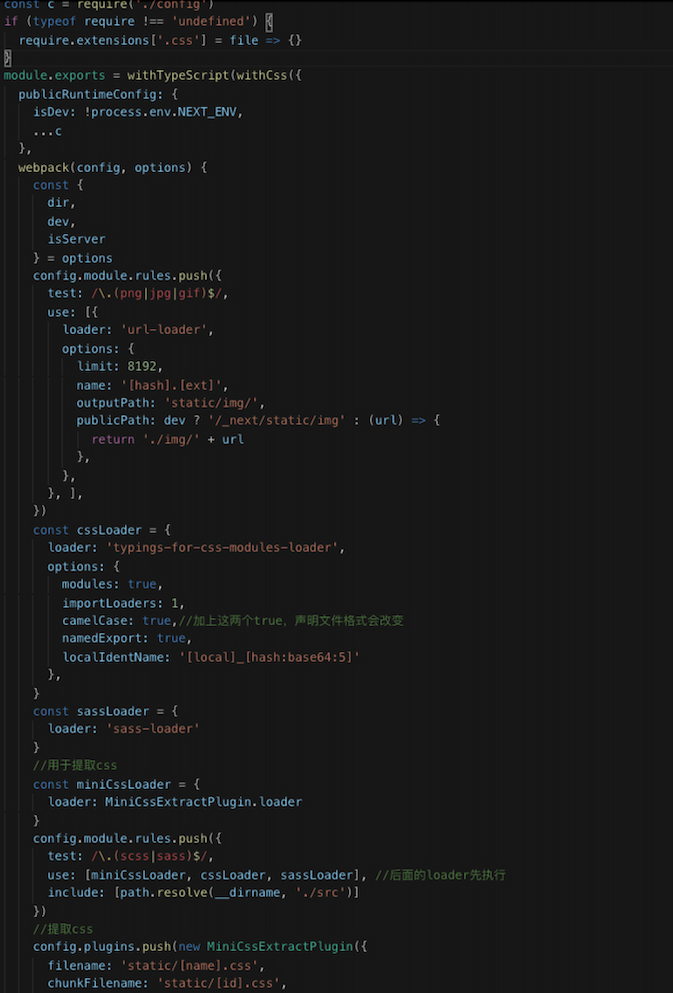 

图5-31 前端next.js配置

（6）工程目录划分如图5-32。其中components目录可以存放ui组件，layouts存放公共布局，lib封装了http请求方法，pages存放页面代码，static存放静态资源，styles存放公共样式，utils存放工具类。.babelrc用于配置babel插件，tsconfig.json用于配置TypeScript处理等。

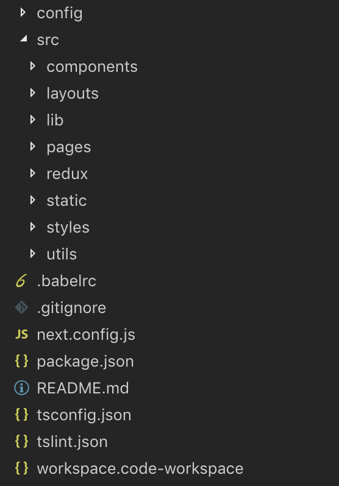 

图5-32 前端工程目录

（7）配置完毕后执行npm run dev运行服务，默认端口号为3000，可以在浏览器上访问3000端口打开前端页面。

### 5.4.3 前端部分页面展示

前端页面布局主要分为侧边栏，右侧分为顶部导航、Breadcrumbs、内容、页脚。交互方面主要实现了全局消息提示、通知弹窗、确认弹窗以及表单对话框等。

（1）组件管理页面，实现了分页和排序功能，超过十条数据自动分页。请求成功后，顶部出现消息提示交互。效果如图5-33。

 

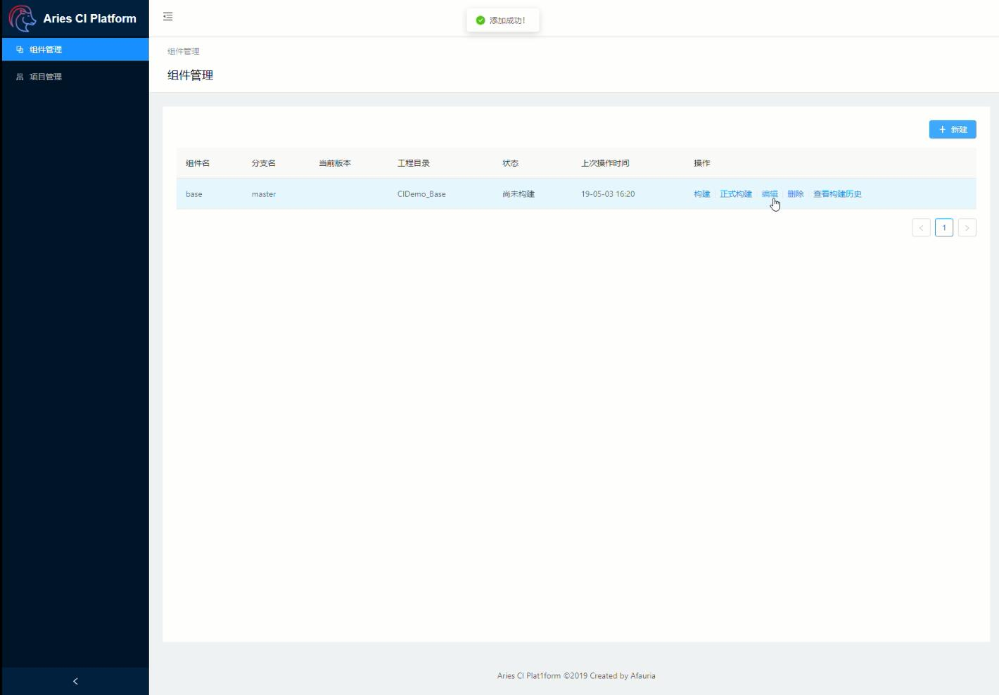 

图5-33 组件管理页面

（2）表单对话框，实现了表单验证功能。效果如图5-34。

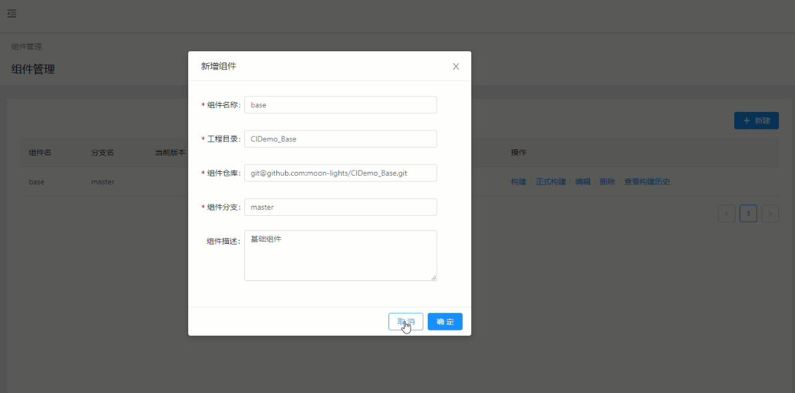 

图5-34 创建组件页面

（3）构建历史页面，使用表格控件，倒序显示。效果如图5-35。

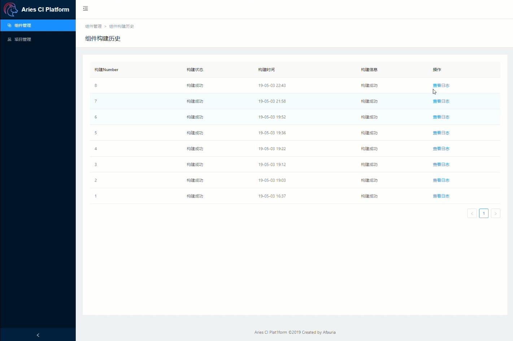 

图5-35 构建历史页面

（4）项目详情页面，实现了下拉框联想功能，即根据条件自动更新下拉框选项。效果如图5-36。

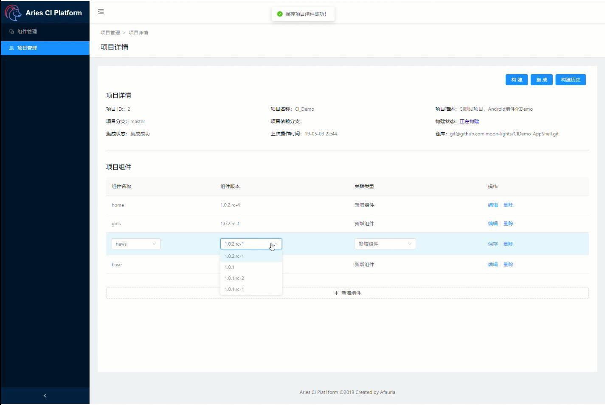 

图5-36 项目详情页面

（1）交互效果：通知弹窗和确认弹窗如图5-37所示。

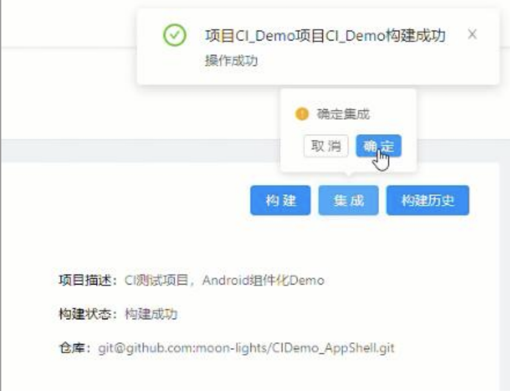 

图5-37 通知和确认弹窗效果

## 5.5 后端实现

### 5.5.1 后端架构

本系统采用前后端分离方式开发，后端只负责提供接口数据，不涉及View层，基于Springboot和Mybatis框架实现，共分为三层：

（1）Controller层（控制层）：负责接收前端请求，并调用相应的业务模块执行逻辑。同时可以在这一层对数据进行拆装，转换为前端和业务层需要的数据。

（2）Service层（业务层）：实现业务模块逻辑，包括任务执行，调度，事务控制和异常处理等。还负责调用Dao层操作数据。对外只暴露业务接口。

（3）Dao层（数据操作层）：实现数据库操作，在xml文件中定义数据库操作语句，通过mybatis框架解析和执行。

架构图如5-38所示。

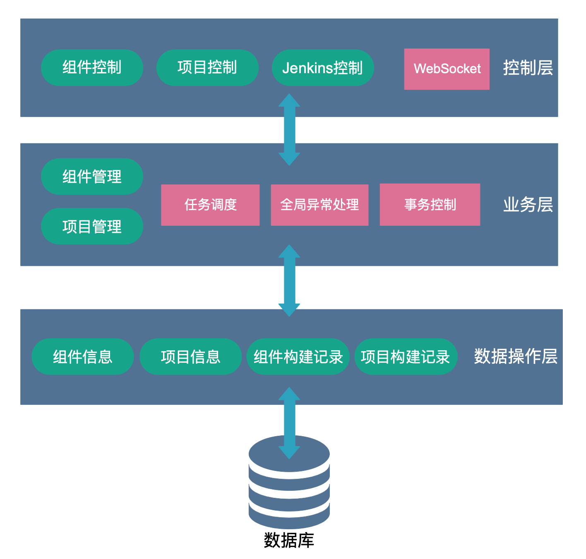 

图5-38 Web后端架构图

### 5.5.2 功能实现概述

（1）组件管理业务：包含组件、组件构建记录、Jenkins组件任务的CRUD功能，以及组件构建和Jenkins组件任务的执行。

（2）项目管理业务：包含项目、项目构建记录、Jenkins项目任务的CRUD功能，以及项目构建、集成和Jenkins项目任务的执行。

（3）跨域问题解决：由于浏览器的同源策略限制导致不同源的前端页面请求服务端会被拒绝，也就是跨域问题，为了解决这一问题，需要服务端指定允许访问的源。建立CorsConfig.java文件，配置如图5-39所示

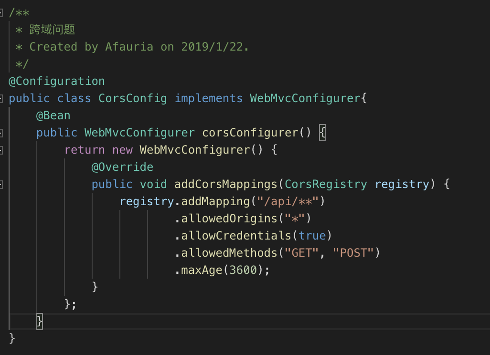 

图5-39 跨域问题处理

（4）全局异常处理：通过Springboot提供的@ControllerAdvice注解开启全局异常捕获，通过@ExceptionHandler注解捕获特定异常。如图5-40所示。

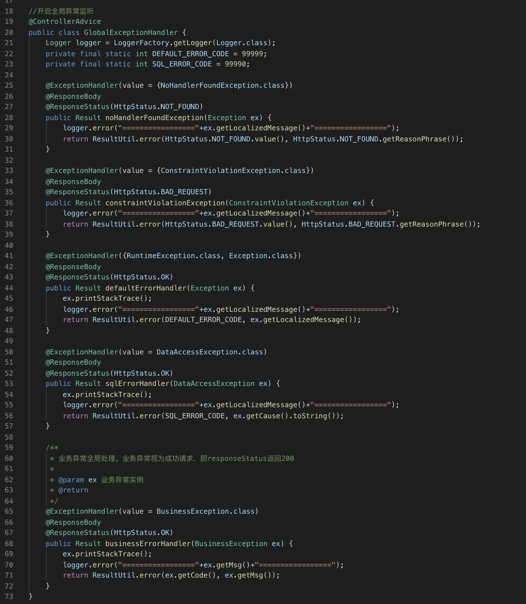 

图5-40全局异常处理

（5）正则匹配修改：Jenkins任务配置是以xml文件形式保存的，创建任务时需要上传配置，为了针对不同组件配置Job，需要修改模板配置文件，这里使用正则表达式修改文件，部分关键代码如图5-41和图5-42所示。

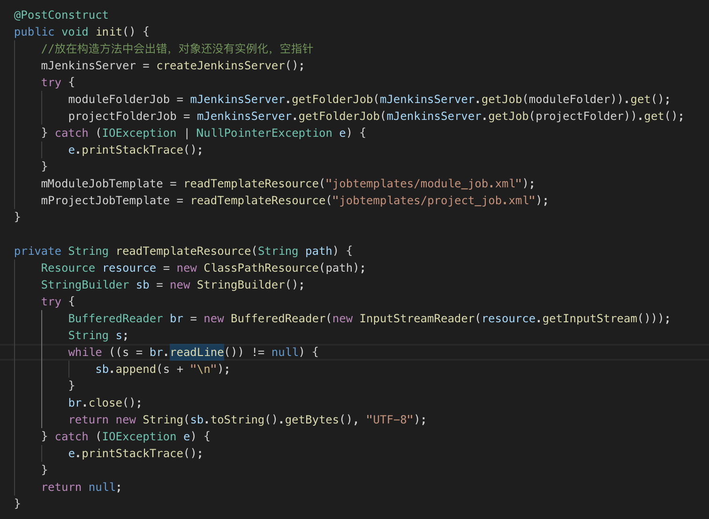 

图5-41读取模板配置文件

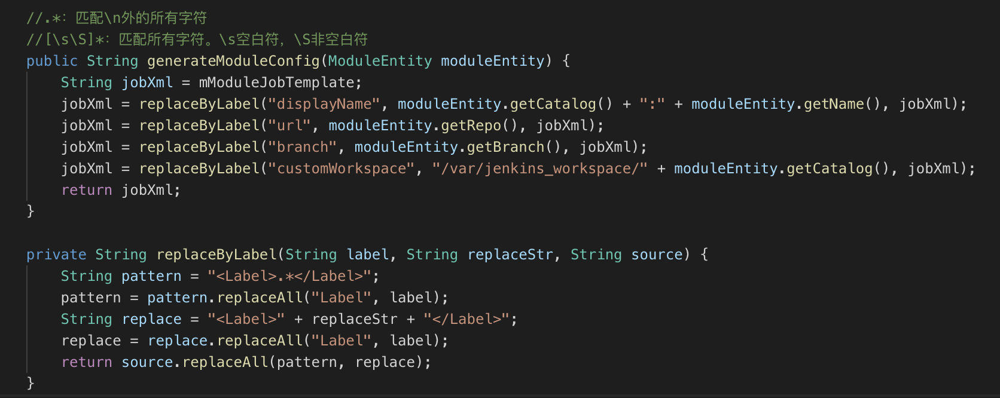 

图5-42 正则匹配修改

 

### 5.5.3 数据库设计

本系统使用MySQL进行数据存储，共有4个实体集，组件、项目、组件构建记录、项目构建记录。其中，一个组件或者项目可以有多条构建记录，每次构建都是一个版本，项目依赖组件的某个版本，一个项目依赖多个组件的某个版本，一个组件的某个版本可以被多个项目依赖。

（1）数据库实体关系图（ER图）设计如图5-43：

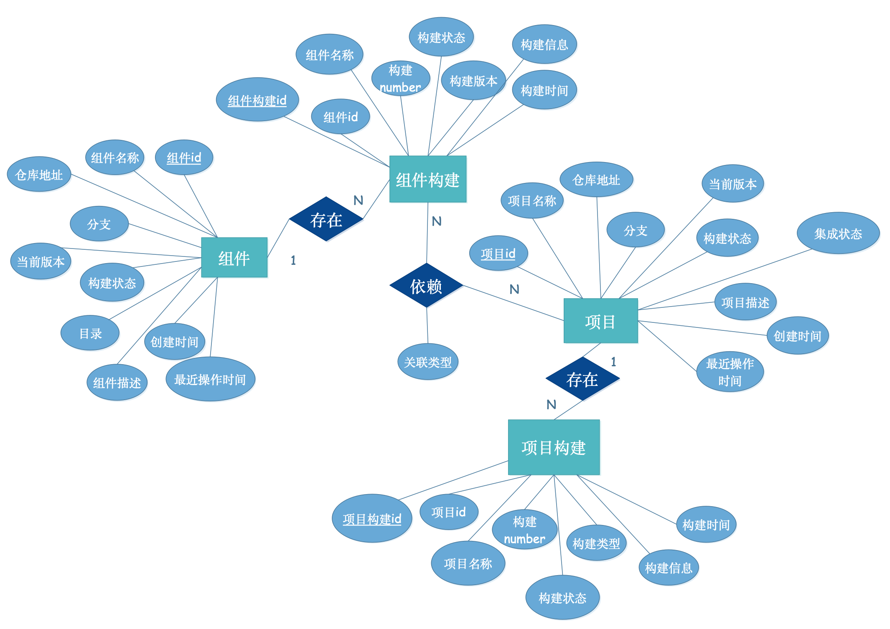 

图5-43 数据库ER图

（2）数据库关系模型如下：

 组件（组件id，组件名称，仓库地址，分支，目录，当前版本，构建状态，组件描述，创建时间，最近操作时间）

组件构建记录（组件构建id，组件id，组件名称，构建序号，构建状态，构建版本，构建信息，构建时间）

项目（项目id，项目名称，仓库地址，分支，当前版本，构建状态，集成状态，项目描述，创建时间，最近操作时间）

项目构建记录（项目构建id，项目id，项目名称，类型构建状态，构建序号，apk下载地址，构建信息，构建时间）

项目组件关系（id，项目id，组件构建id，关联类型）

（3）数据库表设计如下：

表1 组件表

| 表名         | t_module     |         |                |              |
| ------------ | ------------ | ------- | -------------- | ------------ |
| 列名         | 数据类型     | 空/非空 | 备注           | 中文名称     |
| module_id    | int          | 非空    | 自增主键       | 组件id       |
| name         | varchar(30)  | 非空    | 唯一           | 组件名称     |
| repo         | varchar(70)  | 非空    |                | 仓库地址     |
| branch       | varchar(30)  | 非空    |                | 分支         |
| catalog      | varchar(30)  | 非空    |                | 目录         |
| cur_version  | varchar(10)  |         |                | 当前版本     |
| build_status | int(1)       |         | 默认为1        | 构建状态     |
| descr        | varchar(100) |         |                | 组件描述     |
| gmt_create   | timestamp    |         | 默认，自动更新 | 创建时间     |
| gmt_update   | timestamp    |         | 默认，自动更新 | 最近操作时间 |

表2 组件构建记录表

| 表名            | t_module_build |         |                |            |
| --------------- | -------------- | ------- | -------------- | ---------- |
| 列名            | 数据类型       | 空/非空 | 约束条件       | 中文名称   |
| module_build_id | int            | 非空    | 自增主键       | 组件构建id |
| module_id       | int            | 非空    | 外键           | 组件id     |
| module_name     | varchar(30)    | 非空    |                | 组件名称   |
| build_num       | int            | 非空    |                | 构建number |
| build_status    | int(1)         |         | 默认为1        | 构建状态   |
| version         | varchar(10)    | 非空    |                | 构建版本   |
| message         | varchar(100)   |         |                | 构建信息   |
| gmt_create      | timestamp      |         | 默认，自动更新 | 构建时间   |

表3 项目表

| 表名             | t_project    |         |                |              |
| ---------------- | ------------ | ------- | -------------- | ------------ |
| 列名             | 数据类型     | 空/非空 | 约束条件       | 中文名称     |
| project_id       | int          | 非空    | 自增主键       | 项目id       |
| name             | varchar(30)  | 非空    | 唯一           | 项目名称     |
| repo             | varchar(70)  | 非空    |                | 仓库地址     |
| branch           | varchar(30)  | 非空    |                | 分支         |
| cur_version      | varchar(10)  |         |                | 当前版本     |
| build_status     | int(1)       |         | 默认为1        | 构建状态     |
| integrate_status | int(1)       |         | 默认为1        | 集成状态     |
| descr            | varchar(100) |         |                | 项目描述     |
| gmt_create       | timestamp    |         | 默认，自动更新 | 创建时间     |
| gmt_update       | timestamp    |         | 默认，自动更新 | 最近操作时间 |

表4 项目构建记录表

| 表名             | t_project_build |         |                |             |
| ---------------- | --------------- | ------- | -------------- | ----------- |
| 列名             | 数据类型        | 空/非空 | 约束条件       | 中文名称    |
| project_build_id | int             | 非空    | 自增主键       | 项目构建id  |
| project_id       | int             | 非空    | 外键           | 项目id      |
| project_name     | varchar(30)     | 非空    |                | 项目名称    |
| build_num        | int             |         |                | 构建number  |
| build_status     | int(1)          |         | 默认为1        | 构建状态    |
| type             | int(1)          |         | 默认为1        | 类型        |
| download_url     | varchar(100)    |         |                | Apk下载地址 |
| message          | varchar(100)    |         |                | 构建信息    |
| gmt_create       | timestamp       |         | 默认，自动更新 | 构建时间    |

表5 项目组件关系表

| 表名            | t_project_module |         |          |            |
| --------------- | ---------------- | ------- | -------- | ---------- |
| 列名            | 数据类型         | 空/非空 | 约束条件 | 中文名称   |
| id              | int              | 非空    | 自增主键 | 关联关系id |
| project_id      | int              | 非空    | 外键     | 项目id     |
| module_build_id | int              | 非空    | 外键     | 组件构建id |
| type            | int              |         |          | 关联类型   |

# 6 案例测试和演示

本章将以5.1节中实现的Android组件化项目作为案例，演示实际项目是如何结合本系统进行开发的。

（1）首先在平台项目管理中创建项目，输入项目基本信息，如图6-1。输入为空或项目已存在会出现错误提示。

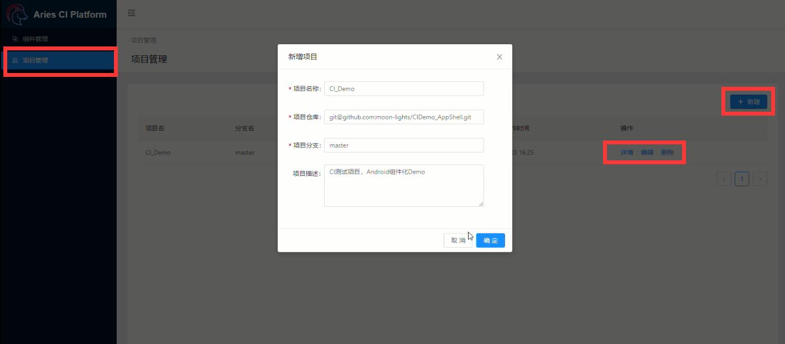 

图6-1 项目创建

创建完成之后可以看到Jenkins页面成功创建了一个项目Job，如图6-2。

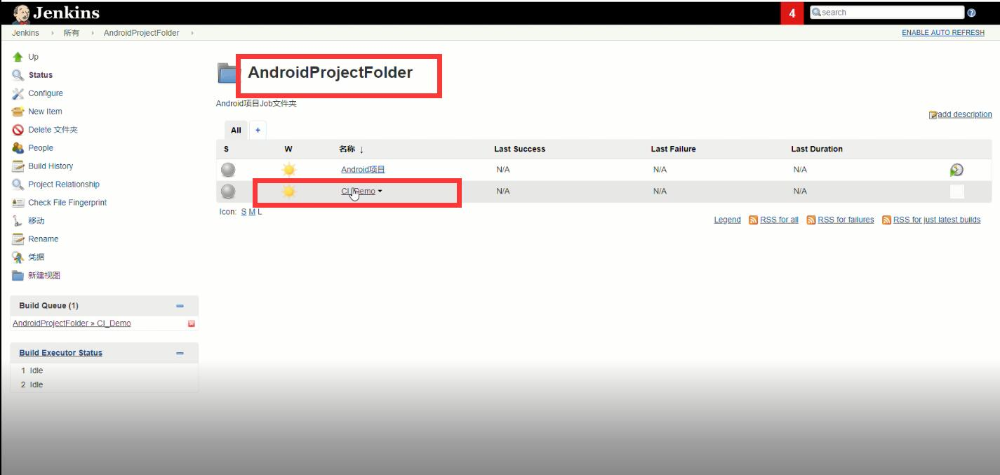 

图6-2 项目Job创建

进入项目详情查看，项目组件为空，如图6-3。

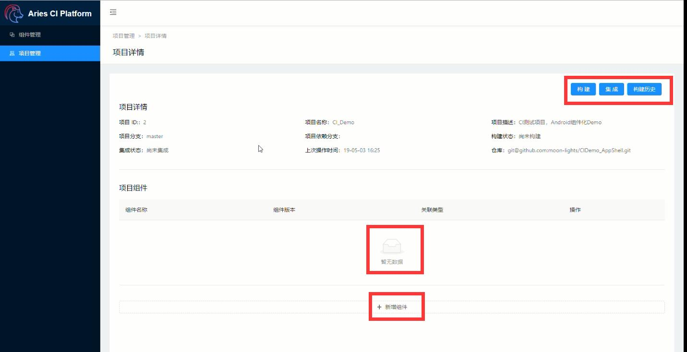 

图6-3 项目详情

进入项目构建历史查看，构建记录为空，如图6-4。

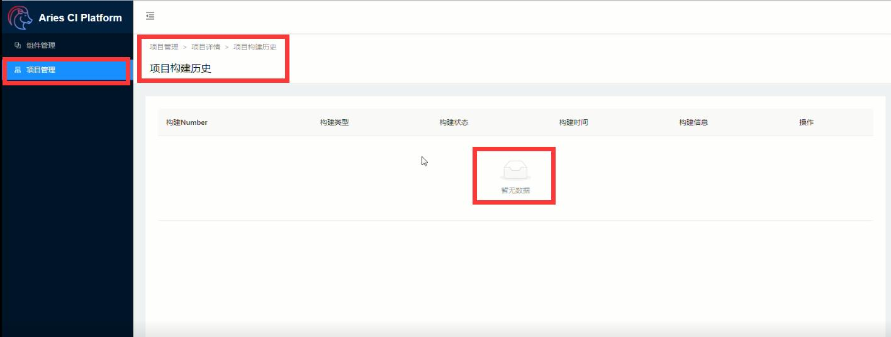 

图6-4 项目构建历史

（2）在平台组件管理中创建组件，输入组件的基本信息，如图6-5。同样地，可以看到Jenkins页面成功创建了一个组件Job。组件构建历史为空。

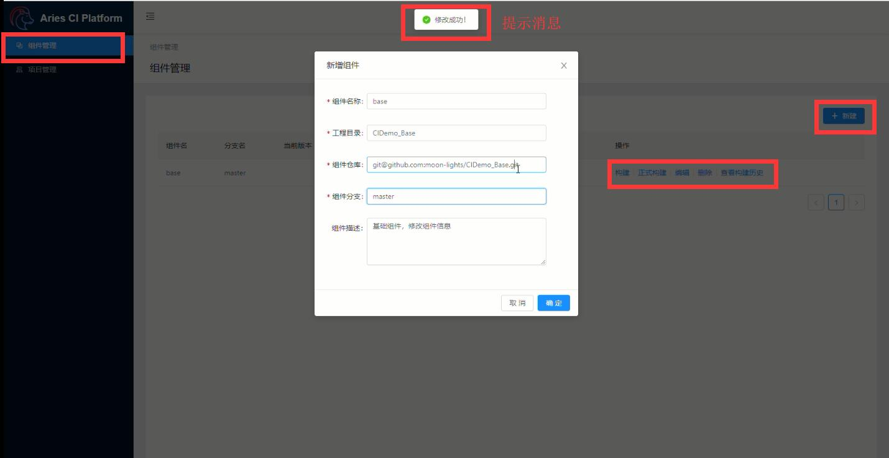 

图6-5 组件创建

（3）在组件的指定分支上开发完成，提交了代码之后，在平台组件管理中点击构建组件，第一次构建需要输入起始版本号，如图6-6，后面版本号会自动生成，不需要再次输入。开始构建之后，前端显示正在构建，Jenkins会在远程、后台执行该任务，不会影响开发者，可以查看构建进度，如图6-7和图6-8。

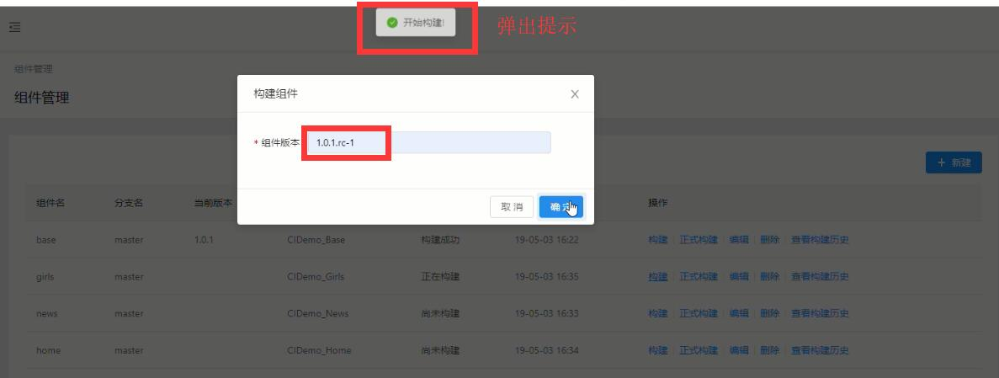 

图6-6 组件构建

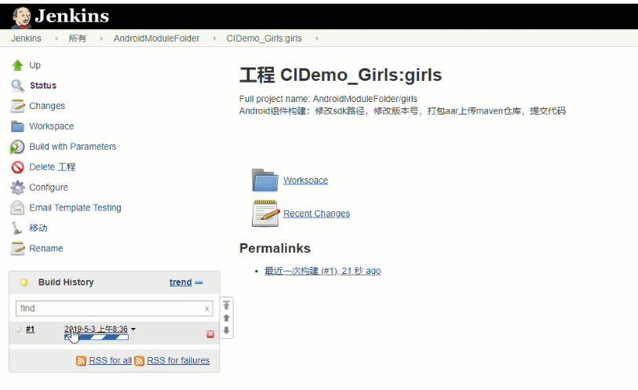 

图6-7 组件构建进度入口

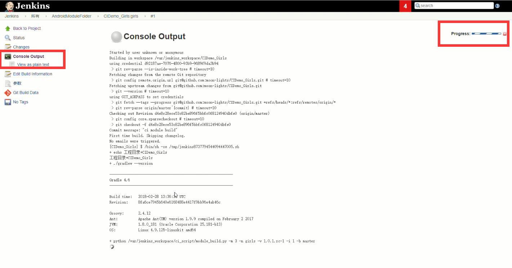 

图6-8 组件构建进度

（3）构建完成后前端会收到通知，如图6-9。

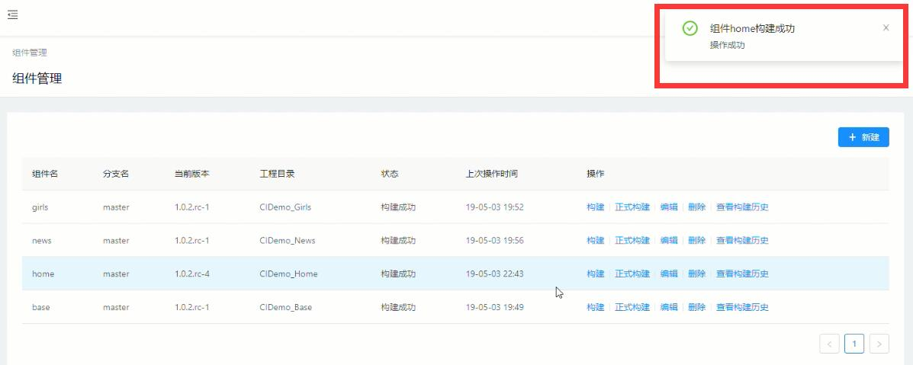 

图6-9 组件构建通知

可以查看构建历史和构建日志。如图6-10和图6-11。

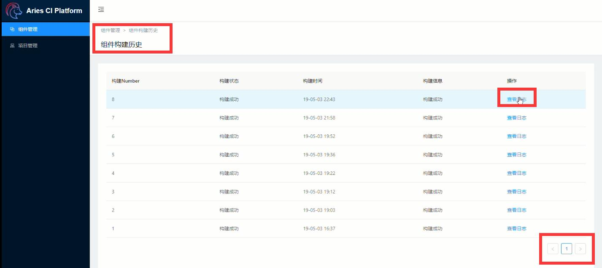 

图6-10 组件构建历史

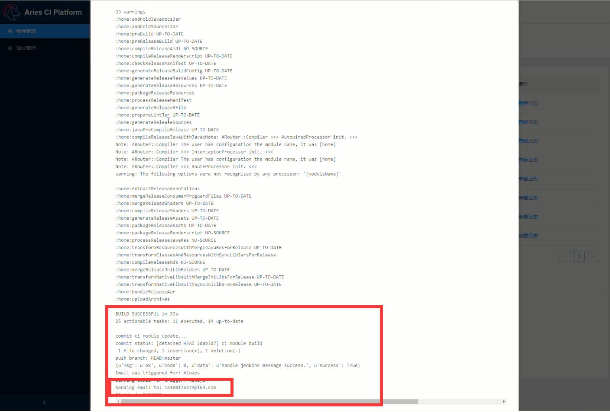 

图6-11 组件构建日志

能够看到日志显示构建成功，并且发送构建结果的邮件到了配置的邮箱。如图6-12。可以点击超链接查看具体日志。

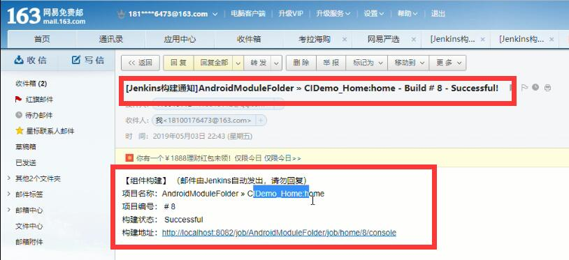 

图6-12 组件构建邮件通知

（4）依次构建好其他几个组件后，在项目详情页面中可以添加项目组件，只能搜索到构建成功的组件版本，且一个项目只能有一个同名组件，保存成功后会弹出提示，如图6-13。

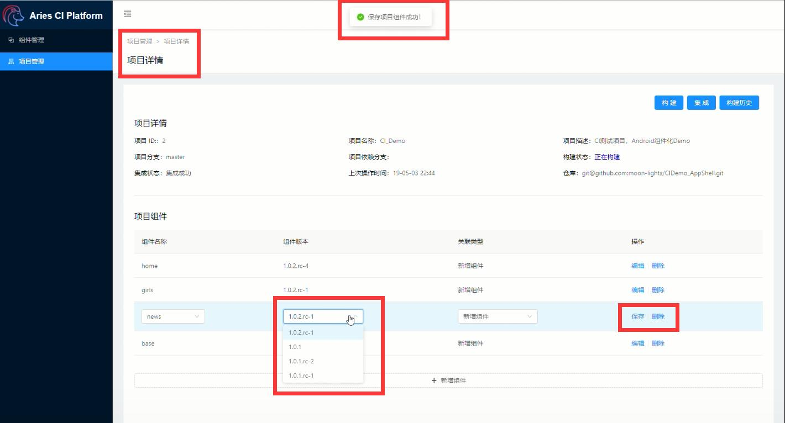 

图6-13 添加项目组件

（5）配置完毕之后点击项目构建，即和组件构建一样开始后台执行Job，可以在Jenkins后台查看构建进度等。构建完成之后同样会收到消息通知和邮件通知，内容有所区别。可以查看项目构建历史。如图6-14。

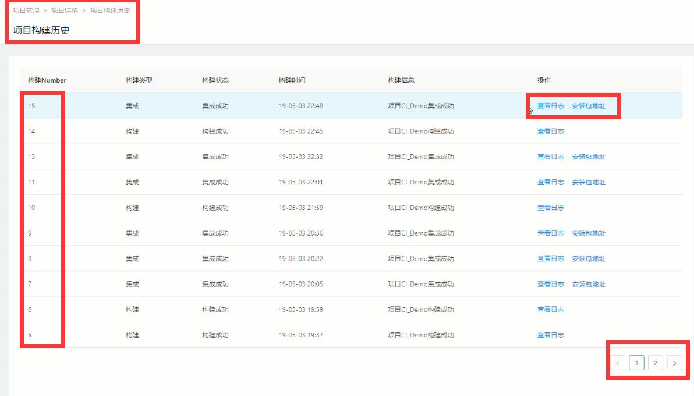 

图6-14 项目构建历史记录

能够看到出现了安装包地址，跳转到apk下载地址，供用户下载最新应用，如图6-15。

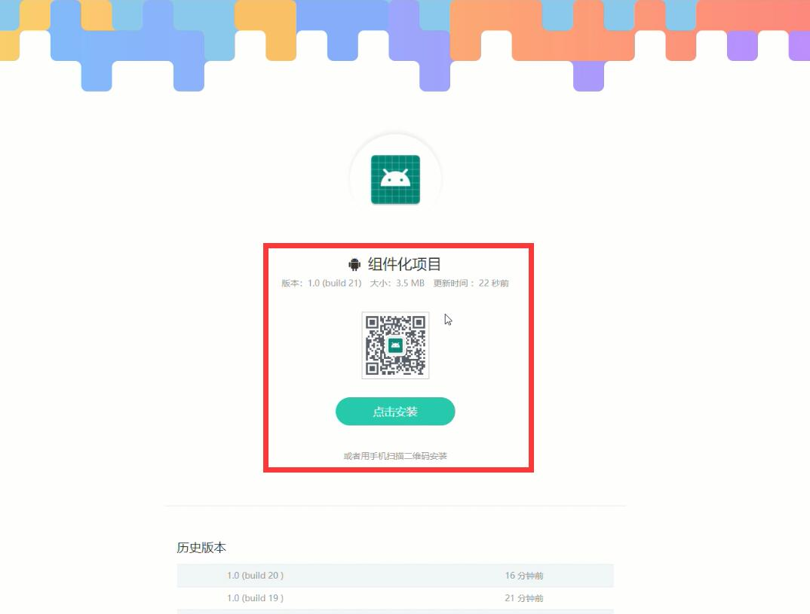 

图6-15 apk下载地址

（6）至此完成了一次集成，根据持续集成的定义，每天都要进行构建，通过平台简化了一系列重复繁琐的操作，实现了远程构建，提高了效率，能够及时暴露和反馈问题，增强项目开发过程的可见性，并且能够随时随地提供可以运行的软件。安装并运行应用，效果如图6-16所示。

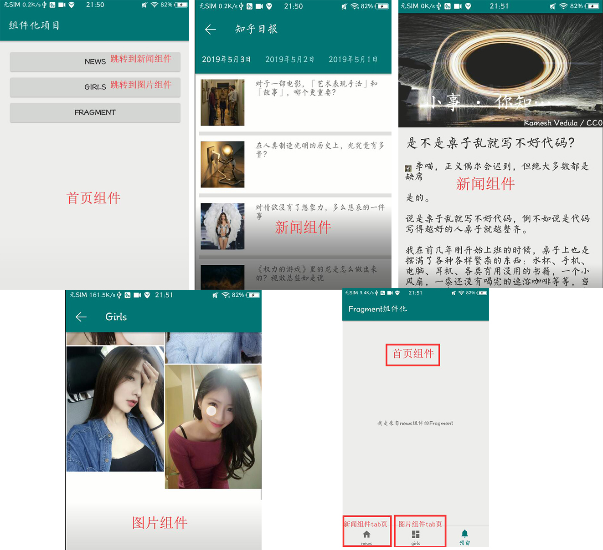 

图6-16 应用效果前

（7）假设提出了测试bug或者新增了需求，如要求在首页新增一个入口，跳转到其他页面。首页组件的开发者实现了该功能，并且将源码推送到远程仓库。如图6-17。

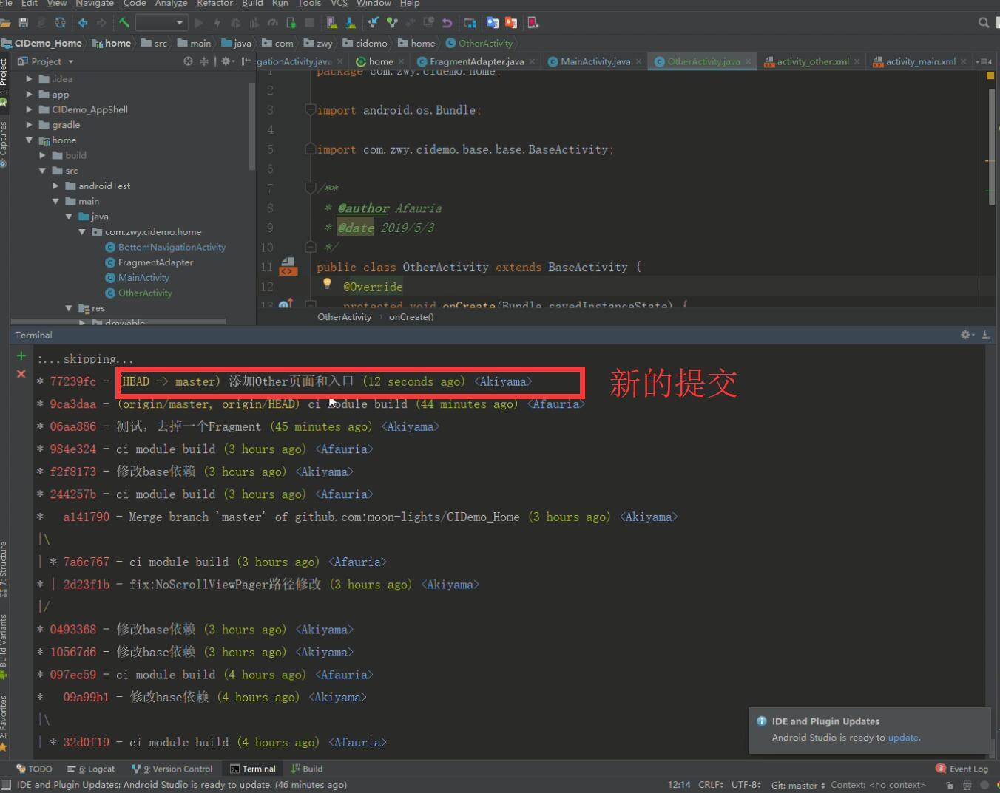 

图6-17 开发其他页面

按照上述流程在平台上构建首页组件，修改项目依赖组件版本，进行集成，即可打出新的apk包，供其他角色进行验收测试等。同样地进行下载和安装。运行效果如图6-18所示。

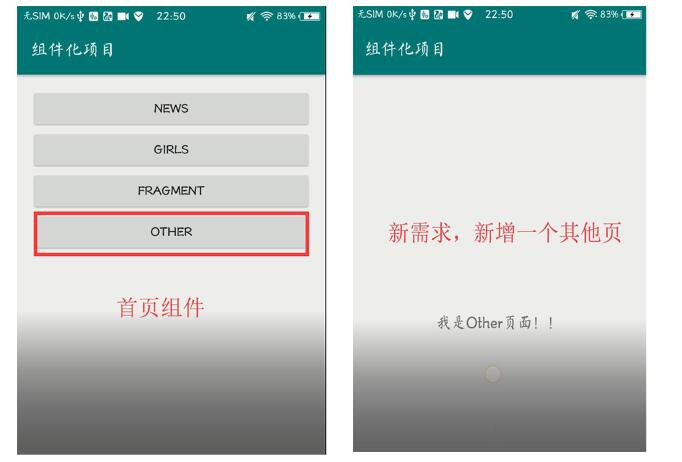 

图6-18 应用效果后

（8）循环上述步骤，直到应用开发完成，进行项目最终集成和发布应用。通过案例可以看到持续集成与瀑布式开发流程的明显区别，在开发过程中可以不断提出新建议或者问题，开发者可以快速实现，并且提交测试，而不用分阶段完成任务，等到最终集成之后才进行测试，这也就是敏捷的来源。

# 7 总结与展望

通过平台可视化界面对组件化项目进行管理和构建，可以减少重复、耗时的操作，降低沟通成本，大大地提高了开发效率，增强了开发过程的可见性和可控性，开发者不需要手动的构建、测试、发布等。通过每日构建和频繁集成能够及时发现项目缺陷，降低发布风险，提高软件质量，快速迭代软件产品。

本文提出和设计了一套持续集成方案，并实现了一套简易版的持续集成生态。目前已实现基本功能，各端联调通信，能够正常走完所有流程，需要在使用过程中通过实际大量的数据和测试暴露问题，改进方案。目前本系统还有一些可以优化的点，如下：

（1）加入用户管理系统和用户权限系统：项目和组件可以有各自的负责人，负责人拥有所有的权限，对其他成员只保持可见权限，提高系统的安全性，减少风险，团队成员各司其职。同时平台的每次操作都会记录用户，便于事后追溯问题。

（2）前端优化数据筛选、搜索、排序等功能：目前只实现了部分功能，由于数据量较少，因此功能暂时用处不大，当数据量大的时候，这些用户友好功能就能体现出相应的价值。丰富反馈机制如红点提示等，报错标红等UI效果。

（3）Jenkins添加静态代码质量检查任务：可以在构建之前执行检查任务，执行完成之后会生成检查报告，展示到平台，提醒开发者优化代码，并且可是设置分数低于合格值构建不通过。

（4）Jenkins添加自动化测试任务：可以在项目构建完毕之后执行自动化测试任务，执行完后生成测试日志，一定程度上减少手动重复测试，避免测试人员反复测试同一个问题并且提交。

（5）优化组件管理和项目管理的流程：如通过平台直接创建项目分支，不需要手动创建分支，项目集成之后自动打TAG、优化版本变化流程等。

（6）增加看板功能：即类似jira等敏捷开发工具，产品或测试人员可以通过平台针对某个开发者发布问题或者任务，把项目的进度、个人完成率、超时完成等数据统计显示在看板上，开发者完成任务或者修复问题之后在平台上修改状态，测试人员测试通过之后关闭问题，形成一个闭环。看板数据还可以作为绩效管理等的有力依据。

新的感悟：

1. 根据项目类型配置不同Jenkins任务模板
2. 应用可以发布到构件仓库，不需要上传蒲公英
3. 应用配置管理或者配置分发
4. 版本号不写死在代码里面，生成提交：可以通过gradle读取外部变量
5. 系统组件化：将系统构建作为项目，组件可能是应用、配置等

 

# 参考文献

[1]Paul M D,Steve Matyas,Andrew Glover.持续集成：软件质量改进和降低风险之道[M].王海鹏译.北京：电子工业出版社，2013.

[2]Kent Beck,Cynthia Andres. Extreme Programming Explained: Embrace Change[M].

[3]Fowler M. Continuous Integration[EB/OL]. https://martinfowler.com/articles/continuousIntegration.html,2006-5-1/2018-12-20.

[4][朱红](http://yuanjian.cnki.com.cn/Search/Result?author=朱红),[仇润鹤](http://yuanjian.cnki.com.cn/Search/Result?author=仇润鹤).基于Jenkins的移动通信业务自动化测试平台的设计与测试[J].科技与创新，2016,(7).

[5]陈松乔,任胜兵,王国军.现代软件工程[M].北方交通大学出版社，2002-11-13.

[6]张力文.基于Jenkins的项目持续集成方案研究与实现[D].西南交通大学，2017.

[7]Jez Humble,David Farley.持续交付：发布可靠软件的系统方法.乔梁译[M].北京：人民邮电出版社，2011.

[8]Kent Beck,Fowler M,et al. Manifesto for Agile Software Development [EB/OL]. http://agilemanifesto.org/,2001/2018-12-30.

[9]inter_peng.持续集成（Continuous Integration）基本概念与实践[EB/OL]. https://blog.csdn.net/inter_peng/article/details/53131831，2016-11-11/2019-5-5.

[10]王宁.基于Jenkins的持续集成系统的设计与实现[D].北京邮电大学，2014.

[11]Swartout P. Continuous Deliver and DevOps-A Quickstart Guide[M]. Birmingham:Packt Publishing Ltd，2014:3.

[12]Ekaterina Novoseltseva. [Top benefits of continuous integration](https://apiumtech.com/blog/top-benefits-of-continuous-integration-2/)[EB/OL]. https://apiumtech.com/blog/top-benefits-of-continuous-integration-2/，2015-12-28/2018-11-22.

[13]曾家乐.Android组件化架构[M].电子工业出版社，2018-03-01.

[14] runoob.Docker架构[EB/OL]. https://www.runoob.com/docker/docker-architecture.html，2019-5-5.

[15]guiying712.Android组件化方案[EB/OL]. https://blog.csdn.net/guiying712/article/details/55213884，2017-2-15/2019-5-5.

[16]Jonhn Ferguson Smart. Jenkins:The Definitive Guide[M]. O’REILLY,2011.

[17]dnsliu.基于Jenkins实现Android项目的持续集成[EB/OL].https://blog.csdn.net/dnsliu/article/details/81019086，2018-7-12/2019-5-5.

 

