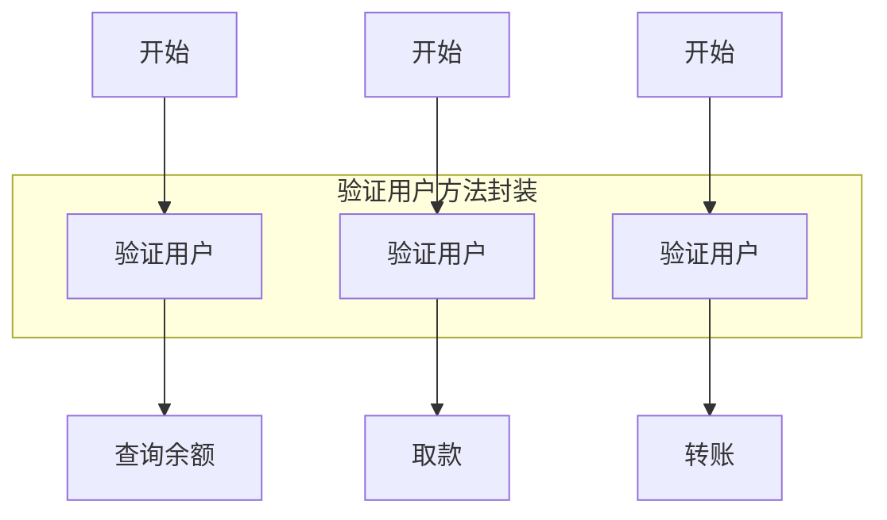
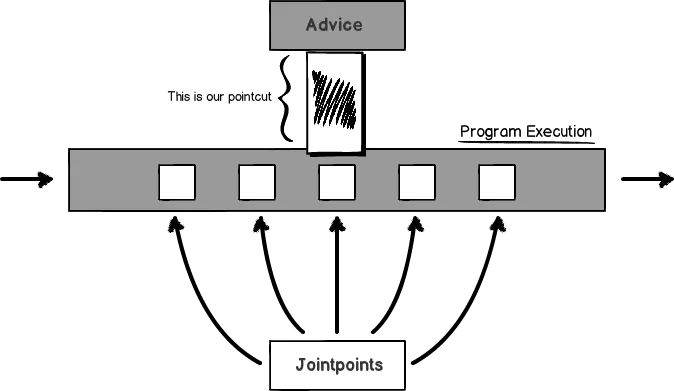
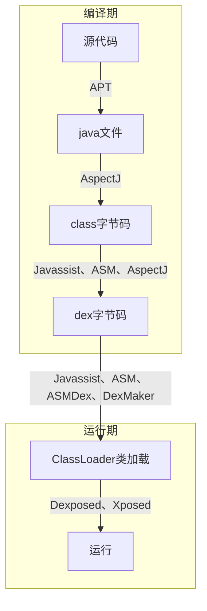

---

layout: post
title: 面向切面编程（AOP）
date: 2021-12-01
categories: 技术
description: 介绍AOP概念，实现原理，常用工具和技术对比
tags:
- AOP
keywords: [AOP, 字节码插桩]
---

# 什么是AOP

## OOP和AOP

* OOP（Object Oriented Program，面向对象编程）：侧重对功能进行模块化和封装继承。关注静态的对象层次结构。
* AOP（Aspect Oriented Program，面向切面编程）：侧重对横跨各个模块中的公共功能进行统一处理。关注动态的运行时的业务流程。

例如使用OOP封装了一个日志框架，包含打印、缓存、上报等功能。看起来很完美，实际上存在以下问题：

1. 对调用方来说，需要在多处地方添加方法调用，和调用方的主业务耦合，违背单一职责原则。代码分散，需求变动的时候需要改动多处。
2. 难以对**现有对象**（如三方库中的类）动态添加功能，需要通过继承或组合的方式扩展对象功能。
2. 编写代码的时候需要考虑不同类之间的共性，再提取方法或者接口。

如下图

需要在每个流程中加入验证用户的步骤，即使对重复代码进行了封装，但还是免不了要调用方法。

解决：将验证用户的方法抽离出来（切面），在编译或者运行期间讲代码**织入**到目标位置（连接点）。我们把这种方法叫AOP。

**AOP能够将这些与业务无关，却被业务模块所共同调用的逻辑封装起来（切面）；在不侵入业务代码的情况下，将这些公共的功能插入到主业务流程中（连接点）。减少系统的重复代码，降低模块间的耦合度，提高可维护性。**

**AOP的思想可以让我们在写代码的时候只考虑主业务流程，而不用考虑这些不重要的流程。**

AOP和OOP是互补的关系

## 相关概念

* 横切关注点（Cross-cutting concerns）：面向对象模型中大多数类会实现单一特定的功能，但有时候也需要添加一些公共的附属功能。例如日志、埋点等功能会分布在不同对象层次中，与对象自身的功能没有关系。这些散布在各处的无关的代码称为**横切关注点**。

* 连接点（JoinPoint）：程序运行时的一些执行点，可以在这些地方插入代码。如方法调用、方法执行、类初始化、构造、变量get和set等。

* 切点（Pointcut）：用于选择和匹配我们想要插入代码的目标JoinPoint。

  > 关于切点，有两种说法，刚开始看概念很容易混乱，两种理解都可以，只是角度不同。
  >
  > 1. 切点是指写匹配规则的地方，定义在切面中。关注从哪里切入（切入的点）
  > 2. 切点是指匹配到的结果（目标JoinPoint），是JoinPoint的子集。关注切到的结果（切到的点）

* 通知（Advice）：Pointcut拦截到JoinPoint之后要做的事情，即要增强的功能（要注入的代码，如log打印，权限检查等）。常见的通知类型如前置通知（在Pointcut之前执行）、后置通知、异常通知、最终通知、环绕通知。

* 切面（Aspect）：切入点+通知=切面

* 织入（Weaving）：注入代码（Advice）到目标位置（JoinPoint）的过程。分为静态织入（编译期或类加载期）和动态织入（运行期）

* 目标对象（Target）：被代理的对象

* 代理（Proxy）：一个类被增强实际上是生成一个代理类，调用的时候实际上是调用代理类的方法。

## 实现原理

1. 静态织入：编译期织入代码。又分为不同阶段：java、class、dex代码。如APT、AspectJ、ASM、Javassit、ASMDex、DexMaker、操作AST、手动修改class文件。
2. 动态织入：运行时织入代码。又分为类加载和运行。如Java动态代理、Cglib、Javassit、XPosed、Dexposed、自定义类加载器。

Android注解解析主要分为两种：

1. 运行时反射解析当前类（注解作用域：RUNTIME）：性能较低。
2. 编译期生成代理类和代理对象（注解作用域：SOURCE、CLASS）：需要生成额外代码

### APT（Annotation Processing Tool，注解处理器）

见[APT介绍和实践]()

| AOP技术 | 作用时机 | 输入     | 输出     | 代表框架                                             |      |
| ------- | -------- | -------- | -------- | ---------------------------------------------------- | ---- |
| APT     | 编译期   | Java文件 | Java文件 | DataBinding、Dagger2、ButterKnife、EventBus3、DBFlow |      |
|         |          |          |          |                                                      |      |

### 方法优缺点、难点比对

| 方法          | 作用时机                                | 操作对象                    | 优点                                                         | 缺点                                                         | 为了上手，我需要掌握什么？                                   |
| ------------- | --------------------------------------- | --------------------------- | ------------------------------------------------------------ | ------------------------------------------------------------ | ------------------------------------------------------------ |
| **APT**       | 编译期：还未编译为 class 时             | .java 文件                  | 1. 可以织入所有类；2. 编译期代理，减少运行时消耗             | 1. 需要使用 apt 编译器编译；2. 需要手动拼接代理的代码（可以使用 Javapoet 弥补）；3. 生成大量代理类 | 设计模式和解耦思想的灵活应用                                 |
| **AspectJ**   | 编译期、加载时                          | .java 文件                  | 功能强大，除了 hook 之外，还可以为目标类添加变量，接口。也有抽象，继承等各种更高级的玩法。 | 1. 不够轻量级；2. 定义的切点依赖编程语言，无法兼容Lambda语法；3. 无法织入第三方库；4. 会有一些兼容性问题，如：D8、Gradle 4.x等 | 复杂的语法，但掌握几个简单的，就能实现绝大多数场景           |
| **Javassist** | 编译期：class 还未编译为 dex 时或运行时 | class 字节码                | 1. 减少了生成子类的开销；2. 直接操作修改编译后的字节码，直接绕过了java编译器，所以可以做很多突破限制的事情，例如，跨 dex 引用，解决热修复中 CLASS_ISPREVERIFIED 问题。 | 运行时加入切面逻辑，产生性能开销。                           | 1. 自定义 Gradle 插件；2. 掌握groovy 语言                    |
| **ASM**       | 编译期或运行期字节码注入                | class 字节码                | 小巧轻便、性能好，效率比Javassist高                          | 学习成本高                                                   | 需要熟悉字节码语法，ASM 通过树这种数据结构来表示复杂的字节码结构，并利用 Push 模型来对树进行遍历，在遍历过程中对字节码进行修改。 |
| **ASMDEX**    | 编译期和加载时：转化为 .dex 后          | Dex 字节码，创建 class 文件 | 可以织入所有类                                               | 学习成本高                                                   | 需要对 class 文件比较熟悉，编写过程复杂。                    |
| **DexMaker**  | 同ASMDEX                                | Dex 字节码，创建 dex 文件   | 同ASMDEX                                                     | 同ASMDEX                                                     | 同ASMDEX                                                     |
| **Cglib**     | 运行期生成子类拦截方法                  | 字节码                      | 没有接口也可以织入                                           | 1. 不能代理被final字段修饰的方法；2. 需要和 dexmaker 结合使用 | --                                                           |
| **xposed**    | 运行期hook                              | --                          | 能hook自己应用进程的方法，能hook其他应用的方法，能hook系统的方法 | 依赖三方包的支持，兼容性差，手机需要root                     | --                                                           |
| **dexposed**  | 运行期hook                              | --                          | 只能hook自己应用进程的方法，但无需root                       | 1. 依赖三方包的支持，兼容性差；2. 只能支持 Dalvik 虚拟机     | --                                                           |
| **epic**      | 运行期hook                              | --                          | 支持 Dalvik 和 Art 虚拟机                                    | 只适合在开发调试中使用，碎片化严重有兼容性问题               | --                                                           |

### AspectJ

见[AspectJ介绍和案例](/2021/12/02/tech-2021-12-02-AspectJ介绍和示例/)

### ASM

**ASM 插桩工具 :**

**操作灵活 :** 可以在字节码任何位置，自定义修改、插入、删除相关逻辑 ;

**上手很难 :** 对 .class 字节码文件有比较深入的了解，编写过程较复杂

| AOP技术           | 功能             | 性能                                         | 面向接口编程 | 编程难度                                          |
| ----------------- | ---------------- | -------------------------------------------- | ------------ | ------------------------------------------------- |
| 直接改写class文件 | 完全控制类       | 无明显性能代价                               | 不要求       | 高，要求对class文件结构和Java字节码有深入的了解   |
| JDK Instrument    | 完全控制类       | 无论是否改写，每个类装入时都要执行 hook 程序 | 不要求       | 高，要求对 class 文件结构和 Java 字节码有深刻了解 |
| JDK Proxy         | 只能改写 method  | 反射引入性能代价                             | 要求         | 低                                                |
| ASM               | 几乎能完全控制类 | 无明显性能代价                               | 不要求       | 中，能操纵需要改写部分的 Java 字节码              |
| AspectJ           |                  |                                              |              |                                                   |

基于ASM的字节码处理工具：[Hunter](https://github.com/Leaking/Hunter/blob/master/README_ch.md)、[Hibeaver](https://github.com/BryanSharp/hibeaver)

基于Javassist的字节码处理工具：DroidAssist

ASM是一个框架/库，它为您提供了一个API来操作现有的字节码和/或轻松生成新的字节码。

另一方面，AspectJ是一种基于Java语言的语言扩展，具有自己的语法，专门用于通过面向方面的编程概念扩展Java运行时的功能。它包括一个编译器/编织器，可以在编译时或运行时运行。

它们的相似之处在于它们都通过现有字节码的字节码操作和/或生成新的字节码来实现其目标。

ASM更通用，因为它没有关于如何修改现有字节码的意见，它只是为您提供了一个API，您可以随心所欲地使用它。另一方面，AspectJ更具体，范围更窄，它只支持一些预定义的AOP结构，但它为您提供了一个界面（aspectj语言），如果您可以在这些结构中使用它，则更容易使用它为您提供。

对于我见过的大多数用例，AspectJ绰绰有余，但在极少数情况下，ASM可能是一个不错的选择，但是你需要更多的编程努力取得类似的成果。

### ASMDex

类似ASM的字节码操作库，运行在Android平台，操作dex字节码

### DexMaker

提供JavaAPI，用于编译期或运行时生成Dex字节码

### Javassist

原理：使用Gradle Task或Transform，在dex文件生成之前，修改class字节码。不需要生成子类代理

框架：热修复HotFix

Javassist & ASM 对比
Javassist抽象出源代码级的API，比ASM中实际的字节码操作更容易使用
Javassist使用反射机制，这使得它比运行时使用Classworking技术的ASM慢。
总的来说ASM比Javassist快得多，并且提供了更好的性能。Javassist使用Java源代码的简化版本，然后将其编译成字节码。这使得Javassist非常容易使用，但是它也将字节码的使用限制在Javassist源代码的限制之内。
总之，如果有人需要更简单的方法来动态操作或创建Java类，那么应该使用Javassist API 。如果需要注重性能地方，应该使用ASM库。

### Cglib（Code Generation Library）

原理：底层采用ASM字节码框架，运行期间类加载的时候为目标类创建一个字类，代理拦截父类方法调用。解决了JDK动态代理需要定义接口的问题

缺点：

1. 无法代理final类和方法：Cglib是通过子类代理实现的
2. 无法在Android中使用，Android加载的是dex文件，而Cglib生成的是class文件：需要结合Dexmaker生成dex字节码文件。参考[将cglib动态代理思想带入Android开发](https://blog.csdn.net/zhangke3016/article/details/71437287)

# AOP应用场景

1. 参数校验和判空
2. 运行时权限验证或申请
3. 运行时登录验证
4. 检查网络连接
6. 日志管理：输出调试日志。如打印代码行数、入参、出参等
7. 重要生命周期添加打印
8. 无侵入埋点
9. 事件防抖
10. 异常统一处理
10. 事务处理
11. 性能监控，如统计方法耗时
12. 方法调用线程切换
13. 对变量和方法返回值进行缓存和注入，内存缓存和持久缓存
13. 对数据和常量加密
14. 热修复：新方法替换旧方法

AOP和字节码插桩的区别和联系

> * AOP：是一种编程思想，OOP的延续。将系统中非核心的业务提取出来，进行单独处理。AOP中用到了IoC和DI的思想
> * 字节码插桩：即修改字节码，是实现AOP的一种技术。AOP除了修改字节码之外还可以修改源码、抽象语法树等。
>
> 除了上面的场景之外，字节码插桩和修改还可以应用于：
>
> 1. 三方库Hook，不需要修改三方库源码
> 2. 应用破解

AOP与IoC（控制反转）、DI（依赖注入）的区别和联系

> 区别：AOP强调对代码运行过程进行修改。IoC和DI强调不同对象间的依赖关系，以及如何依赖。
>
> 联系：AOP和IoC用到的技术类似，例如AspectJ、APT、字节码修改等，既可用于AOP，也可以用于IoC
>
> Tips：IoC和DI是同一个概念的不同描述，也可以说通过依赖注入来实现控制反转。

# AOP实战

编写AOP思路：

1. 考虑注入代码的时机、以及注入是否有限制（如final、private限制），选择合适的AOP工具（使用场景、性能等）
   1. 编译期：生成java、class、dex文件
   2. 运行期：类加载、运行时
2. 考虑要注入代码的地方：如方法调用、执行、类初始化等时机
3. 考虑怎么找到要注入代码的地方
   1. 匹配类名、方法名
   2. 使用注解标记
4. 考虑怎么处理代码
   1. 在代码前后插入逻辑
   2. 替换目标代码

# 框架

1. Lancet轻量级的框架，编译速度快，支持增量编译
2. Lancet语法简单，易于上手。AspectJ需要学习的语法比较多。
3. Lancet仅支持hook具体的方法，不能像AspectJ一样根据自定义的注解来Hook一个类或者任意的方法。

## 使用场景建议

1. 如果只是相对特定的函数，aar中函数、项目中的函数、Android系统源码中的函数进行Hook，可以选择使用Lancet。
2. 如果需要使用注解对某一类操作进行Hook时，例如，权限检查、性能检测等函数，可以使用AspectJ。

# 结语

参考文章：

* [一文读懂 AOP | 你想要的最全面 AOP 方法探讨](https://juejin.cn/post/6844903728525361165)
* [一文应用 AOP | 最全选型考量 + 边剖析经典开源库边实践，美滋滋](https://juejin.cn/post/6844903741808705544)