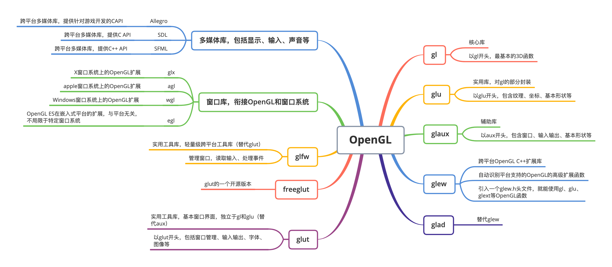
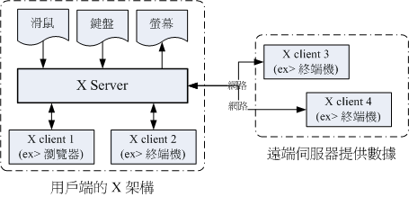
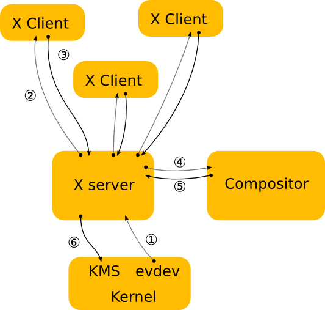
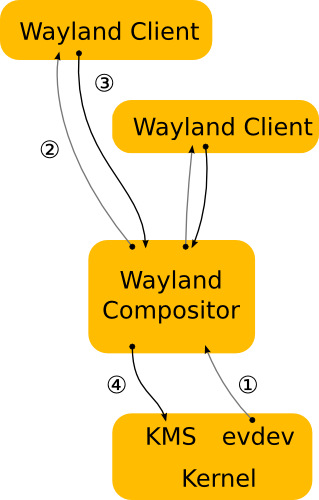
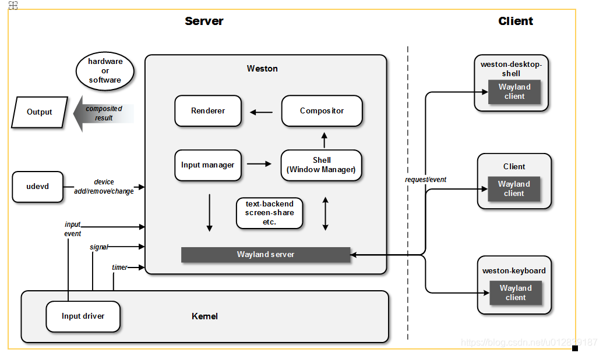
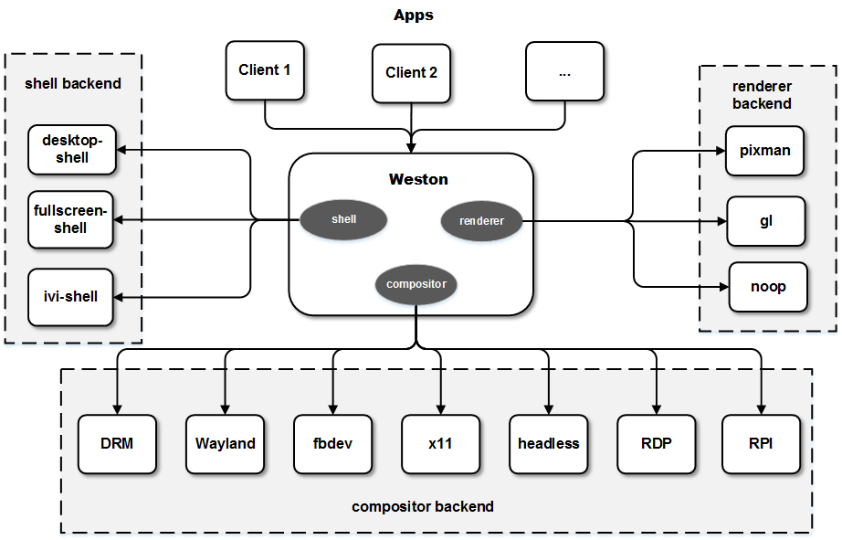
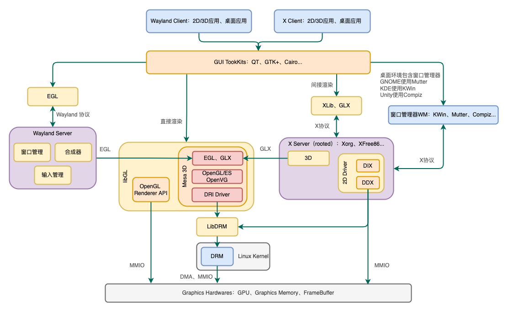

# OpenGL

OpenGL（Open Grapics Library） 是一套图形操作与渲染规范，它定义了一套 API；一般由显卡商进行实现。OpenGL只负责图形绘制，不包含窗口。

* OpenGL ES（OpenGL for Embedded Systems）
* GLEW（OpenGL Extension Wrangler Library）：对底层OpenGL接口的封装，实现了跨平台。
* [GLFW](https://www.glfw.org/)（Graphics Library Framework，图形库框架） 是配合 OpenGL 使用的轻量级工具程序库。GLFW 的主要功能是创建并管理窗口和 OpenGL 上下文，同时还提供了处理手柄、键盘、鼠标输入的功能。有类似功能的库还有 [GLUT](https://www.opengl.org/resources/libraries/glut/)（OpenGL Utility Toolkit）和 [SDL](https://www.libsdl.org/)（Simple DirectMedia Layer）。

各种相关的库介绍如下

窗口库：OpenGL和本地窗口系统之间的通信接口，实现了OpenGL的平台无关性。

例如EGL提供本地窗口相关的API，创建渲染表面EGLSurface，同时提供渲染上下文EGLContext，用来进行状态管理。接下来OpenGL ES可以在这个Surface上进行绘制。

* Display（EGLDisplay）：对实际显示设备的抽象
* Surface（EGLSurface）：对存储图形的内存区域FrameBuffer的抽象，包括Color Buffer（颜色缓冲区）、Stencil Buffer（模版缓冲区）、Depth Buffer（深度缓冲区）
* Context（EGLContext）：存储OpenGL ES绘图的状态信息

> Android中的GLSurfaceView内部实现了对EGL的封装，不需要直接调用EGL库

Mesa是OpenGL的一种开源实现，由两部分组成：

* LibGL：实现了OpenGL的编程接口，提供给用户进行开发
* DRI（Direct Rendering Infrastructure）驱动：直接访问和操作硬件（显卡、显存、GPU），利用硬件加速，实现绘图操作

## 绘图引擎

3D绘图引擎，图形API接口，可以直接操作GPU，主要为GPU硬件加速设计，由显卡厂商实现：

* OpenGL：传统的图形API接口，支持跨平台，主要用于3D绘制
* DirectX：用于Windows系统，是一个多媒体处理框架，不是单纯的图形API，分为显示、声音、输入、网络四部分。显示部分分为Direct2D和Direct3D
* Vulkan：跨平台的2D和3D绘图API，15年发布，为取代OpenGL
* Metal：14年推出，为Apple游戏开发设计

2D绘图引擎，一般是软件实现：

* Cairo：FireFox和GTK+底层使用Cairo绘图引擎
* Skia（SGL）：Google的Android绘图引擎
* GDI、GDI+：微软推出的二维绘图引擎
* Direct2D：微软推出的二维绘图引擎，取代GDI、GDI+

> 图形API可以通过软件（CPU）实现，也可以使用硬件加速（GPU）

## GTK和QT

GTK+（GIMP ToolKit）和QT是图形开发套件（GUI Toolkits），提供了很多控件，有不同的backend，例如在X11上是对XLib的封装，QT支持OpenGL的backend。

GTK2+不直接使用XLib，而是使用GDK和GLib函数库，通过GDK调用XLib，提高了可移植性。

GTK3+使用Cairo作为绘图引擎，Cairo支持不同的backend

> GTK+最初是为GIMP（GNU Image Manipulation Program，GNU图像处理程序）设计的，用于GNU/Linux下图形界面应用程序的开发，也有Winodws版和Mac版

**前端向上层提供统一的编程接口，屏蔽底层绘图细节，后端（Backend）指底层的绘图引擎**，例如

* XLib后端：使用XLib接口，向X Server发送绘图请求，由X Server完成图形绘制
* OpenGL后端：通过OpenGL接口（LibGL），操作GPU完成绘制
* DRM后端：直接调用DRM接口（LibDRM）或者通过DRI或DDX调用

> 后端是相对的概念，例如X Server内部也能调用OpenGL后端，DRM后端

# 窗口系统

Linux是一个基于命令行的操作系统，不包含图形界面，很多Linux服务器不装X服务器，只有命令行界面。而Windows在内核中就实现了图形界面。

GUI界面要呈现给用户，主要分为两个步骤：

1. 渲染：通过图形API接口绘制图形（包括软件/硬件，2D/3D，直接/间接，客户端渲染/服务端渲染），保存到Buffer中（操作内存MMIO、DMA）
2. 送显：将Buffer中的UI数据，呈现到显示设备上。

由于每个应用都有自己的界面，这些应用共用一个显示设备，或是并列显示，或是层叠显示。因此需要一个程序来管理这些应用界面：负责将各个界面排列、合并最终显示到显示设备，即显示服务器。

> 如X Window中的X Server、Wayland中的Wayland Server，Android中的Surface Flinger。

显示服务器（Display Server）：直接和硬件交互（输入设备管理，输出画面到显示器等），需要将事件传递给应用处理，并获取每个应用的绘制信息，因此需要一套通信协议，即窗口系统协议。

## XWindow

X Window是窗口系统协议，用来显示图形界面，**定义了服务端（X Server）和客户端（X Client）通信以及内核通信的机制，是一种协议，不是软件**。

* X Server：负责屏幕绘制，并将图像输出到屏幕；并且接收设备输入，分给对应的窗口处理。直接与硬件交互。
* X Client：指不同的应用程序，负责处理事件，处理绘图数据，并将绘制结果传给X Server。不和硬件交互。
* X Window Manager（窗口管理器）：特殊的X Client，负责管理所有Client窗口大小、位置等，合成所有窗口内容传给X Server。

优点：

1. X Client不需要知道X Server的硬件配备和操作系统，只负责处理绘图数据。
2. 客户端和服务端可以是同一台主机的两个进程，也可以不在一台机器上，使用网络通信。
3. 可以有多个X Server，Linux服务器被多个用户使用，每个用户都有一个显示器需要显示画面。

**注：这里的Server/Client不同于计算机概念上的Server/Client。**

* 在计算机本身的意义上：Server指远程的机器，Client指用户端本地机器，性能和功能较弱。
* 在显示的意义上：Server指显示服务器，一般在用户端，将画面显示到用户端的设备上，而Client运行在远程服务器上。

常用的X Server服务器软件有XFree86、Xorg、Xnest等。

> X11R6（XProtocol Version 11 Release 6）是X协议的版本，XFree86 3.3.6是软件的版本

**Xlib由Xorg提供，封装了X通信协议内容**，供客户端使用。

### X Window由来

终端概念的提出：一台计算机可以被多个用户共享，通过终端连接到同一台计算机，而不需要在计算机旁边，多用户、多任务的概念也是诞生于此。

> 终端只是显示和操作接口，并不包含逻辑处理。
>
> * 例如字符终端（也叫CLI）输入`ls`，传给计算机，应用程序处理之后将结果传回来，终端显示字符。
> * 例如图形界面终端（也叫GUI）点击一个按钮，告诉计算机，应用程序处理之后将绘图数据传回，终端显示画面。

由于每个GUI应用都要显示界面，而显示设备只有一个，因此需要为每个应用分配一个窗口，再对画面进行合成，最终输出到显示设备。

但由于早期RAM内存不足，如果为每个窗口分配一块Buffer，打开几个窗口内存就满了。X Window的做法是只使用一块屏幕大小的Buffer，每个窗口可以减去自己被盖住部分的Buffer，当窗口位置发生变化时，发一个重绘信号给窗口，窗口将绘制数据传给X Server的Buffer。

要实现半透明的窗口，需要对上层窗口和下层窗口做alpha混合，但是由于X Server中的Buffer只有一层，无法进行alpha混合。因此X Window扩展了协议，由Compositor合成之后再将整个屏幕的结果传给X Server渲染（内存够了，但X Window不想变更原来的机制）。

随着时间发展，越来越多的Client和Server程序运行在同一台机器，Client和Server频繁通信导致性能较低，特别是针对3D渲染。因此出现了DRI框架，客户端可以直接利用显卡处理图形（**直接渲染**）。

随着客户端做的事越来越多，X Server做的事越来越少。并且有很多问题不好修改原有机制，而是在X协议基础上打洞和扩展，导致X协议越来越复杂。

* 直接渲染（Direct Rendering）：客户端直接渲染本地窗口内容。显示步骤还是交给显示服务器统一管理
* 间接渲染（Indirect Rendeing）：将绘制指令打包发给Server，通过Server进行窗口的渲染和合成。

> GLX实现了直接渲染和间接渲染，可以通过OpenGL直接访问GPU绘制，也可以将OpenGL绘制指令发给X Server，由X Server执行OpenGL指令。

### XWindow工作机制

XWindow工作机制如下：

1. 鼠标点击按钮，内核收到事件，通过evdev输入驱动发送到XServer
2. XServer将事件发给对应的XClient（实际上XServer不知道窗口信息是否正确，无法将屏幕坐标转为窗口坐标，因为所有的窗口都由Compositor进行管理，例如Compositor可能将窗口缩放或最小化了）
3. 客户端处理事件，决定绘制的效果，比如按压效果，将绘制指令发给请求服务端
4. 服务端告诉显卡驱动进行绘制，并且计算变更区域，告诉窗口管理器
5. 窗口管理器重新合成图像，请求服务端进行渲染
6. 服务端告诉显卡驱动进行绘制

缺点：

1. 窗口管理器也是一个X Client，这个过程中包含多次Client/Server通信。
2. 尽管Compositor已经掌管了最终桌面呈现效果，但是Compositor请求X Server渲染时，X Server还会进行一些**重复工作**，例如窗口计算等。

## Wayland

Wayland的出现就是为了去掉X中不必要的设计，减少Client和Server频繁交互和数据传递，提高效率。

Wayland工作机制如下：去掉了X Server中间层，直接将渲染工作交给了Compositor（相当于X Server+WindowManager），减少了Client/Server通信和X Server的重复工作。

Wayland和XWindow的主要区别在于

* X Window在服务端绘制：XClient调用XLib绘制指令，传给X Server，X Server进行绘制计算存入Buffer，通知合成器（Compositor）合成图像，再将合成的图像渲染到屏幕。当然现代的X Client也可以做渲染（通过Cairo、GTK+、QT等）
* Wayland在客户端绘制：客户端自行计算绘制的图形，放到Buffer中（可以是共享内存，也可以是显存），请求服务端Wayland Compositor合成图像，渲染到屏幕上。

## Wayland/Weston

Wayland和X Window System一样，是一种协议。Weston是Wayland的参考实现，类似X Window中的Xorg。

### Weston架构

Weston模块和工作流程如下

Weston Server内部分为输入管理（InputManager）、窗口管理（Shell）、合成器（Compositor）几个部分。类似于Android的InputManagerService、WindowManagerService和SurfaceFlinger。

Server主循环通过epoll机制等待文件fd（文件描述符），例如监听设备fd输入，listener fd监听Client连接等。

Client和Server之间通过Domain Socket连接通信。

> Domain Socket是UNIX的一种IPC机制，通过绑定socket文件接收和发送数据

Weston自带了一些核心Client和简单用例，如下：

1. weston-desktop-shell：负责一些系统全局界面，如桌面图标、状态栏等
2. weston-keyboard：软键盘面板
3. weston-screenshooter：截屏
4. weston-screensaver：屏保

Weston Server启动过程中会加载几个backend，backend可以有不同的实现，可以以动态链接库的形式被加载，如下：

1. shell backend（桌面后端）：实现窗口管理功能，如desktop-shell、fullscreen-shell、ivi-shell（车载桌面）
2. renderer backend（渲染后端）：处理Client渲染后的内容，负责合成所有窗口，如pixman（软件渲染）、gl（GPU硬件渲染）、noop
3. compositor backend（合成后端）：处理合成之后的内容
   1. DRM（Direct Rendering Module），一般用于Linux桌面系统
   2. fbdev（FrameBuffer设备驱动）：直接输出到Linux的FrameBuffer
   3. RPI（Raspberry PI）：用于树莓派平台
   4. RDP（Remote Desktop Protocal，远程桌面协议）：合成后通过RDP传输到远程桌面
   5. x11：Wayland Compositor作为X Server的Client，运行在X11上
   6. Wayland：Wayland Compositor作为Server的同时，也作为另一个Wayland Compositor的Client
   7. ...

### 渲染流水线

1. Client申请一块Graphic Buffer（可以是共享内存、DRM中的GEM、gralloc分配的显存）
2. 客户端自行绘制，存入BufferQueue
3. 通过Wayland协议（Domain Socket连接）将Buffer的handle（fd）传给Server
4. Server生成z-order序的窗口栈
5. Server使用renderer backend将Buffer转为纹理，并与其他窗口内容合成最终图像
6. 通过compositor backend输出到屏幕

> 移动平台上一般没有专门的显存，实际是系统内存，区别在于图形加速硬件一般要求物理连续且符合要求的内存，普通共享内存一般是物理不连续的

Android SurfaceFlinger由服务端分配Buffer。而Wayland中buffer默认是由Client端分配，理论上可以始终只用一块Buffer，但是由于Client和Server同时访问会产生竞争，所以一般Client端都会实现BufferQueue。

**Client和Server都会发生绘制：Client绘制本地窗口内容，Server用于合成时渲染。两边都可以选择软件或者硬件渲染**。软件渲染如Direct Painting，Cairo，硬件渲染如OpenGL等

## 窗口管理器

在现代的合成桌面系统中，X服务器只提供了生成窗口的方法，真正负责窗口控制（标题栏、边框、移动、缩放等功能）和多窗口合成的是窗口管理器（Window Manager），一般由桌面环境提供。

KDE（K Desktop Enviorment）和GNOME（The GNU Network Object Model Environment）是桌面环境（类似于Window桌面、手机桌面等）。除了窗口管理器的功能外，还包括任务栏，开始菜单、桌面图标等。**本质是一个X Client应用程序，与其他应用同级**。

> KDE基于QT开发，GNOME基于GTK+开发。
>
> XFree86中自带了一个窗口管理器twm（Tab Window Manager）。
>
> * GNOME桌面使用GDM（The GNOME Display Manager）作为窗口管理器。
> * GNOME3桌面使用Mutter作为窗口管理器，Mutter基于Clutter库开发
> * Ubuntu Unity桌面在10.10时使用Mutter，后来使用Compiz作为窗口管理器，Compiz基于OpenGL开发
> * KDE桌面使用KWin作为窗口管理器

开机启动X服务器，X服务器启动桌面应用，进入图形界面，桌面显示任务栏，开始菜单、桌面图标等。可以打开关闭其他应用，控制窗口大小、移动、关闭等。

> 如果不使用窗口管理器，直接打开X应用程序（如浏览器），此时浏览器不能移动、不能最小化、最大化，没有边框。
>
> 演示：
>
> 1. 开机进入图形界面
> 2. 打开XTerm，输入`init 3`，回到字符界面
> 3. 输入`startx`，启动X服务器，同时启动了一个窗口管理器。进入桌面，和正常开机一样，可以操作窗口
> 4. 按`ctrl+alt+backspace`退出
> 5. 输入`xinit`，启动X服务器，此时可以看到一个XTerm应用，但是不能移动
> 6. 在这个XTerm中输入`mozilla`，打开浏览器，由于没有窗口浏览器，无法移动，不能最小化、最大化，没有边框

# 图形系统架构

X Window窗口管理器和X Server分开，通信繁琐，且存在重复工作。

Wayland更简单一些，窗口管理器内置在Wayland Compositor中，基于EGL接口。

X Server使用OpenGL的扩展GLX也可以渲染3D，但是3D绘制信息多，通过X协议传输绘制性能较低。因此出现了使用DRI框架，由客户端直接渲染到Buffer中，再交给显示服务器的Compositor进行合成。

Client可以支持不同的协议，使用不同的后端，选择直接渲染或者间接渲染，开发套件已经封装好了，例如QT支持OpenGL、XLib、Wayland EGL等后端，Cairo支持Skia、DRM、GL、XLib等后端

X Server和Wayland Server本质也是应用程序，可以使用不同的渲染引擎

其他概念解释：

* DIX（Device Independent X，设备无关层）：为X Server提供统一的接口，与底层设备无关
* DDX（Device Dependent X，设备相关层）：X Server的2D硬件驱动，用于访问显卡硬件，实现2D加速，由显卡厂商实现。
* DRI（Direct Rendering Infrastructure，直接渲染框架）：是一套软件架构，不是单个软件或库。用于为用户态程序提供直接渲染功能，涉及Kernel层、XServer层、应用层。
* DRM（Direct Rendering Moudle，直接渲染模块）：Linux内核模块，是DRI框架的一个组件。分为两层：通用DRM接口和显卡驱动实现
  * libDRM：DRM接口封装，用于用户态程序管理显存（例如分配显存、DMA操作、访问FrameBuffer等），由显卡厂商实现接口。例如libDRM-intel（Intel显卡）、libDRM-radeon（AMD镭龙显卡）、libDRM-nouveau（Nvidia显卡）、libDRM-freedreno（高通Adreno显卡）
* KMS（Kernel Mode Setting）：负责分辨率、刷新率等相关参数设置和显示画面切换
* GEM（Graphic Execution Manager）：负责Buffer管理，通过DMA机制
* DMA（Direct Memory Access，直接存储器访问）：外部设备直接与系统内存交换数据，不经过CPU。解决批量数据传输的问题。
* MMIO（Memory-mapped I/O，内存映射I/O）：将I/O设备空间映射到内存空间中，可以像访问内存一样访问外部设备资源
* OpenVG（Open Vector Graphics）：2D矢量图形库

# 结语

查看Flutter嵌入层相关的项目介绍时，出现很多陌生的名词Wayland、X11、DRM等，越搜越懵，涉及到GLX、GLFW、KDE、GNOME等概念、工具。结合多篇文章，反复看，终于简单理解了这些名词之间的关系，在此做个总结。

参考资料：

* [图形栈&架构](http://happyseeker.github.io/graphic/2016/01/25/Graphic-stack.html)
* [Learn OpenGL CN](https://learnopengl-cn.github.io/)
* [X和Wayland的主要区别](https://sh.alynx.one/posts/Difference-between-X-and-Wayland/)
* [xplain](https://magcius.github.io/xplain/article/)
* [Wayland与Weston简介](https://blog.csdn.net/jinzhuojun/article/details/47290707)
* [X Window配置介绍](http://cn.linux.vbird.org/linux_basic/0590xwindow_1.php)
* [OpenGL/Vulkan/Cairo/Skia/angle/VTK/OpenVG/GIMP/Krita等开源绘图库或软件收集](https://www.it610.com/article/1290551243260895232.htm)
