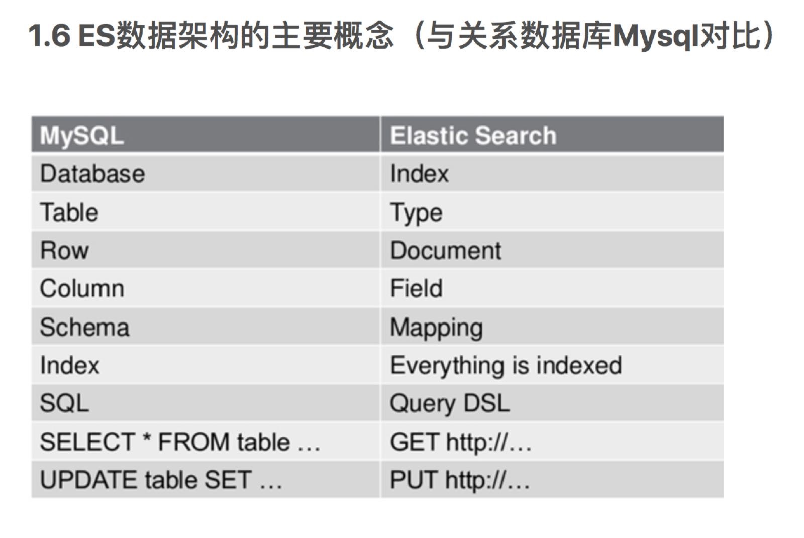

## 概要

1. Elasticsearch：后台分布式存储以及全文检索
2. Logstash: 日志加工、“搬运工” 
3. Kibana：数据可视化展示。

Logstash(收集服务器上的日志文件) 
保存到 ElasticSearch(搜索引擎) 
Kibana提供友好的web界面(从ElasticSearch读取数据进行展示)

## ElasticSearch

实现后台分布式存储以及全文检索
（全文检索就是对一篇文章进行索引，可以根据关键字搜索）

elasticsearch基于lucene的搜索服务器，lucene是一个库，elastic对其进行了封装，减少复杂度。
elasticsearch可以检索数据，返回统计结果，速度快。

### 相关概念

* Cluster ：集群。

  多个搜索服务器的集合

* Node：节点。

  组成集群的单个服务器

* Shard：分片。

  当有大量的文档时，由于内存的限制、磁盘处理能力不足、无法足够快的响应客户端的请求等，一个节点可能不够。这种情况下，数据可以分为较小的分片。每个分片放到不同的服务器上。 

  当你查询的索引分布在多个分片上时，ES会把查询发送给每个相关的分片，并将结果组合在一起，而应用程序并不知道分片的存在。即：这个过程对用户来说是透明的

* Replia：副本。

  为提高查询吞吐量或实现高可用性，可以使用分片副本。 
  副本是一个分片的精确复制，每个分片可以有零个或多个副本。ES中可以有许多相同的分片，其中之一被选择更改索引操作，这种特殊的分片称为主分片。 
  当主分片丢失时，如：该分片所在的数据不可用时，集群将副本提升为新的主分片。

### 对应数据库概念

## Kibana

Kibana 是一个开源分析和可视化平台，旨在可视化操作 Elasticsearch 。Kibana可以用来搜索，查看和与存储在 Elasticsearch 索引中的数据进行交互。可以轻松地进行高级数据分析，并可在各种图表，表格和地图中显示数据。

 Kibana 可以轻松理解海量数据。其简单的基于浏览器的界面使您能够快速创建和共享动态仪表板，实时显示 Elasticsearch 查询的更改。

安装Kibana简单快速。您可以安装 Kibana ，并在几分钟内开始探索您的 Elasticsearch 索引 - 不需要代码，也不需要需额外的基础架构。