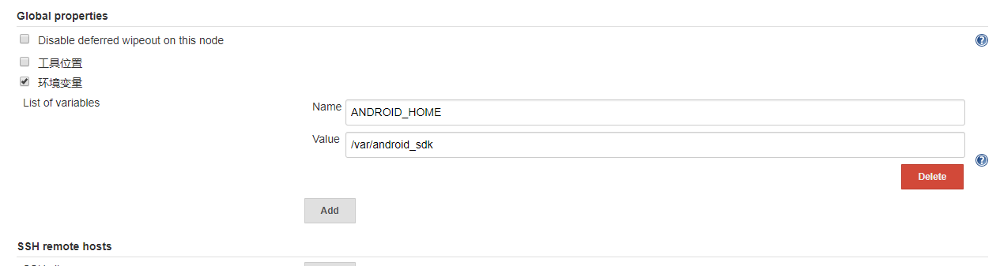
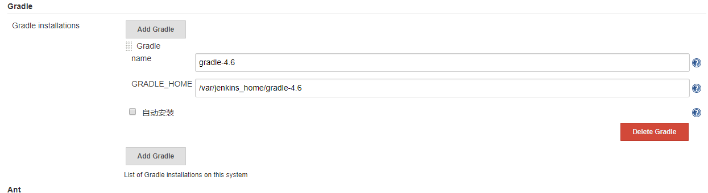
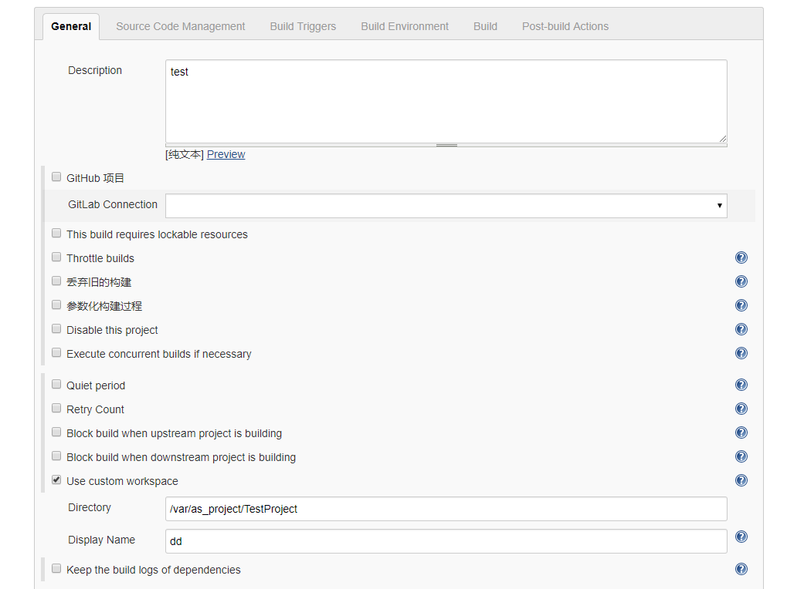
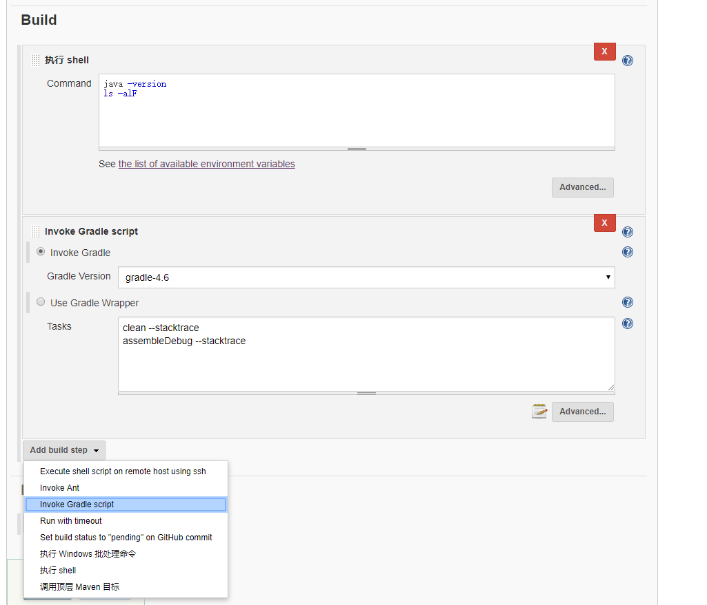
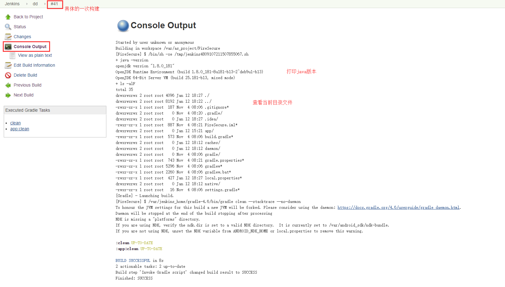
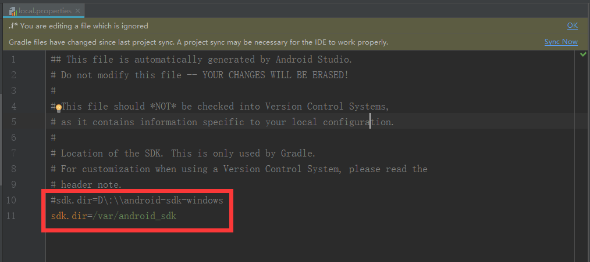
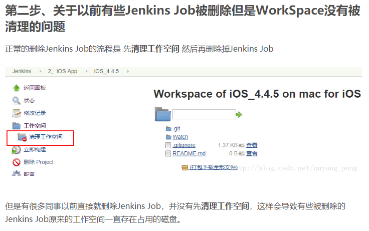
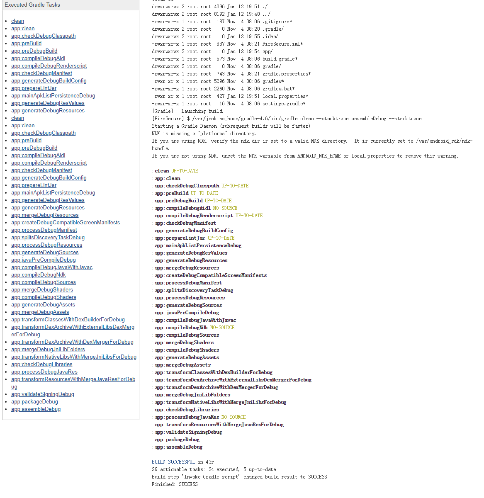

# docker运行jenkins

## 前言

这里使用的docker是windows版的，路径和linux或mac不一样，坑也更多一点。主要就是因为容器的特性，搞明白了之后大部分的问题都可以解决了，具体总结为下面两个原因：

* **使用docker配置jenkins路径有很大的不同，原因是容器内无法访问主机目录，因此需要将主机目录挂载到容器中，Jenkins配置都要使用容器中的目录**，
* **容器内的各种环境也是隔离的，相当于一个独立的系统（类似Win10内置的Linux子系统功能）。也就是说需要的环境都得在容器内再安装一遍。也可以使用挂载，将主机的安装路径挂载到容器中，然后容器中再像Linux一样配置环境变量，这样的好处是和主机版本一致，而且不会增加容器大小。**
  * 如java、python、gradle、android sdk等环境

还有一点要注意的：

**docker容器删掉之后下次再运行，所有的数据都会清空，再创建一个新的容器。因此需要持久化数据**：方法和上面一样，将主机上的目录挂载到docker容器中，对容器目录的读写操作即是对主机的读写，删除容器不会删除主机上的数据，重新创建容器的时候只需要再次挂载主机目录。

我的主机存储路径是这样的（根据需要自行替换）：

* `E:\ASproject`：存放android项目
* `D:\Docker\Volume\Jenkins`：用于持久化容器
* `D:\android-sdk-windows`：存放安卓sdk

## docker安装jenkins

* `docker search jenkins`：在docker hub查找jenkins镜像

搜到的第一个jenkins镜像（Official Jenkins Docker iage）版本太老了，会有很多问题，这里使用jenkins/jenkins镜像。

* `docker pull jenkins/jenkins`：拉取镜像
* `docker run -d -p 8082:8080 -p 50000:50000 --name myjenkins -v /d/Docker/Volume/Jenkins:/var/jenkins_home -v /e/ASproject:/var/as_project -v /d/android-sdk-windows:/var/android_sdk jenkins/jenkins:lts`：运行jenkins，
  * `-v 主机目录:容器目录`：主机目录挂载到容器目录
  * `-p 主机端口:容器端口`：容器端口映射到主机端口
  * `-d`：后台运行
  * `--name`：容器命名，这里命名为`myjenkins`，可自行替换，后面用到的也替换
* 浏览器访问`localhost:8082`：能够访问即成功了

挂载目录解释：

Jenkins的很多配置需要设置路径（如jdk、gradle、android sdk、项目workspace等），而容器内无法访问主机的目录，使用主机目录会配置失败，因此需要将主机目录挂载到容器中

`-v /d/Docker/Volume/Jenkins:/var/jenkins_home`：将主机`D:\Docker\Volume\Jenkins`挂载到容器的`/var/jenkins_home`，即访问`/var/jenkins_home`就是访问主机`D:\Docker\Volume\Jenkins`。这样做是为了容器持久化，否则删除容器之后所有的配置都会消失。重新运行容器之后只要再次挂载这个目录就能恢复配置。

`-v /e/ASproject:/var/as_project`：这样做是为了把项目工作区挂载到容器中，不然访问不到安卓的项目，也可以把项目复制到刚才挂载的`D:\Docker\Volume\Jenkins`这个目录下，让容器能够访问到，不推荐这么做，因为会改变原先项目的路径，而且太大了，所以单独挂载到容器的一个新的目录作为工作区，原先项目路径也不用改变。

`-v /d/android-sdk-windows:/var/android_sdk`：同样的道理，把本机的sdk挂载到容器的新目录中，不用在容器中再装一次sdk

## Jenkins初始化

### 第一次进入需要初始密码

* 可以直接访问刚才挂载的主机目录：`D:\Docker\Volume\Jenkins\secrets\initialAdminPassword`

* 或者使用命令行
  * `docker exec -it myjenkins /bin/bash`进入容器。
  * `cd var/jenkins_home/secrets`进入目录
  * `cat initialAdminPassword`：查看密码，复制到浏览器
* 设置了用户密码之后这个文件就没了

### 安装插件

上一步输入密码之后提示安装插件，使用推荐安装，或者自行选择插件

失败了没关系，进去之后可以到系统管理--插件管理中再安装

### 设置用户名、密码

## Jenkins配置

### 环境变量配置

进入系统管理--系统设置，如下，这里使用刚才挂载的容器内的路径，不能直接用`D:\android-sdk-windows`



注：这个版本的Jenkins镜像好像自带了java环境，因此不用再配置java环境变量，也不用将主机jdk目录挂载到容器内

### 全局工具配置

配置gradle路径，将安装的gradle整个拷贝到`D:\Docker\Volume\Jenkins`中，对应容器中的`/var/jenkins_home`（当然也可以按照上面的挂载方法，将主机安装的gradle挂载到容器新的目录）,这里配置如下



注：

* android studio安装的gradle一般是在`C:\Users\XXX\.gradle\wrapper\dists\gradle-4.6-all\bcst21l2brirad8k2ben1letg\gradle-4.6`，将这个文件夹复制到容器能够访问到的主机目录即可
* jdk不需要配置，这个版本的jenkins镜像自带了java环境

## 任务配置

任务就是每次执行任务的模板，可以查看执行日志，第几次执行等

创建任务、填写名字、描述、这些较简单，跳过，这里只讲关键的配置

### 工作区配置

点击advanced展开配置

刚才我们使用`-v /e/ASproject:/var/as_project`，把主机的android项目目录挂载到了容器的中，因此可以通过容器路径访问主机上的TestProject项目，因此配置如下



### Build配置

会在上面配置的工作区上执行脚本，有多种脚本可以执行，如gradle，shell等。可以写一些简单的脚本进行测试，比如打印java版本，查看当前目录文件等。gradle脚本选择刚才在全局工具配置中的名称



点开左边的构建历史，查看某次构建，如下



注：我们的docker内部是使用linux环境的（也可以切换成windows的），因此能够选择`执行shell`，而不能选择`执行Windows批处理命令`

### 代码远程仓库配置

留坑

配置ssh访问github：使用docker exec命令进入容器，然后参考linux配置，参考文章：[Linux   ssh访问Github相关配置](https://blog.csdn.net/m0_38139979/article/details/82820972)

## 其他

### python环境安装

Job配置的时候可以配置python脚本，也可以配置shell，通过shell命令来执行python脚本。如 `python /var/jenkins_home/scripts/***.py`。

**注：脚本路径要用容器内路径，不能用主机上的路径**

docker版的jenkins自带了python2的环境，但是没有pip，因此需要再安装pip：

* 使用`docker exec -it <容器名/容器id> /bin/bash`进入容器内，然后就当Linux环境进行安装就可以了

参考[[Linux 下安装pip](https://www.cnblogs.com/technologylife/p/5870576.html)](https://www.cnblogs.com/technologylife/p/5870576.html)，输入以下命令（安装的是python2的pip）：

```shell
$ wget https://bootstrap.pypa.io/get-pip.py
$ python get-pip.py
$ pip -V　　#查看pip版本
```

**不过这样安装有个问题，就是删除容器之后下次需要再次安装模块**：解决思路应该是把主机上的python安装目录整个挂载到容器中，然后再`run`的时候通过`--env`设置环境变量，替换掉jenkins自带的python。**没试过，应该可行。有知道的大佬可以联系我**

保存一下需要安装的模块：

```shell
pip install requests
pip install gitpython
```


# 踩坑

## docker for windows重启电脑

每次电脑重启，容器显示在运行，但是已经不能用了，执行restart重启容器会报错

```shell
Error response from daemon: Cannot restart container myjenkins: 
driver failed programming external connectivity on endpoint myjenkins 
(0e1a94a2783d0ff6acc8a8580652692a27bd5dea24bfa2d45d329bb5764bfaa0): 
Error starting userland proxy: mkdir /port/tcp:0.0.0.0:8082:tcp:172.26.0.2:8080: input/output error
```

解决：不知道什么原因，将docker服务整个重启即可

## gradle配置

将gradle复制到jenkins容器映射目录（即主机的`d:\Docker\Volume\Jenkins`），在系统管理--全局工具配置-Gradle中的`GRALDE_HOME`使用路径`/var/jenkins_home/gradle-4.6`。gradle-wrapper不知道怎么弄，没成功过

```shell
//gradle路径不正确
Started by user unknown or anonymous
Building in workspace E:\ASproject\FireSecure
[Gradle] - Launching build.
[Gradle] - [ERROR] Can't retrieve the Gradle executable.
Build step 'Invoke Gradle script' marked build as failure
Finished: FAILURE
```

## java环境配置

docker里面有个java环境（docker-java-home），不知道是装docker就有的，还是装jenkins才弄上去的，
（猜测应该是jenkins自带的，我看了一下其他容器（nginx）没有java环境。nexus也有一个java环境，路径和jenkins不一样，不过版本一模一样，让我有点怀疑）
（网上说需要在系统管理--系统设置里设置Jenkins的JAVA_HOME环境变量，docker版的好像不需要，默认设置了docker-java-home）

## java -version（注意：不是--）

```shell
Error: Could not create the Java Virtual Machine.
Error: A fatal exception has occurred. Program will exit.
Build step 'Execute shell' marked build as failure
```

## docker内的容器找不到主机路径，需要Volume挂载

**这个是最常见的，可能会以各种各样的形式出现**

### 容器访问主机上的工程

默认workspace在容器内的var/jenkins_home路径，上面我们已经通过`-v /d/Docker/Volume/Jenkins:/var/jenkins_home` 把主机的`d:\Docker\Volume\Jenkins`挂载到该目录下面了，访问`var/jenkins_home`就是访问`d:\Docker\Volume\Jenkins`。

也就是说需要将Android工程都复制到`d:\Docker\Volume\Jenkins`里面，然后通过`/var/jenkins_home`去访问具体的项目。

这样做的坏处显而易见，主机上的文件和docker容器文件混在一起，结构不清晰（强迫症受不了，目录和命名都要清清楚楚），要删除也不方便（我们要做的是随时可拆卸）。

解决办法很简单，还是挂载，将工程目录挂载到容器中一个新的目录下，单独存放工程。在run的时候使用`-v /e/ASproject:/var/as_project`挂载一个新的目录，`e:\ASproject`是放我的android项目，然后挂载到容器内的`/var/as_project`，访问`/var/as_project`就是访问`e:\ASproject`。

如果有java工程或者前端工程的话，可以按这种方式再挂载一个新的目录，然后在job里面需要配置Custom Workspace

### 容器内Android Sdk路径

同理，Android项目的local.properties文件中用来指定sdk路径，一般是主机sdk路径。

这里也要修改成容器内的路径，否则执行编译的时候会找不到sdk路径，本地开发的时候再调成主机sdk路径。如图



**注：这里还有一个坑**

执行gradle的upload命令时一直报`llvm-rs-cc is missing`，在主机上运行没问题，容器中执行就报这个错。找了很久，发现是sdk的build_tools出了问题。

原因：主机是windows环境，下载的是windows版本的sdk，容器内是linux环境，通过上面的方法挂载主机的sdk，在容器中使用会出错。

解决办法：下载linux版本的android sdk，sdk比较大，有些文件是通用的，可以不用重复下载（build-tools刚好是不通用的，因此报了上面的错误）

具体方法可以看这篇文章：[windows和linux下androidSDK](https://www.kafan.cn/edu/84098914.html)

顺便学下linux下安装android sdk：[Linux -- 安装配置Android SDK](https://blog.csdn.net/u011974797/article/details/78973012)

## Force GRADLE_USER_HOME to use workspace

这个选项是把gradle缓存之类的（就是平时用户目录下的.gradle/下的东西）都放到workspace里，网上说勾上，但这里我不建议勾选，不勾选他会下到`/root`目录下，所有项目共用（和平时一样）。

## job左边的workspace里面有一个清扫工作空间，看到一篇文章说



**这里提醒一下，删除job不会删除项目，但是点击了清理工作空间，整个项目都会被删掉（慎用！！！！！）**

## docker中使用vim，有的容器有（nexus），有的容器没有（nginx、jenkins）

```shell
#更新来源
apt-get update
#安装vim
apt-get install -y vim
```

## 执行`compileDebug --stacktrace `出错，改为`gradlew compileDebugJavaWithJavac --stacktrace`

```
org.gradle.execution.TaskSelectionException: Task ‘compileDebug’ is ambiguous in root project ‘NJCitizenCardApp’. Candidates are: ‘compileDebugAidl’, ‘compileDebugAndroidTestAidl’, ‘compileDebugAndroidTestJavaWithJavac’, ‘compileDebugAndroidTestNdk’, ‘compileDebugAndroidTestRend
erscript’, ‘compileDebugAndroidTestShaders’, ‘compileDebugAndroidTestSources’, ‘compileDebugJavaWithJavac’, ‘compileDebugNdk’, ‘compileDebugRenderscript’, ‘compileDebugShaders’, ‘compileDebugSources’, ‘compileDebugUnitTestJavaWithJavac’, ‘compileDebugUnitTestSources’.
at org.gradle.execution.TaskSelector.getSelection(TaskSelector.java:116)
at org.gradle.execution.TaskSelector.getSelection(TaskSelector.java:81)
at org.gradle.execution.commandline.CommandLineTaskParser.parseTasks(CommandLineTaskParser.java:42)
at org.gradle.execution.TaskNameResolvingBuildConfigurationAction.configure(TaskNameResolvingBuildConfigurationAction.java:44)
at org.gradle.execution.DefaultBuildConfigurationActionExecuter.configure(DefaultBuildConfigurationActionExecuter.java:48)
```

## 执行`build`命令的时候出现这个

```
Caused by: java.lang.IllegalStateException: llvm-rs-cc is missing 
at com.android.builder.core.AndroidBuilder.compileAllRenderscriptFiles(AndroidBuilder.java:1194) 
at com.android.build.gradle.tasks.RenderscriptCompile.taskAction(RenderscriptCompile.java:
```

我这里是因为buildToolsVersion（没加）、compileSdkVersion（27）和targetSdkVersion（27）不一致引起的，把buildToolsVersion加上这个问题就消失了。

然而最后正常之后，又提示：（也就是说白加了，问题不出在这里）

```
WARNING: The specified Android SDK Build Tools version (27.0.3) is ignored, as it is below the minimum supported version (28.0.3) for Android Gradle Plugin 3.2.1.
Android SDK Build Tools 28.0.3 will be used.
To suppress this warning, remove "buildToolsVersion '27.0.3'" from your build.gradle file, as each version of the Android Gradle Plugin now has a default version of the build tools.
```

## 共用缓存报错（Jenkins执行任务，本地使用IDE也在执行）

 这是因为在跑job的时候，手贱在android studio里面也点了一下。最后搜到是共用缓存被锁住的问题[参考](https://stackoverflow.com/questions/53186389/gradle-build-on-gitlab-ci-could-not-create-service-of-type-scriptpluginfactory)，再跑一下就好了（不。是换了个错误）

```shell
AILURE: Build failed with an exception.

* What went wrong:
Could not create service of type ScriptPluginFactory using BuildScopeServices.createScriptPluginFactory().
> Could not create service of type FileHasher using BuildSessionScopeServices.createFileSnapshotter().

* Try:
Run with --info or --debug option to get more log output. Run with --scan to get full insights.

* Exception is:
org.gradle.internal.service.ServiceCreationException: Could not create service of type ScriptPluginFactory using BuildScopeServices.createScriptPluginFactory().
	at org.gradle.internal.service.DefaultServiceRegistry$FactoryMethodService.invokeMethod(DefaultServiceRegistry.java:857)
	at org.gradle.internal.service.DefaultServiceRegistry$FactoryService.create(DefaultServiceRegistry.java:808)
	
	........ more
	
Caused by: org.gradle.api.UncheckedIOException: java.io.IOException: Input/output error
	at org.gradle.internal.UncheckedException.throwAsUncheckedException(UncheckedException.java:57)
	at org.gradle.internal.UncheckedException.throwAsUncheckedException(UncheckedException.java:40)
	at org.gradle.cache.internal.DefaultFileLockManager.lock(DefaultFileLockManager.java:103)
	at org.gradle.cache.internal.LockOnDemandCrossProcessCacheAccess.incrementLockCount(LockOnDemandCrossProcessCacheAccess.java:105)
	at org.gradle.cache.internal.LockOnDemandCrossProcessCacheAccess.acquireFileLock(LockOnDemandCrossProcessCacheAccess.java:161)
	at org.gradle.cache.internal.DefaultCacheAccess.onStartWork(DefaultCacheAccess.java:368)
	at org.gradle.cache.internal.DefaultCacheAccess.useCache(DefaultCacheAccess.java:213)
	at org.gradle.cache.internal.DefaultCacheAccess.useCache(DefaultCacheAccess.java:203)
	at org.gradle.cache.internal.DefaultCacheAccess.newCache(DefaultCacheAccess.java:298)
	at org.gradle.cache.internal.DefaultCacheAccess.newCache(DefaultCacheAccess.java:57)
	at org.gradle.cache.internal.DefaultPersistentDirectoryStore.createCache(DefaultPersistentDirectoryStore.java:148)
	at org.gradle.cache.internal.DefaultCacheFactory$ReferenceTrackingCache.createCache(DefaultCacheFactory.java:177)
	at org.gradle.api.internal.changedetection.state.CrossBuildFileHashCache.createCache(CrossBuildFileHashCache.java:51)
	at org.gradle.api.internal.changedetection.state.CachingFileHasher.<init>(CachingFileHasher.java:44)
	at org.gradle.internal.service.scopes.BuildSessionScopeServices.createFileSnapshotter(BuildSessionScopeServices.java:198)
	at org.gradle.internal.reflect.JavaMethod.invoke(JavaMethod.java:73)
	at org.gradle.internal.service.ReflectionBasedServiceMethod.invoke(ReflectionBasedServiceMethod.java:35)
	at org.gradle.internal.service.DefaultServiceRegistry$FactoryMethodService.invokeMethod(DefaultServiceRegistry.java:855)
	... 82 more
Caused by: java.io.IOException: Input/output error
	at org.gradle.cache.internal.filelock.LockStateAccess.readState(LockStateAccess.java:69)
	at org.gradle.cache.internal.filelock.LockStateAccess.ensureLockState(LockStateAccess.java:46)
	at org.gradle.cache.internal.filelock.LockFileAccess.ensureLockState(LockFileAccess.java:59)
	at org.gradle.cache.internal.DefaultFileLockManager$DefaultFileLock.lock(DefaultFileLockManager.java:293)
	at org.gradle.cache.internal.DefaultFileLockManager$DefaultFileLock.<init>(DefaultFileLockManager.java:154)
	at org.gradle.cache.internal.DefaultFileLockManager.lock(DefaultFileLockManager.java:100)
	... 97 more

```

## Docker容器内无法访问主机网络

背景：执行Jenkins打包aar到maven仓库的时候，提示无法连接到Nexus服务。

原因：Docker容器内无法访问主机网络

我运行了Docker的Nexus容器，主机使用`localhost:8081`访问Nexus服务，Docker的Jenkins容器无法访问`localhost`地址。（可以使用`exec`命令进入容器内，在容器中使用curl或者telnet工具尝试访问端口）

解决办法：

* 使用主机IP访问
  * 在容器内使用`ip addr`命令查看ip地址
  * 在容器外使用`ipconfig`命令查看ip地址
* 运行容器的时候可以配置容器网络：默认有三种网络：host、bridge、none，可以使用`docker network ls`命令查看，可以使用`docker network create`命令自行创建网络。使用`docker run --network 网络名`命令配置容器网络
  * 容器使用宿主机网络：使用`docker run --network host`命令。（有坑：这种模式只适用于Linux主机，不适合windows和mac）
  * 容器以桥接模式连接到宿主机：使用`docker run --network bridge`命令（不设置的话使用默认的bridge网络）

参考[Docker容器访问宿主机网络的方法](https://www.jb51.net/article/149173.htm)

这里碰到了一个问题，我对网络不太了解，不过经过测试之后得出来了一些结论，有知道的可以联系我。

我主机总共监听了3个端口：

- 使用docker运行了Nexus容器，映射到主机的8081端口，原端口也是8081
- 使用docker运行了Jenkins容器，映射到主机的8082端口，原端口是8080
- 主机上运行了springboot的服务，监听8083端口

这里不设置桥接网络，即用默认的Bridge网络，使用`docker inspect <容器名>`可以查看到Networks的配置

```json
//截取其中网关和ip地址
//Jenkins配置如下
{
  "Gateway": "172.17.0.1",
  "IPAddress": "172.17.0.3"
}
//查看Nexus的配置，这个ip是按容器创建顺序自动分配的
{
  "Gateway": "172.17.0.1",
  "IPAddress": "172.17.0.2"
}
```

下面进入Jenkins容器中使用curl测试下能否访问地址和端口，测试结果如下

* 在主机浏览器上使用`localhost`都能访问这三个端口，没问题。
* 主机上访问172.17.0.1:8081，超时，但不是被拒绝了
* Jenkins容器内访问：

| 主机:端口                                       | Jenkins            |
| ----------------------------------------------- | ------------------ |
| localhost                                       | 三个端口都访问不到 |
| 172.17.0.1:8081（网关+Nexus映射端口）           | 可以               |
| 172.17.0.1:8082（网关+Jenkins映射端口）         | 可以               |
| 172.17.0.1:8083（网关+主机服务端口）            | 不可以             |
| 172.17.0.2:8081（NexusIP+Nexus原/映射端口）     | 可以               |
| 172.17.0.2:8082（NexusIP+Jenkins映射端口）      | 不可以             |
| 172.17.0.2:8083（NexusIP+主机服务端口）         | 不可以             |
| 172.17.0.3:8081（JenkinsIP+Nexus映原/映射端口） | 不可以             |
| 172.17.0.3:8082（JenkinsIP+Jenkins映射端口）    | 不可以             |
| 172.17.0.3:8083（JenkinsIP+主机服务端口）       | 不可以             |
| 主机动态ip:8081                                 | 可以               |
| 主机动态ip:8082                                 | 可以               |
| 主机动态ip:8083                                 | 可以               |
| 主机动态ip:8080                                 | 不可以             |
| 172.17.0.1:8080（网关+Jenkins原端口）           | 不可以             |
| 172.17.0.3:8080（JenkinsIP+Jenkins原端口）      | 可以               |

得出结论如下（对网络不太了解，凭自己感觉得出来结论，有错误的地方可以联系我）：

* docker使用bridge网络，即是一个虚拟的网关：172.17.0.1，或者叫子网？（可以使用`docker network create`命令自行创建网络），容器在这个子网下创建，会分配到一个虚拟的ip地址
* 在子网内的容器互相访问可以使用`网关+容器映射端口`，或者使用`容器的ip+该容器的原端口号`
  * 这里的原端口指的是没有映射过的端口，如Jenkins是8080，Nexus是8081
  * Nexus可以使用172.17.0.3:8080访问Jenkins，使用8082则不可以
* 主机访问容器，直接访问`主机IP+容器映射端口`。理论上应该是可以通过网关（172.17.0.1）访问到容器内部的，这里只是提示超时了，不知道应该怎么设置。

按我的理解就是docker给每个容器分配了一个虚拟的网关和虚拟的ip地址。把每个容器看作一台机器，同一个网关下的容器看作一个子网下的机器。（真实的网络我不了解，但是应该能够得出和虚拟的一样的结论）

* 容器映射出去的端口到网关那里，因此可以通过`网关+容器映射端口`访问到容器。同样也映射到了主机那里，可以通过`主机ip+容器映射端口`访问
* 知道容器ip的情况下，可以直接访问容器监听的端口，即`容器ip+容器原端口`（和主机服务类似，也可以通过localhost访问自己的端口），不能使用映射出去的端口了
* 但是容器要访问外部（主机）的话就只有通过主机ip访问（不过这个ip是动态在变的，每次都要换，也可以通过域名，或者设置固定ip）

win10固定ip设置：

* 命令行`ipconfig/all`查看IPv4、子网掩码、网关、首选DNS、备用DNS。（或者网络和Internet->状态->查看网络属性）
* 找到IP设置->IPv4，选择手动，一个个填上去就好了。
* 就不放图了

### docker容器内无法访问公网

Temporary failure in name resolution

```shell
ping www.baidu.com
#报错
ping: www.baidu.com: Temporary failure in name resolution
#或者：ping: www.bing.com: Name or service not known
```

原因：DNS设置有问题

解决办法：windows下打开docker设置，如下图，选择固定DNS（具体原因不太懂，自己尝试了这样改就OK了）


## python编码错误

### 编码错误1

背景：http请求返回值中含有中文，在容器内使用命令行运行没报错，使用jenkins job运行就报编码错误。

```shell
UnicodeEncodeError: 'ascii' codec can't encode characters in position 84-87: ordinal not in range(128)
```

原因：python默认编码是ascii。

解决办法：

（1）加上这三句，设置编码。（本文件有效）

```python
import sys
reload(sys)
sys.setdefaultencoding('utf8')
```

（2）设置python默认编码（全局python环境）,#在Python的Lib\site-packages文件夹下新建一个sitecustomize.py文件，内容为：

```python
#coding=utf8
import sys
reload(sys)
sys.setdefaultencoding('utf8')
```

（3）使用命令行运行不会报错。。。

### 编码错误2

还有一种情况，python文件中出现中文，包括中文注释，运行的时候也会报错（而且使用命令行也会报错）

```shell
SyntaxError: Non-ASCII character '\xe5' in file E:/CiProject/jenkins_workspace/ci_scripts/util/http_util.py on line 11, but no encoding declared; see http://python.org/dev/peps/pep-0263/ for details
```

原因：python文件默认是以ascii保存的

解决办法：需要声明文件编码格式，在文件头加上声明，下面几种方式都可以

```python
#coding=<encoding name>
----------------------------------------------------------
#!/usr/bin/python
# -*- coding: <encoding name> -*-
-----------------------------------------------------------
#!/usr/bin/python
# vim: set fileencoding=<encoding name> :
```

## 其他Android错误

运行Gradle脚本可能会出现各种各样的Android或者Gradle错误，只能一个个排查了，比如遇到内存不足，sdk版本不对等

## docker容器时区和宿主机不一致

* docker容器内时区为UTC：国际协调时间，即0时区
* 宿主机时区为CST：中国标准时间，即东八区

解决办法：

1. 启动容器的时候通过挂载共享主机的localtime：`docker run --name <name> -v /etc/localtime:/etc/localtime`

2. 将主机的配置文件拷贝到容器中：`docker cp /etc/localtime:【容器ID或者NAME】/etc/localtime`

3. 使用`docker exec -it <容器名/id> /bin/bash`进去容器内部进行修改。（当作一个linux系统即可）

4. 创建自定义的Dockerfile，如下。保存后使用docker build生成镜像

   ```shell
   FROM redis
   FROM tomcat
   ENV CATALINA_HOME /usr/local/tomcat
   #设置时区
   RUN /bin/cp /usr/share/zoneinfo/Asia/Shanghai /etc/localtime \
     && echo 'Asia/Shanghai' >/etc/timezone \
   ```

**对于Windows版的docker，时区配置不知道在哪，上面的方法不知道有没有用，因为暂时不影响，所以没尝试**

## 使用shell执行gradlew命令

* 使用gradle命令：在容器内下载gradle，并且在**容器内部（不是宿主机）**配置环境变量。（或者直接挂载主机的gradle路径）
* 使用gradlew命令：gradlew对gradle进行了封装，并且会自动下载对应版本的gradlew。

**使用gradlew注意：**

* 修改Android工程的.gitignore，下面三行去掉

  ```shell
  /gradle/
  /gradlew
  /gradlew.bat
  ```

* 脚本需要使用`./gradlew ***`执行，而不是`gradlew`，因为容器是linux环境，和宿主机（windows）不同

* 会自动下载相应版本到用户目录的`.gradle`文件夹下

## 切换task为`assembleDebug`终于成功打出apk了，折腾了一晚上天快亮了，

