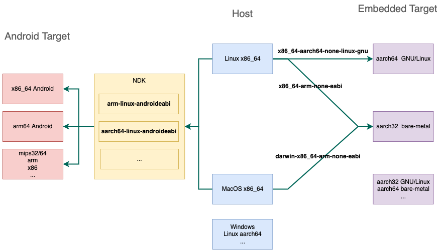
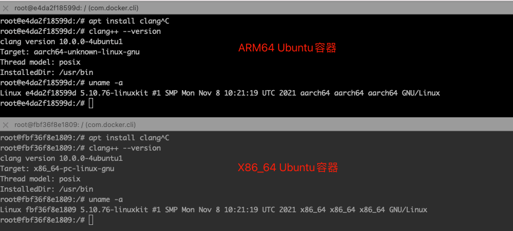

# 交叉编译概念

一支编译程序只生成一种机器代码。不同架构使用的编译器不同，并且生成不同的目标代码，例如x86，x64架构上的GCC是不一样的。要在一种CPU架构上生成另一个平台的目标代码，需要使用**交叉编译**。

* 本地编译（native compile）：本机编译出来的程序在本机上运行
* 交叉编译（cross compile）：在一个平台上生成另一个平台的可执行代码，即编译环境和运行环境不一样。常用于嵌入式开发

编译用的机器叫宿主机（Host），软件运行的机器叫目标机（Target）。宿主机和目标机通过串口或网络通讯。

为何需要交叉编译？

> 单片机或嵌入式设备功能较少，硬件资源和性能有限，只能供嵌入式系统运行，难以再提供编译资源。

嵌入式系统一般也比PC系统要轻量，CPU种类更多（如x86、arm、armv7、arm64、mips等），各家的指令集也存在差异，因此嵌入式操作系统一般要针对芯片分别进行编译。应用软件也需要分别编译。

> * Android使用Java，运行在虚拟机上，因此不需要分别编译，但是如果使用了so库，则需要分别编译
>* iPhone不同版本使用不同CPU架构，编译的时候可以选择目标版本系统和目标架构。

# 交叉编译工具链

交叉编译工具链（交叉编译器）：交叉编译用到的**一系列工具、库和头文件**等。一般命名为`arch-[-vendor][-os][-(gnu)eabi][-tool]`，如`arm-none-linux-gnueabi-gcc`、`arm-linux-ld`等。

> 常用的交叉编译工具链有两种：GCC/GNU和Clang/LLVM

注：交叉编译工具本身也是应用程序，需要针对主机编译才能运行。因此可能会出现命名如下

* `x86_64-aarch64-none-linux-gnueabihf`：在Linux x86_64主机上运行，目标平台是aarch64架构的Linux系统
* `aarch64-arm-none-linux-gnueabihf`：在Linux aarch64主机运行，目标平台是arm架构的Linux系统
* `aarch64-aarch64-none-elf`：在Linux aarch64主机运行，目标平台是aarch64架构的裸机系统

> * aarch32=arm
> * aarch64=arm64

交叉编译示意图如下：



Android和Java代码编译只需要编译成dex或class，不需要编译成目标代码，因此不需要交叉编译。但是Android中的Native开发还是需要使用交叉编译工具链，只不过NDK中做了封装。

ABI（Application Binary Interface）和EABI（Embedded ABI）区别

> 前者是计算机上的，后者是嵌入式平台上（arm、mips等）

`arm-none-eabi`和`arm-none-linux-eabi`区别

> 前者指目标平台为aarch32架构的裸机系统（ELF bare-metal，没有操作系统），后者指目标平台为aarch32架构的Linux系统（GNU/Linux）

`arm-linux-gnueabi`和`arm-linux-gnueabihf`区别

> 前者适用于armel架构，后者适用于armhf架构。二者的`--mfloat-abi`编译选项不同。

gcc编译选项`-mfloat-abi`有三种值：

* soft：不用fpu进行浮点运算，使用软件模式。
* softfp：armel架构采用的默认值，用fpu计算，传参数用普通寄存器传。
* hard：armhf架构采用的默认值，用fpu计算，传参数也用fpu的浮点寄存器传。

> el表示little-endian
>
> hf表示hard float，需要fpu浮点运算单元支持
>
> arm64默认是hf，因此不需要hf后缀
>
> be表示big-endian

交叉编译工具链获取方式：

1. 获取源码，自行编译制作：[LLVM-Project](https://github.com/llvm/llvm-project)、[Clang构建](https://clang.llvm.org/get_started.html)、[Linux ARM交叉编译工具链制作过程](https://www.cnblogs.com/Charles-Zhang-Blog/archive/2013/02/21/2920999.html)
2. 使用现成的编译好的工具链：[ARM](https://developer.arm.com/tools-and-software/open-source-software/developer-tools/)、[Linaro](https://www.linaro.org/downloads/)、[Codesourcery](https://www.plm.automation.siemens.com/global/en/products/embedded-software/sourcery-codebench-lite-downloads.html)。
3. 使用包管理器直接下载，如apt、rpm、yum等

## 制作LLVM交叉编译工具链

本地编译器构建比较简单（一般可以直接使用包管理器安装），交叉编译器则需要获取LLVM源码自行构建。

Flutter引擎使用Clang/LLVM工具链编译，这里简单介绍下步骤：

```shell
# 下载源码
$ git clone --branch=llvmorg-11.1.0 --depth=1 https://github.com/llvm/llvm-project.git
$ cd llvm-project

# 构建并安装Clang
$ cmake -G Ninja \
    -S llvm \
    -B build_llvm \
    -DCMAKE_BUILD_TYPE=Release \
    -DCMAKE_CROSSCOMPILING=True \
    -DCMAKE_INSTALL_PREFIX=$HOME/sdk/toolchain \
    -DLLVM_ENABLE_PROJECTS=clang \
    -DLLVM_DEFAULT_TARGET_TRIPLE=arm-linux-gnueabihf \
    -DLLVM_TARGET_ARCH=ARM \
    -DLLVM_TARGETS_TO_BUILD=ARM
$ cmake --build build_llvm && sudo cmake --install build_llvm
```

> * -S：源码目录
> * -G：使用Ninja构建
> * -B：构建目录
> * -DCMAKE_INSTALL_PREFIX：LLVM工具和库安装的路径。默认安装在/usr/local，可能会覆盖系统本身的工具
> * -DLLVM_ENABLE_PROJECTS：LLVM子项目构建，分号分隔
> * -DLLVM_ENABLE_RUNTIMES：运行时库构建，分号分隔

### Binutils构建

GNU Binutils：二进制工具集合：

* ld、gold：GNU链接器
* as：GNU汇编器
* addr2line：地址转代码行数
* ar：归档工具
* objdump：输出目标文件信息
* objcopy：拷贝目标文件
* ....

```shell
# 下载源码
$ git clone --depth=1 git://sourceware.org/git/binutils-gdb.git
$ cd binutils-gdb
# 构建并安装Binutils
$ ./configure --prefix="$HOME/sdk/toolchain" \
    --enable-gold \
    --enable-ld \
    --target=arm-linux-gnueabihf
$ make -j$(expr $(expr $(nproc) \* 6) \/ 5) && sudo make install
```

> `./configure`也是用于生成Makefile文件

### libcxx和libcxx构建

```shell
$ cd llvm-project
# arm目标平台libcxxabi构建
$ [ -d build_libcxxabi ] && sudo rm -r build_libcxxabi ;\
cmake -G Ninja \
    -S libcxxabi \
    -B build_libcxxabi \
    -DCMAKE_MAKE_PROGRAM=$(which ninja) \
    -DCMAKE_BUILD_TYPE=Release \
    -DCMAKE_SYSROOT=$HOME/flutter-engine/sdk/sysroot \
    -DCMAKE_INSTALL_PREFIX=$HOME/sdk/toolchain \
    -DCMAKE_SYSTEM_NAME=Linux \
    -DCMAKE_SYSTEM_PROCESSOR=ARM \
    -DCMAKE_C_COMPILER=$HOME/sdk/toolchain/bin/clang \
    -DCMAKE_CXX_COMPILER=$HOME/sdk/toolchain/bin/clang++ \
    -DCMAKE_AR=$HOME/sdk/toolchain/bin/arm-linux-gnueabihf-ar \
    -DCMAKE_RANLIB=$HOME/sdk/toolchain/bin/arm-linux-gnueabihf-ranlib \
    -DLLVM_TARGETS_TO_BUILD=ARM \
    -DLIBCXX_ENABLE_SHARED=False \
    -DLIBCXXABI_ENABLE_EXCEPTIONS=False
$ cmake --build build_libcxxabi && sudo cmake --install build_libcxxabi
# arm目标平台libcxx构建
$ [ -d build_libcxx ] && sudo rm -r build_libcxx ;\
cmake -G Ninja \
    -S libcxx \
    -B build_libcxx \
    -DCMAKE_MAKE_PROGRAM=$(which ninja) \
    -DCMAKE_BUILD_TYPE=Release \
    -DCMAKE_SYSROOT=$HOME/sdk/sysroot \
    -DCMAKE_INSTALL_PREFIX=$HOME/sdk/toolchain \
    -DCMAKE_SYSTEM_NAME=Linux \
    -DCMAKE_SYSTEM_PROCESSOR=ARM \
    -DCMAKE_C_COMPILER=$HOME/sdk/toolchain/bin/clang \
    -DCMAKE_CXX_COMPILER=$HOME/sdk/toolchain/bin/clang++ \
    -DCMAKE_AR=$HOME/sdk/toolchain/bin/arm-linux-gnueabihf-ar \
    -DCMAKE_RANLIB=$HOME/sdk/toolchain/bin/arm-linux-gnueabihf-ranlib \
    -DLLVM_TARGETS_TO_BUILD=ARM \
    -DLIBCXX_ENABLE_EXCEPTIONS=False \
    -DLIBCXX_ENABLE_SHARED=False \
    -DLIBCXX_ENABLE_RTTI=False \
    -DLIBCXX_CXX_ABI=libcxxabi \
    -DLIBCXX_CXX_ABI_INCLUDE_PATHS=$HOME/llvm-project/libcxxabi/include \
    -DLIBCXX_CXX_ABI_LIBRARY_PATH=$HOME/sdk/toolchain/lib \
    -DLIBCXX_ENABLE_STATIC_ABI_LIBRARY=True
$ cmake --build build_libcxx && sudo cmake --install build_libcxx
```

> `[-d path]`：判断目录是否存在，存在则条件成立
>
> `[-n 变量]`：判断变量是否为空，为空则条件成立

踩坑：`libcxx`和`libcxxabi`构建报错，网上说是Glibc版本太高，折腾了一下没搞定。

```shell
/root/flutter-engine/sdk/toolchain/bin/arm-linux-gnueabihf-ld: /root/flutter-engine/sdk/sysroot/lib/gcc/arm-linux-gnueabihf/9/libstdc++.so: undefined reference to `acos@GLIBC_2.4'
```

# sysroot

指定编译时的逻辑根目录，**只在链接过程中起作用**，作为交叉编译工具链搜索目标平台库和头文件的根路径。

> 编译过程中默认会在`/usr/include`、`/usr/lib`下查找引用的库和头文件，指定sysroot为dir之后会在`dir/usr/include`、`dir/usr/lib`下查找。

**sysroot本质是目标平台的依赖库，不特指某个库，而是编译时需要的所有的库，不同软件编译依赖不同的库。**

**软件交叉编译时需要链接对应架构的平台库，在sysroot路径下查找目标平台的库和头文件。**

直接在主机用apt安装只会安装当前平台的库，所以需要利用容器环境的包管理工具（apt）下载目标架构的平台库。

例如在arm64容器中和x86_64容器中分别使用apt安装依赖库，二者的目标平台不同（如下图对比）。



## 制作sysroot

sysroot本质是目标平台的依赖库，只要能下载到编译需要的依赖库即可。

1. 网上下载
1. 使用Docker+QEMU+包管理器下载已经编好的库
2. 使用BuildRoot构建系统，交叉编译依赖库的源码，生成可链接的目标平台库
3. 使用Yocto构建系统，交叉编译依赖库的源码，生成可链接的目标平台库

以Docker+QEMU为例，创建`flutter_elinux`需要的arm64 sysroot

1. 在Linux主机上安装Docker

2. 安装QEMU，用于运行arm架构容器：`apt install qemu-user-static`

3. 运行Docker官方`arm64v8/ubuntu`容器：`docker run -it --name ubuntu-arm64 arm64v8/ubuntu:18.04`

   1. arm Ubuntu镜像：`docker pull arm32v7/ubuntu`
   2. arm64 Ubuntu镜像：`docker pull arm64v8/ubuntu`

4. 在容器中安装依赖库：根据需要安装，这里以Flutter eLinux为例

   ```shell
   $ apt update
   $ apt install clang cmake build-essential pkg-config libegl1-mesa-dev libxkbcommon-dev libgles2-mesa-dev
   $ apt install libwayland-dev wayland-protocols
   $ apt install libdrm-dev libgbm-dev libinput-dev libudev-dev libsystemd-dev
   ```

5. 将arm64平台的依赖库拷贝到Linux主机：根据需要拷贝sysroot，常用的有`/lib /usr /etc /opt`

   ```shell
   $ docker cp ubuntu-arm64:/ ubuntu-arm64-sysroot
   ```

> 由于公司的远程Linux主机没有权限使用apt，无法安装QEMU，因此在本地Mac主机上运行ARM64容器，下载平台库制作sysroot，再上传到Linux X86_64的容器中进行编译。

# pkg-config

通过`.pc`文件查找软件的头文件和库文件位置，用于C/C++程序链接。

例如`/usr/lib/arm-linux-gnueabihf/pkgconfig/x11.pc`

```shell
$ cat /usr/lib/arm-linux-gnueabihf/pkgconfig/x11.pc
prefix=/usr
exec_prefix=${prefix}
libdir=${prefix}/lib/arm-linux-gnueabihf
includedir=${prefix}/include

xthreadlib=-lpthread
# 软件简介
Name: X11
Description: X Library
Version: 1.6.9
Requires: xproto kbproto
Requires.private: xcb >= 1.11.1
# 头文件路径
Cflags: -I${includedir}
# 库目录
Libs: -L${libdir} -lX11
Libs.private: -lpthread
```

* 查看已知的软件包：`pkg-config --list-all`
* 查看软件头文件路径：`pkg-config --cflags <software>`
* 查看软件库路径：`pkg-config --libs <software>`

输出的格式可以直接用于gcc链接选项，例如

```shell
$ pkg-config --cflags --libs cairo
-I/usr/include/cairo -I/usr/include/glib-2.0 -I/usr/lib/arm-linux-gnueabihf/glib-2.0/include -I/usr/include/pixman-1 -I/usr/include/uuid -I/usr/include/freetype2 -I/usr/include/libpng16 -lcairo
$ g++ -o main.out $(pkg-config --cflags --libs cairo) main.cc
```

# CMake配置

CMake编译过程中遇到一些问题，做个记录。

CMakeList.txt中添加打印：`message(WARNING ${变量名})`

查看CMake变量

* `cmake --help-variable-list`
* `cmake --help-variable CMAKE_SYSROOT_COMPILE`

## 保存临时文件夹

cmake执行时会使用测试项目进行检查。执行完之后会自动删除。

添加`--debug-trycompile`选项可以保留临时目录。

> cmake会调用多个命令，有时候cmake执行失败，我们想调试具体的报错命令，需要用到临时目录。

## 编译工具链指定

交叉编译时主机可能会包含本地编译工具链，以及多个目标平台的交叉编译工具链，因此需要指定编译工具链。

方式一：执行命令的时候添加参数选项。

例如：`-DCMAKE_C_COMPILER=aarch64-linux-gnu-gcc -DCMAKE_CXX_COMPILER=aarch64-linux-gnu-g++`

方式二：通过文件配置变量

例如创建`gcc_arm_toolchain.cmake`文件：

```makefile
# 指定目标系统
SET(CMAKE_SYSTEM_NAME Linux)

# 指定编译器
SET(CMAKE_C_COMPILER aarch64-none-linux-gnu-gcc)
SET(CMAKE_CXX_COMPILER aarch64-none-linux-gnu-g++)

# 指定搜索的根路径
SET(CMAKE_FIND_ROOT_PATH /opt/gcc-arm-11.2-2022.02-x86_64-aarch64-none-linux-gnu/)
SET(CMAKE_FIND_ROOT_PATH_MODE_PROGRAM NEVER) # 使用本机程序
SET(CMAKE_FIND_ROOT_PATH_MODE_LIBRARY ONLY)  # 仅使用 FIND_ROOT 下的库
SET(CMAKE_FIND_ROOT_PATH_MODE_INCLUDE ONLY)  # 仅使用 FIND_ROOT 下的头文件
```

执行命令的时候使用`-DCMAKE_TOOLCHAIN_FILE=gcc_arm_toolchain.cmake`选项指定配置文件，或者在CMakeList.txt中使用`include(gcc_arm_toolchain.cmake)`引入文件

## include_directories

编译过程中如果提示找不到头文件，需要添加头文件查找路径：

* 方式一：编译命令添加`-I dir`参数
* 方式二：配置`CMakeList.txt`文件，添加命令`include_directories([AFTER|BEFORE][SYSTEM] dir1 [dir2...])`

BEFORE和AFTER表示将路径添加到列表前面还是后面。SYSTEM表示当成系统搜索目录。

举例：`test.h`头文件放到sub目录下，`main.cpp`引用头文件如下：

```cpp
//main.cpp
#include "sub/test.h"
//不指定sub路径
//#include "test.h"
#include <stdio.h>
int main(int argc, char **argv)
{
    printf("Hello, World!\n");
    return 0;
}
```

```makefile
# CMakeList.txt
cmake_minimum_required(VERSION 3.18.2)
project(cmake_test)
# 引入头文件路径
# include_directories(sub) 
add_executable(test main.cpp)
```

执行`cmake --build .`，生成test程序，执行输出Hello World!

如果直接`#include "test.h"`，构建的时候会提示找不到头文件：`fatal error: 'test.h' file not found `

此时可以在CMakeList.txt中添加`include_directories(sub) `，引入头文件路径，编译成功。

## target_include_directories

`target_include_directories(target PRIVATE|INTERFACE|PUBLIC dir)`：指定目标包含的头文件路径。`include_directories()`会对其子目录起作用，导致整个工程编译时都会增加`-I dir`

参考：[cmake：target_**](https://zhuanlan.zhihu.com/p/82244559)

# 结语

关于GCC链接可以参考[构建工具](/2022/01/03/tool-2022-01-03-GNU和编译工具介绍/)

glibc和glib：

* glib：GTK+库
* glibc：GNU C函数库，[glibc介绍和安装](http://blog.fpliu.com/it/software/GNU/glibc)

参考资料：

* [Flutter eLinux：Cross-building from x64 to arm64](https://github.com/sony/flutter-elinux/wiki/Building-flutter-apps#case-1-use-docker--qemu)：制作sysroot
* [Build Flutter engine for linux-arm/arm64](https://wiki.loliot.net/docs/lang/flutter/engine/flutter-engine-for-linux-arm64/)、[Flutter on Raspberry Pi (mostly) from scratch](https://medium.com/flutter/flutter-on-raspberry-pi-mostly-from-scratch-2824c5e7dcb1)：自行制作toolchain，编译Flutter引擎
* [Linux 下交叉编译 ARM64-linux 版本 GDAL-3.2.0](https://www.cnblogs.com/oloroso/p/13995309.html)