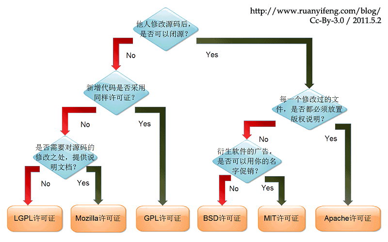
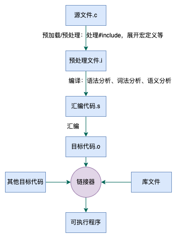
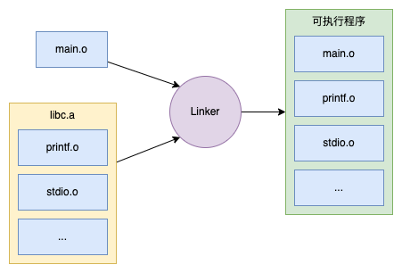

# GNU介绍

* 1983年：Richard Stallman发起GNU计划，目标是创建一套完全自由的操作系统，起因是Unix版权问题
* 1985年：成立FSF，为GNU计划提供技术、法律以及财政支持
* 1990年：完成Emacs编辑器，GCC编译器以及大部分Unix系统的程序库和工具。但操作系统内核（Hurd）仍未完成
* 1991年：Linus开发与Unix兼容的Linux内核，并采用GPL条款发布。之后许多程序员参与了开发和修改
* 1992年：Linux与其他GNU软件结合，诞生GNU/Linux操作系统，简称Linux系统。

> 内核：用于资源分派和硬件管理的程序
>
> Linux只是一个内核，用户态还是使用GNU系的软件，如bash shell、emacs编辑器、gcc编译器套装、glibc（GNU的C库）等
>
> GNU官方核心是GNU Hurd，GNU/Linux是变种，除了Linux之外，还有FreeBSD内核、NetBSD内核等
>
> Google在Linux内核的基础上，开发了bionic库，替换了glibc库，用于Android系统

GNU（GNU's Not Unix!）：是一个自由的操作系统，是由多个应用程序、系统库、开发工具组成的程序集合。模仿Unix界面和使用方式（类Unix），做的一个开源的版本。

> 自由软件：
>
> 1. 运行软件的自由
> 2. 研究该软件如何工作，按需改写软件的自由
> 3. 重新发布拷贝的自由
> 4. 向公众发布改进版软件的自由

GNU计划：又称“革奴计划”，在这个计划下做了很多工作和项目，如GCC、glibc、bash shell、emacs等，并成立了FSF，起草了GPL协议条款。

## 常见开源许可协议

* FSF：（Free Software Foundation，自由软件基金会）
* GPL：（GNU General Public License，GNU通用公共许可证）
* LGPL：(GNU Lesser General Public License，GNU较宽松公共许可证 ) ，旧称 GNU Library General Public License (GNU 库通用公共许可证)；
* GFDL：（GNU Free Documentation License，GNU自由文档许可证）
* BSD：（Berkeley Software Distribution，伯克利软件套件），Unix的衍生系统（类Unix）
* BSD许可证：允许软件闭源发布

借用一下阮一峰老师的图片：



# GCC

完整的GNU工具链包括Binutils（包括Assembler汇编器、Linker链接器）、GCC编译器、C库

## gcc/g++编译过程

1. 预处理（pre-compile）[预处理器cpp]：删除#define并展开宏定义，处理#include等，**生成.i预处理文件**。`gcc -E file.c -o file.i`
2. 编译（compile）[编译器egcs]：语法分析、词法分析、语义分析等，**生成.s汇编代码文件**。`gcc -S file.i -o file.s`
3. 汇编（assembly）[汇编器as]：**生成.o可重定位目标代码文件**。`gcc -c file.s -o file.o`
4. 链接（link）[链接器ld]：处理各个模块之间的引用和依赖，将目标文件链接到可执行文件或其他目标文件。**生成可执行文件**。`gcc hello.o –o hello`
   1. 静态链接：目标文件直接包含到可执行文件中
   2. 动态链接：可执行程序运行时加载目标文件
5. 反汇编：使用`objdump`反汇编，输出机器码和对应的汇编代码



也可以直接一条命令执行：`gcc -o hello.out hello.c`，将`hello.c`编译，生成`hello.out`文件，默认生成`a.out`

### 静态链接：编译时链接

作用：由于开发过程存在多个源代码文件（`.c`文件），且存在依赖关系，每个源文件都会生成一个目标文件（`.o`文件），因此需要将这些目标文件链接打包。

优点：可执行程序包含所有执行程序需要的东西，运行速度快。

缺点：

* 目标文件打包在可执行程序中，多个程序依赖同一份目标文件时，造成空间浪费
* 库函数修改时，需要重新编译链接生成可执行程序。

静态库：编译时链接的库。一般是`.a`文件。

静态链接步骤如下：

1. 编译静态库源码，生成.o目标文件：`gcc -c lib.c -o lib1.o`
2. 打包生成`.a`归档文件：`ar -q libfoo.a lib1.o lib2.o `
3. 链接生成`.out`可执行文件：`gcc -o main main.c -static -L. -lfoo`

> `-L`：静态链接库搜索路径



### 动态链接：运行时链接

作用：解决静态链接的缺陷，将各个模块拆分成相对独立的部分，运行时才链接形成完整的程序。

动态库（共享库）：程序运行时链接的库。可以被多个程序共享。一般是`.so`文件。

动态链接步骤如下：

1. 编译动态库源码，生成`.so`文件：`gcc -shared -fPIC dlib1.c dlib2.c -o libfoo.so`
3. 链接动态库生成可执行程序：`gcc main.c -lfoo -o main.out`（去掉lib和so前后缀）
4. 运行时在特定目录下搜索动态链接库

> `-fPIC`：使用地址无关代码（Position Independent Code）技术来生成文件。不加这个选项的话无法让其他程序共享。
>
> 原理：告诉GCC目标代码不要包含对函数和变量具体内存位置的引用，运行时才确定具体的内存地址空间，由每个进程自行决定。

动态链接除了编译时指定路径外，还可以通过代码加载：

1. 使用`-ldl`选项编译（链接`libdl.so`库）：`gcc file.c -ldl -o file.out`
2. 代码调用
   1. `dlopen`：打开动态库文件，返回句柄
   2. `dlsym`：查找动态库中的函数并返回调用地址
   3. `dlclose`：关闭动态库文件
   4. `dlerror`：返回动态库函数出错信息

| 操作系统 | 目标文件 | 静态链接库 | 动态链接库 |
| -------- | -------- | ---------- | ---------- |
| Windows  | obj      | lib        | dll        |
| Linux    | o        | a          | so         |
| MacOS    | o        | a          | dylib      |

### 链接库搜索路径

ld链接时有两个选项：

* `-rpath-link=dir`：指定编译链接时查找的路径
* `-rpath=dir`：指定的路径会被记录在生成的可执行程序中，用于运行时查找.so文件。

此外，还可以通过环境变量设置链接查找路径

* `export LIBRARY_PATH=xxx`：添加gcc编译时查找链接库的路径。
* `export LD_LIBRARY_PATH=xxx`：添加程序加载运行时查找链接库的路径

静态链接时搜索路径顺序：

1. `-L`和`-rpath-link`参数指定的路径
2. `LIBRARY_PATH`环境变量配置的路径
3. 默认目录：`/lib`、`usr/lib`、`/usr/local/lib`

动态链接搜索路径顺序：

1. 编译时`-rpath`指定的路径
2. `LD_LIBRARY_PATH`环境变量配置的路径
3. ldconfig指定的路径：`/etc/ld.so.conf`中配置
   1. 查看缓存的链接路径：`cat /etc/ld.so.cache`
   2. `/etc/ld.so.conf`中配置一般是`include /etc/ld.so.conf.d/*.conf`
   3. 因此可以在`/etc/ld.so.conf.d/`目录下创建`xxx.conf`文件，配置链接路径
   4. 添加完之后执行下`ldconfig`更新缓存
4. 默认目录：`/lib`、`usr/lib`

> 自己编译链接库时，可以直接将链接库拷贝到`/lib`目录下。
>
> 为了不和系统混淆，可以通过环境变量或者ldconfig配置链接库搜索路径

如何查看ld链接时的搜索路径：

```shell
$ ld --verbose | grep SEARCH_DIR | tr -s ' ;' \\012
SEARCH_DIR("=/usr/local/lib/x86_64-linux-gnu")
SEARCH_DIR("=/lib/x86_64-linux-gnu")
SEARCH_DIR("=/usr/lib/x86_64-linux-gnu")
SEARCH_DIR("=/usr/lib/x86_64-linux-gnu64")
SEARCH_DIR("=/usr/local/lib64")
SEARCH_DIR("=/lib64")
SEARCH_DIR("=/usr/lib64")
SEARCH_DIR("=/usr/local/lib")
SEARCH_DIR("=/lib")
SEARCH_DIR("=/usr/lib")
SEARCH_DIR("=/usr/x86_64-linux-gnu/lib64")
SEARCH_DIR("=/usr/x86_64-linux-gnu/lib")

$ gcc -print-search-dirs | sed '/^lib/b 1;d;:1;s,/[^/.][^/]*/\.\./,/,;t 1;s,:[^=]*=,:;,;s,;,;  ,g' | tr \; \\012
libraries:
  /usr/lib/gcc/x86_64-linux-gnu/9/:/usr/x86_64-linux-gnu/lib/x86_64-linux-gnu/9/:/usr/x86_64-linux-gnu/lib/x86_64-linux-gnu/:/usr/x86_64-linux-gnu/lib/:/usr/lib/x86_64-linux-gnu/9/:/usr/lib/x86_64-linux-gnu/:/usr/lib/:/lib/x86_64-linux-gnu/9/:/lib/x86_64-linux-gnu/:/lib/:/usr/lib/x86_64-linux-gnu/9/:/usr/lib/x86_64-linux-gnu/:/usr/lib/:/usr/x86_64-linux-gnu/lib/:/usr/lib/:/lib/:/usr/lib/
```

## gcc和GCC

**gcc和GCC是不同的东西**

* GCC：（GNU Compiler Collection，GNU编译器套件），为GNU操作系统开发的编译器，可以编译C、C++、Java、Go、Object-c等。
* gcc（GNU C Compiler，C 编译器）
* g++（GNU C++ Compiler，C++编译器）

> 最早GCC是GNU C语言编译器（GNU C Compiler），只能处理C语言，后来扩展支持更多编程语言。
>
> 也可以理解为gcc只是一个执行入口，不是编译器，通过调用GNU C compiler进行编译。

## gcc和g++区别

1. 对于.c后缀的文件，gcc把它当做是C程序；g++当做是C++程序；
2. 对于.cpp后缀的文件，gcc和g++都会当做c++程序。
3. 编译阶段，g++会调用gcc;
4. 链接阶段，通常会用g++来完成，因为gcc命令不能自动和c++程序使用的库连接。

# GCC和Make

* GCC：GNU编译套件。只有一个文件的时候使用gcc编译器比较方便。当有多个文件时，编译顺序以及依赖关系处理使用gcc很麻烦。
* make工具：批处理工具。makefile中规定了编译和链接的顺序，make根据makefile文件进行编译，比直接调用gcc逐个编译文件方便。手写makefile文件较麻烦，并且不同平台makefile不一样。
  * Makefile定义了多个规则，每个规则由目标、依赖、命令构成
* CMake工具：更加方便的生成makefile文件，并且能够跨平台，解决不同平台手写makefile较麻烦的问题，但仍然需要手写`CMakelist.txt`文件。

> cmake除了生成makefile之外，还可以生成ninja、Xcode等构建配置文件。例如`cmake -G Ninja xxx`


make、mm、mmm命令

> m是对make的封装
>
> make用来编译整个工程，首次编译需要使用make，
>
> mm和mmm用来编译某个目录下的模块
>
> 默认是增量编译，使用-B选项可以强制编译所有目标文件

make和Gradle

> * gradle命令类似make命令，根据配置文件（makefile、gradle文件）进行构建
> * gradle文件类似makefile，用于编译配置管理，语法使用groovy
> * gradle通过dependencies配置依赖库，makefile通过gcc/g++编译器的链接参数引用第三方库
> * makefile中的目标对应gradle中的task
> * 由于每种工程类型构建过程较固定（如Java项目、Android项目、Android库）。因此gradle中预置了很多task，打包在plugin中。使用不同的plugin即可直接构建。
> * 由于不同项目配置上存在差异，因此Gradle提供了一些自定义配置项：如项目id、sdk版本等

make和ninja、cmake与gn

> * [ninja](https://ninja-build.org/)：编译工具，负责编译最终的可执行文件。依赖其他构建工具进行高级语言编译。类似于make
> * [gn](https://gn.googlesource.com/gn)：生成ninja所需的构建文件，可以针对不同平台生成不同的ninja构建文件。类似于cmake
>
> chromium工程使用gn生成不同平台的ninja构建文件，再通过ninja进行编译。适用于大型项目。

Android.bp和Android.mk文件

> * 早期Android系统使用Android.mk配置文件+make工具的配置编译源码
> * Android 7.0引入ninja和kati：kati工具将Android.mk转为ninja配置文件，通过ninja工具进行编译
> * Android 8.0使用Android.bp配置文件替代Android.mk，引入soong工具将bp文件转为ninja文件，通过ninja工具进行编译
> * Android 9.0强制使用Android.bp配置文件

# LLVM

经典的编译器设计分为三段：前端、优化、后端，当需要支持多种语言时，只需要添加不同的前端，当需要支持多个目标机器时，只需要添加不同的后端，优化器只处理通用的中间代码。GCC、LLVM、Java都是该模型的一种实现

由于GCC模块化分层做的不好，编译器代码重用难度大，需要生成完整的编译器。

[LLVM](https://llvm.org/)（Low Level Virtual Machine，底层虚拟机）的出现是为了解决编译器代码重用问题，采用接口和模块化的设计，便于添加定制功能，开发者只需要关注编译前端。[The Architecture of Open Source Applications: LLVM](http://www.aosabook.org/en/llvm.html)

LLVM是模块化、可重用的编译器和工具链集合，用于取代GCC。虽然全称是Low Level Virtual Machine（底层虚拟机），但它实际与虚拟机并没有关系。

* LLVM采用BSD协议，GCC采用GPL协议
* Clang更轻量，编译提示更友好
* GCC使用`libstdc++`标准库，Clang使用`libc++`标准库
* Android NDK
  * r11：建议使用Clang编译
  * r13：默认使用Clang编译
  * r18：移除GCC

## Clang与LLVM

Clang是LLVM项目下的一个子项目

* 广义的LLVM指LLVM编译器框架系统，包括前端（源码转为LLVM IR中间代码）、优化器、后端（中间代码转为汇编代码）以及相关的库或模块。如下
  * 核心库：源代码到中间代码的优化，与目标平台无关
  * Clang：C/C++/Objective-C的编译器，转换为LLVM IR（Intermediate Representation）中间语言
  * LLDB：基于Clang的调试库
  * libc++：LLVM提供的c++标准库
  * libclc：OpenCL标准库
  * LLD：链接器
  * ...
* 狭义的LLVM聚焦于编译后端，Clang对应编译前端。

# 结语

操作系统不太了解，简单学习下，扩宽视野。

* CMake使用可以参考[cmake快速入门](https://blog.csdn.net/kai_zone/article/details/82656964)
* gcc和g++具体区别可以参考[GCC的gcc和g++区别](https://www.cnblogs.com/samewang/p/4774180.html)

参考资料：

* [Linux和GNU系统](https://www.gnu.org/gnu/linux-and-gnu.html)

