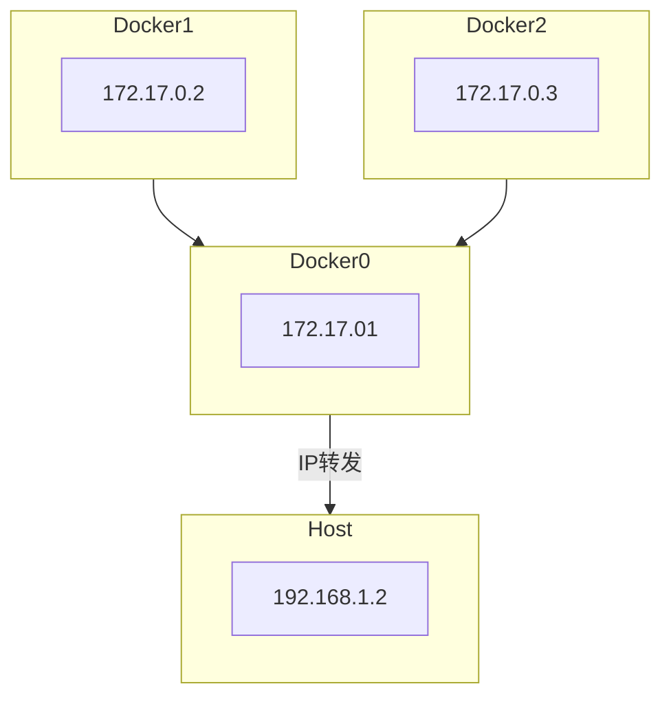
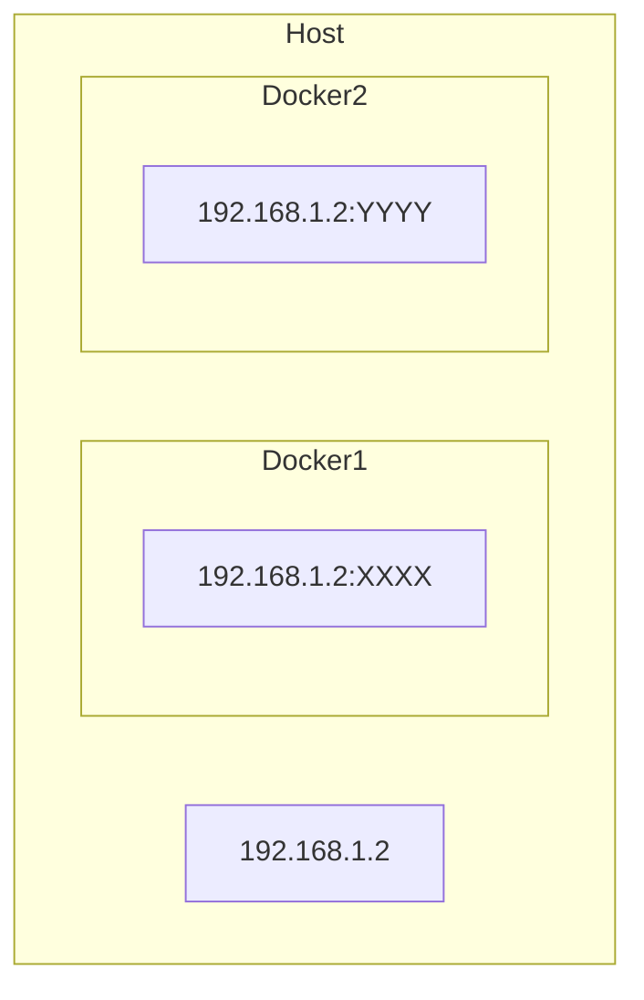

# Docker构建

## Dockerfile配置

[Dockerfile文档](https://docs.docker.com/reference/dockerfile/)

举例python后端配置

```dockerfile
# 使用Python 3.9的slim版本作为基础镜像
FROM python:3.9-slim

# RUN在build镜像时运行
RUN apt-get update && apt-get install -y \
    build-essential \
    default-libmysqlclient-dev \
    pkg-config \
    && rm -rf /var/lib/apt/lists/*

# 设置工作目录为/app
WORKDIR /app

# 复制requirements.txt文件到工作目录
COPY requirements.txt requirements.txt

# 将RUN根据调用频次分成两步，可以加快构建速度
# 安装Python依赖
RUN pip install --upgrade pip \
    && pip install -r requirements.txt

# 复制所有文件到工作目录
COPY . .

# 设置镜像环境变量
ENV MYSQL_HOST=${MYSQL_HOST}
ENV MYSQL_USER=${MYSQL_USER}
ENV MYSQL_PASSWORD=${MYSQL_PASSWORD}
ENV MYSQL_DB=${MYSQL_DATABASE}

# CMD在启动容器时运行
CMD ["gunicorn", "-b", "0.0.0.0:8000", "app:app"]
```

前端配置：先打包程序，再部署到nginx

```dockerfile
# Step 1: 使用Node.js镜像来打包程序
FROM node:20-alpine as build-stage

# 设置工作目录
WORKDIR /app

# 安装项目依赖和复制文件
COPY package*.json ./
RUN npm install

# 复制剩余的项目文件
COPY . .

# 生成构建文件
RUN npm run build

# 多阶段构建，最终发布只用nginx镜像+静态资源文件
# Step 2: 使用Nginx镜像来部署构建好的文件
FROM nginx:stable-alpine as production-stage

# 拷贝构建的文件到Nginx默认发布目录
COPY --from=build-stage /app/dist /usr/share/nginx/html

# 如果有自定义的Nginx配置，拷贝配置文件（可选）
# COPY nginx.conf /etc/nginx/nginx.conf

# 暴露Nginx端口
EXPOSE 80

# 启动Nginx
CMD ["nginx", "-g", "daemon off;"]
```

# Docker网络配置

`docker network ls`：查看Docker网络配置

`docker network inspect <NetworkID>`：查看网络配置详情

## 默认桥接模式(bridge)

这是Docker的默认网络模式。Docker会为每个容器分配一个IP地址，并创建一个本地的网络桥接接口，连接所有在该主机上运行的容器。

通过桥接接口，容器可以相互通信，也可以与主机上的其他服务通信。

Bridge模式提供了良好的隔离性，但可能会有一定的性能开销。适用于需要容器间通信且与外部网络隔离的场景。



## 主机模式(host)

容器共享宿主机的网络栈，使用宿主机的IP地址和端口。

这种模式下，容器可以直接访问宿主机的网络资源，性能较高，但隔离性较差，可能带来安全风险。

适用于需要高性能网络连接的应用。

注：主机模式不允许端口映射和自定义路由规则，与主机保持一致。-p、-icc参数无效



## 容器模式(container)

多个容器共享同一个网络命名空间。

一个容器可以共享另一个容器的网络栈。新创建的容器不会创建自己的网卡，配置自己的 IP

适用于需要紧密协作的容器，如服务发现或负载均衡场景。

`docker run -it --net container:<容器id> <镜像id>`

## 无网络模式(none)

容器没有分配任何网络资源。无网络模式适用于不需要网络连接的容器，例如用于批处理作业或与外部网络完全隔离的容器。

* 自定义网络模式(user-defined)：允许用户创建和管理自己的网络。自定义网络模式提供了更灵活的网络配置选项，例如指定子网、定义网络驱动程序和连接多个容器到同一个网络等。

## 自定义网络模式

`docker network create custom_network`，默认为driver模式，会创建一个新的虚拟网桥。可以让多个容器使用该自定义网络
