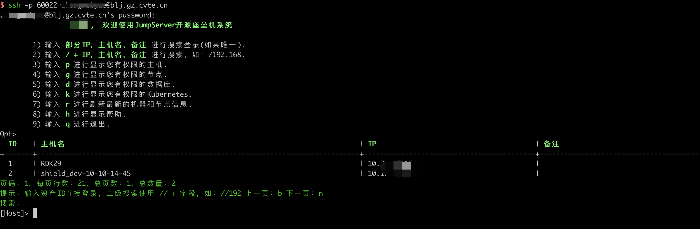
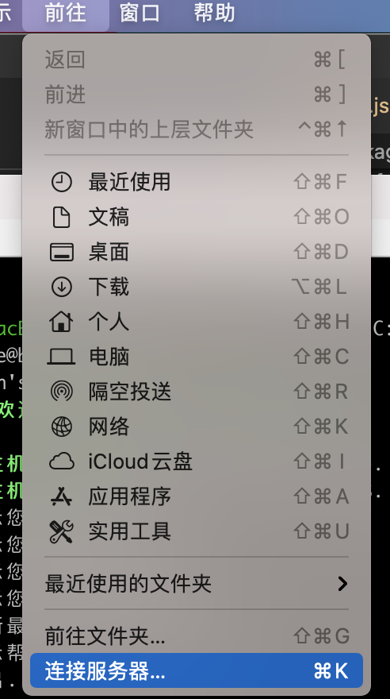
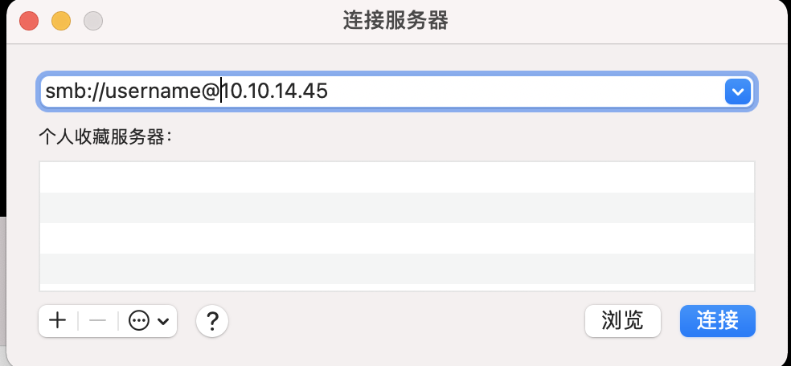
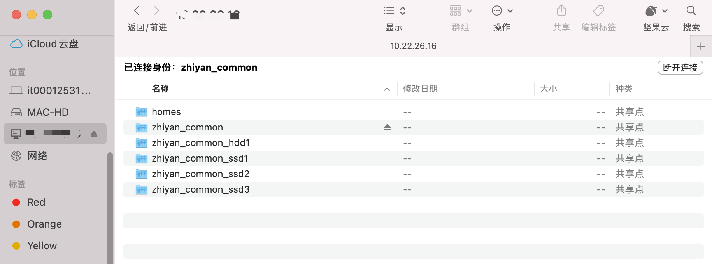
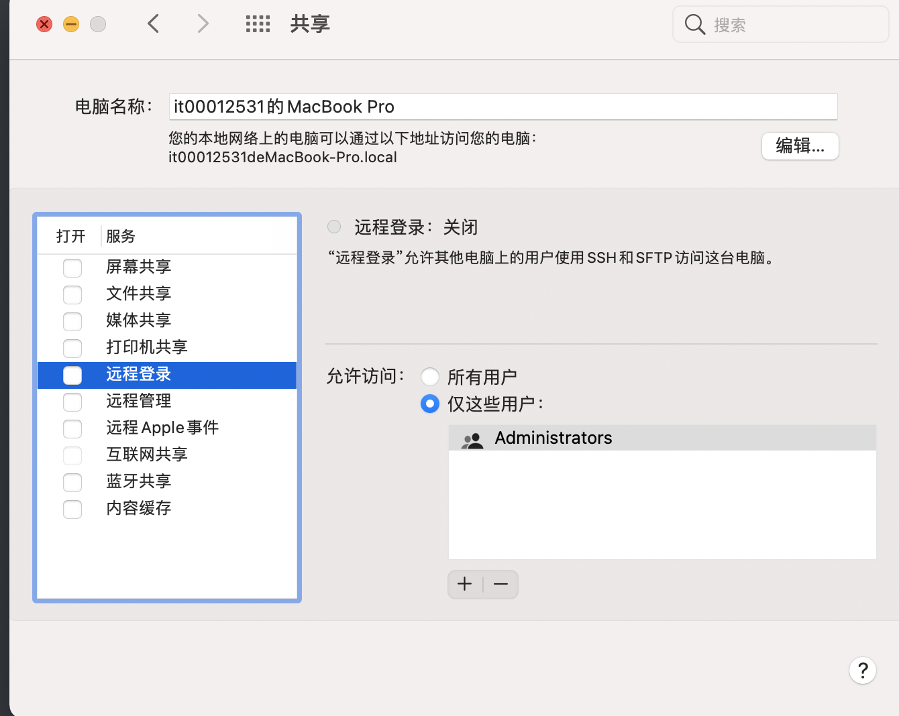

# 登录服务器

## ssh登录远程主机

登录远程主机：`ssh -p 端口号 远程主机用户名@远程主机域名或ip`，输入远程主机密码

ssh（Secure Shell）： Linux下实现远程登录功能的服务，默认 ssh 服务端口号为 22。

## 堡垒机登录远程主机

有的公司会采用堡垒机来访问服务器，堡垒机用于多台服务器统一监控和管理、身份认证、账号管理、登录等。

使用堡垒机登录不需要知道主机用户名和密码，而是输入统一4A账号。堡垒机验证之后选择该账号下的主机登录

# 传输文件

如何将本地文件拷贝到远程主机上？

## SMB连接：知道主机用户名和密码

SMB（Server Message Block）：可以用于跨平台文件传输

Mac电脑连接步骤：Finder->前往->连接服务器->输入`smb:username@host`->输入远程主机密码

连接成功之后可以通过Finder访问或者拷贝文件夹

## SCP：不知道主机用户名和密码

scp（secure copy）：scp 是 linux 系统下基于 ssh 登陆进行安全的远程文件拷贝命令。

如果使用堡垒机登录，不知道用户名和密码，无法通过SMB传输文件。此时可以使用SCP命令。步骤如下

1. 打开本机ssh服务，让远程主机能够通过ssh登录到本机。没打开的话ssh登录本机会报错`ssh: connect to host localhost port 22: Connection refused`
   1. 打开系统偏好设置->共享->远程登录
   2. 或者使用命令`sudo systemsetup -f -setremotelogin on`

2. 通过堡垒机登录远程主机
3. 通过scp命令拷贝文件`scp -r 用户名@本地主机:本地文件路径 ./`，输入本机密码：-r表示拷贝文件夹，`./`表示拷贝到远程主机当前目录

## 通过远程仓库获取文件

一种取巧的方式

1. 将本地文件push到远程仓库如git仓库、docker仓库等。
2. 登录远程主机，使用pull获取文件。

